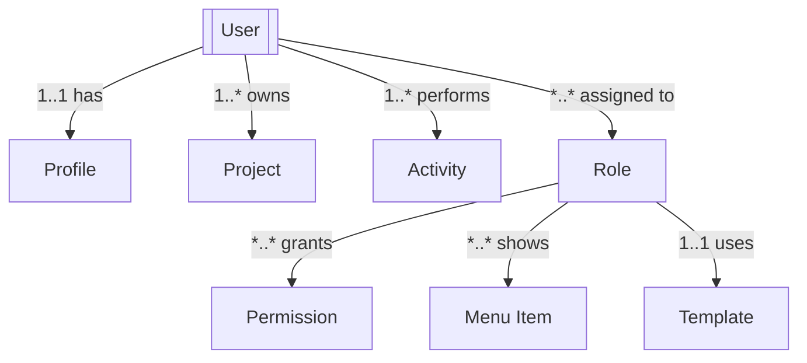

# Admin System REST API Design Documentation

## Document Change Log

### Version History

| Version | Date | Author | Changes | Breaking Changes |
|---------|------|---------|---------|------------------|
| 1.3.0 | 2025-01-03 | System | - Added pagination to all list endpoints<br>- Enhanced authentication specifications<br>- Standardized error response format<br>- Added validation specifications<br>- Added document changelog section | No |
| 1.2.0 | 2025-08-28 | adrian | - Updated entity relationship diagrams with Mermaid.js<br>- Added descriptive relationship matrices<br>- Integrated diagram rendering | No |
| 1.1.0 | 2025-08-27 | adrian | - Added initial API endpoints<br>- Defined core resources | No |
| 1.0.0 | 2025-08-27 | adrian | - Initial API design documentation<br>- Core endpoints defined<br>- Basic RBAC implementation | N/A |

### Upcoming Changes (Next Release)

- [ ] Add WebSocket support for real-time updates
- [ ] Implement GraphQL endpoint
- [ ] Add batch operations support
- [ ] Enhanced filtering capabilities

### Deprecation Notices

- None at this time

---

## Table of Contents
1. [Document Change Log](#document-change-log)
2. [Overview](#overview)
3. [Architecture](#architecture)
4. [Entity Model](#entity-model)
5. [Authentication & Authorization](#authentication--authorization)
6. [API Endpoints](#api-endpoints)
7. [Data Models](#data-models)
8. [Error Handling](#error-handling)
9. [Rate Limiting & Quotas](#rate-limiting--quotas)
10. [Audit & Logging](#audit--logging)

## Overview

This document provides a comprehensive REST API design for the Admin Management System based on the analyzed data structures. The system manages users, roles, permissions, projects, menus, system monitoring, and licensing.

### Key Features
- Multi-tenant user management with role-based access control (RBAC)
- Hierarchical permission system with granular access control
- Project and resource management with budget tracking
- System monitoring with alerts and activity logging
- License and feature management
- Menu and UI customization per role

## Architecture

### System Components

```
┌─────────────────────────────────────────────────────────┐
│                   API Gateway                           │
├─────────────────────────────────────────────────────────┤
│                Authentication Layer                      │
├─────────────────────────────────────────────────────────┤
│                Authorization Layer                       │
├──────────────────────┬──────────────────────────────────┤
│   Core Services      │      Monitoring Services         │
├──────────────────────┼──────────────────────────────────┤
│ • User Management    │ • Activity Logging               │
│ • Role Management    │ • System Alerts                  │
│ • Permission System  │ • Metrics Collection             │
│ • Project Management │ • Audit Trail                    │
│ • Menu Assignment    │ • Dashboard Analytics            │
├──────────────────────┴──────────────────────────────────┤
│                    Data Layer                           │
└─────────────────────────────────────────────────────────┘
```

### Service Hierarchy

```
Admin System
├── Identity & Access Management (IAM)
│   ├── Users
│   ├── Roles
│   ├── Permissions
│   └── Sessions
├── Project Management
│   ├── Projects
│   ├── Resources
│   ├── Budgets
│   └── Environments
├── System Configuration
│   ├── Menu Management
│   ├── Dashboard Configuration
│   └── Feature Flags
├── Monitoring & Analytics
│   ├── Activity Logs
│   ├── System Alerts
│   ├── Metrics
│   └── Reports
└── License Management
    ├── License Info
    ├── Feature Activation
    └── Seat Management
```

## Entity Model

### Core Entities and Relationships

<!-- Visual: Simple Mermaid graph for quick comprehension; followed by matrix for accessibility -->



Legend: 1 = one, * = many, 1..* = one-to-many, *..* = many-to-many, 1..1 = one-to-one

| From     | Relationship         | To           | Cardinality |
|----------|----------------------|--------------|-------------|
| User     | has                  | Profile      | 1..1        |
| User     | owns                 | Project      | 1..*        |
| User     | performs             | Activity     | 1..*        |
| User     | assigned to          | Role         | *..*        |
| Role     | grants               | Permission   | *..*        |
| Role     | shows                | Menu Item    | *..*        |
| Role     | uses                 | Template     | 1..1        |

### Entity Hierarchy

1. **Organization** (Root Level)
   - Contains all system-wide configurations
   - Manages license and feature availability

2. **Users** (Tenant Level)
   - Individual user accounts
   - Can have multiple roles
   - Owns projects and resources

3. **Roles** (Authorization Level)
   - Predefined and custom roles
   - Collection of permissions
   - Associated with menu configurations

4. **Permissions** (Granular Level)
   - Atomic access rights
   - Grouped by categories
   - Inheritable through role hierarchy

5. **Projects** (Resource Level)
   - Resource containers
   - Budget and quota management
   - Environment-specific configurations

## Authentication & Authorization

### Authentication Flow

```
POST /api/v1/auth/login
Authorization: Bearer {token}
X-API-Key: {api-key} (for service-to-service)
```

### Authorization Model

```json
{
  "authorization": {
    "type": "RBAC",
    "hierarchy": {
      "admin": ["all_permissions"],
      "dashboard_admin": ["user_management", "view_dashboard"],
      "ds": ["ai_operations", "data_management"],
      "ops": ["system_monitoring", "deployments"],
      "biz": ["documents", "reports"]
    }
  }
}
```

## API Endpoints

### Base URL
```
https://api.admin.example.com/v1
```

### User Management

#### Authentication Required
All endpoints require: `Authorization: Bearer {token}`  
Admin role required for: POST, PUT, PATCH, DELETE operations

#### Users Resource

```
GET    /users?page=1&pageSize=20&sort=createdAt&order=desc  # List all users with pagination
GET    /users/{userId}                 # Get specific user details
POST   /users                          # Create new user [Admin Required]
PUT    /users/{userId}                 # Update user completely [Admin Required]
PATCH  /users/{userId}                 # Partial update user [Admin/Self]
DELETE /users/{userId}                 # Delete user (soft delete) [Admin Required]

# Sub-resources
GET    /users/{userId}/roles           # Get user's roles
POST   /users/{userId}/roles           # Assign roles to user
DELETE /users/{userId}/roles/{roleId}  # Remove role from user

GET    /users/{userId}/permissions     # Get effective permissions
GET    /users/{userId}/projects?page=1&pageSize=10  # Get user's projects with pagination
GET    /users/{userId}/activities?page=1&pageSize=20  # Get user's activity log with pagination

# Bulk operations
POST   /users/bulk                     # Create multiple users
PATCH  /users/bulk                     # Update multiple users
DELETE /users/bulk                     # Delete multiple users

# Search and filter
GET    /users/search?q={query}         # Search users
GET    /users/filter                   # Advanced filtering
POST   /users/export                   # Export users data
```

### Role Management

#### Authentication Required
All endpoints require: `Authorization: Bearer {token}`  
Admin role required for: POST, PUT, DELETE operations

```
GET    /roles?page=1&pageSize=20       # List all roles with pagination
GET    /roles/{roleId}                 # Get role details
POST   /roles                          # Create custom role [Admin Required]
PUT    /roles/{roleId}                 # Update role [Admin Required]
DELETE /roles/{roleId}                 # Delete role [Admin Required]

# Permissions management
GET    /roles/{roleId}/permissions     # Get role permissions
PUT    /roles/{roleId}/permissions     # Update role permissions
POST   /roles/{roleId}/permissions     # Add permissions to role
DELETE /roles/{roleId}/permissions/{permissionId}  # Remove permission

# Role templates
GET    /roles/templates                # Get role templates
POST   /roles/templates/{templateId}/apply  # Apply template

# Role hierarchy
GET    /roles/hierarchy                # Get role hierarchy tree
PUT    /roles/{roleId}/parent          # Set parent role
```

### Permission Management

```
GET    /permissions                    # List all permissions
GET    /permissions/categories         # Get permission categories
GET    /permissions/{permissionId}     # Get permission details

# Permission checks
POST   /permissions/check              # Check if user has permissions
GET    /permissions/matrix             # Get permission matrix

# Permission groups
GET    /permissions/groups             # List permission groups
POST   /permissions/groups             # Create permission group
```

### Project Management

#### Authentication Required
All endpoints require: `Authorization: Bearer {token}`  
Project owner or Admin role required for modifications

```
GET    /projects?page=1&pageSize=20&filter=status:active  # List all projects with pagination
GET    /projects/{projectId}          # Get project details
POST   /projects                       # Create project
PUT    /projects/{projectId}          # Update project
DELETE /projects/{projectId}          # Delete project

# Project members
GET    /projects/{projectId}/members?page=1&pageSize=50  # Get project members with pagination
POST   /projects/{projectId}/members   # Add members
DELETE /projects/{projectId}/members/{userId}  # Remove member

# Project resources
GET    /projects/{projectId}/resources # Get project resources
PUT    /projects/{projectId}/resources # Update resource allocation
GET    /projects/{projectId}/quota     # Get project quotas
PUT    /projects/{projectId}/quota     # Update quotas

# Project budget
GET    /projects/{projectId}/budget    # Get budget info
PUT    /projects/{projectId}/budget    # Update budget
POST   /projects/{projectId}/budget/request  # Request budget increase
POST   /projects/{projectId}/budget/approve  # Approve budget request

# Project environments
GET    /projects/{projectId}/environments?page=1&pageSize=10  # List environments with pagination
POST   /projects/{projectId}/environments     # Create environment
PUT    /projects/{projectId}/environments/{env}  # Update environment
```

### Menu Management

```
GET    /menus                          # List all menu configurations
GET    /menus/{menuType}              # Get specific menu type
PUT    /menus/{menuType}              # Update menu configuration

# Menu assignments
GET    /menus/assignments              # Get all menu assignments
GET    /menus/assignments/{roleId}    # Get role menu assignments
PUT    /menus/assignments/{roleId}    # Update role menu items

# Menu items
GET    /menus/items?page=1&pageSize=100  # List all available menu items with pagination
POST   /menus/items                   # Create custom menu item
PUT    /menus/items/{itemId}         # Update menu item
DELETE /menus/items/{itemId}         # Delete menu item

# Menu icons
GET    /menus/icons                   # Get available icons
POST   /menus/icons                   # Upload custom icon
```

### System Monitoring

```
# Activity Logs
GET    /activities                    # List all activities
GET    /activities/{activityId}      # Get activity details
GET    /activities/user/{userId}     # Get user activities
POST   /activities/search             # Search activities
GET    /activities/export             # Export activity logs

# System Alerts
GET    /alerts                        # List active alerts
GET    /alerts/{alertId}             # Get alert details
POST   /alerts                        # Create alert
PUT    /alerts/{alertId}             # Update alert
PATCH  /alerts/{alertId}/acknowledge # Acknowledge alert
DELETE /alerts/{alertId}             # Dismiss alert

# Metrics
GET    /metrics                       # Get system metrics
GET    /metrics/dashboard             # Get dashboard metrics
GET    /metrics/users                 # Get user metrics
GET    /metrics/resources             # Get resource metrics
GET    /metrics/performance           # Get performance metrics

# Audit Trail
GET    /audit?page=1&pageSize=100&from=2024-01-01&to=2024-12-31  # Get audit logs with pagination
GET    /audit/user/{userId}?page=1&pageSize=50  # Get user audit trail with pagination
GET    /audit/resource/{resourceId}?page=1&pageSize=50  # Get resource audit trail with pagination
POST   /audit/search                  # Search audit logs with pagination in request body
```

### License Management

```
GET    /license                       # Get license information
GET    /license/features              # Get enabled features
GET    /license/seats                 # Get seat allocation
PUT    /license                       # Update license
POST   /license/validate              # Validate license key

# Feature flags
GET    /features                      # List all features
GET    /features/{featureId}         # Get feature status
PUT    /features/{featureId}         # Enable/disable feature
```

### Dashboard Administration

```
GET    /dashboard/config              # Get dashboard configuration
PUT    /dashboard/config              # Update configuration

# Dashboard widgets
GET    /dashboard/widgets             # List available widgets
POST   /dashboard/widgets             # Add widget
PUT    /dashboard/widgets/{widgetId} # Update widget
DELETE /dashboard/widgets/{widgetId} # Remove widget

# Dashboard layouts
GET    /dashboard/layouts             # Get available layouts
GET    /dashboard/layouts/{roleId}   # Get role-specific layout
PUT    /dashboard/layouts/{roleId}   # Update role layout
```

### Administrative Operations

```
# System status
GET    /admin/status                  # Get system status
GET    /admin/health                  # Health check

# Maintenance
POST   /admin/maintenance/start       # Start maintenance mode
POST   /admin/maintenance/stop        # Stop maintenance mode
GET    /admin/maintenance/status      # Get maintenance status

# Backup & Restore
POST   /admin/backup                  # Create backup
GET    /admin/backups                 # List backups
POST   /admin/restore/{backupId}     # Restore from backup

# Cache management
POST   /admin/cache/clear             # Clear cache
GET    /admin/cache/stats             # Get cache statistics
```

## Data Models

### User Model

```json
{
  "id": 1,
  "username": "adrian",
  "email": "adrian@nstarxinc.com",
  "name": "Adrian",
  "status": "active",
  "verified": true,
  "createdAt": "2023-01-15T00:00:00Z",
  "updatedAt": "2024-01-20T00:00:00Z",
  "lastLogin": "2024-01-20T14:45:23Z",
  "profile": {
    "country": {
      "name": "Romania",
      "code": "ro"
    },
    "company": "DLNP Tech",
    "department": "Engineering",
    "title": "Senior Developer",
    "phone": "+40-xxx-xxx-xxx",
    "timezone": "Europe/Bucharest",
    "language": "en",
    "avatar": "avatar_url"
  },
  "roles": ["admin", "ds", "ops", "biz"],
  "permissions": ["view_dashboard", "manage_users", "..."],
  "settings": {
    "notifications": {
      "email": true,
      "push": true,
      "sms": false
    },
    "theme": "dark",
    "twoFactorAuth": true
  },
  "metadata": {
    "activity": 85,
    "balance": 75000,
    "representative": {
      "name": "admin",
      "image": "admin.png"
    }
  }
}
```

### Role Model

```json
{
  "id": 1,
  "name": "Administrator",
  "code": "admin",
  "description": "Full access to all system features",
  "type": "system",
  "priority": 1,
  "parentRoleId": null,
  "permissions": [
    {
      "id": "perm_1",
      "name": "view_dashboard",
      "granted": true,
      "constraints": {}
    }
  ],
  "menuConfiguration": {
    "type": "admin",
    "items": ["dashboard", "users", "settings"]
  },
  "createdAt": "2023-01-01T00:00:00Z",
  "updatedAt": "2024-01-20T00:00:00Z",
  "createdBy": "system",
  "metadata": {
    "userCount": 5,
    "isDefault": true,
    "canDelete": false
  }
}
```

### Permission Model

```json
{
  "id": "perm_view_users",
  "name": "view_users",
  "label": "View Users",
  "description": "Allows viewing user list and details",
  "category": "User Management",
  "type": "read",
  "resource": "users",
  "action": "view",
  "constraints": {
    "scope": "organization",
    "conditions": [
      {
        "field": "department",
        "operator": "equals",
        "value": "${user.department}"
      }
    ]
  },
  "dependencies": ["view_dashboard"],
  "metadata": {
    "risk": "low",
    "audit": true
  }
}
```

### Project Model

```json
{
  "id": "proj_123",
  "name": "AI Platform Development",
  "code": "AI-PLATFORM",
  "description": "Main AI platform project",
  "owner": "adrian@nstarxinc.com",
  "status": "active",
  "environment": "production",
  "accessLevel": "confidential",
  "createdAt": "2023-06-01T00:00:00Z",
  "updatedAt": "2024-01-20T00:00:00Z",
  "members": [
    {
      "userId": 1,
      "role": "owner",
      "permissions": ["full_access"],
      "joinedAt": "2023-06-01T00:00:00Z"
    },
    {
      "userId": 2,
      "role": "developer",
      "permissions": ["read", "write"],
      "joinedAt": "2023-07-01T00:00:00Z"
    }
  ],
  "resources": {
    "quota": {
      "cpu": 16,
      "memory": 64,
      "storage": 1000,
      "bandwidth": 5000
    },
    "usage": {
      "cpu": 12,
      "memory": 48,
      "storage": 750,
      "bandwidth": 3500
    },
    "limits": {
      "maxInstances": 10,
      "maxDatabases": 5,
      "maxApiCalls": 1000000
    }
  },
  "budget": {
    "allocated": 100000,
    "spent": 65000,
    "committed": 15000,
    "remaining": 20000,
    "period": {
      "start": "2024-01-01",
      "end": "2024-12-31"
    },
    "approver": "finance@company.com",
    "spendingFrozen": false,
    "alerts": [
      {
        "threshold": 80,
        "action": "notify"
      },
      {
        "threshold": 95,
        "action": "freeze"
      }
    ]
  },
  "infrastructure": {
    "location": "us-east-1",
    "diskType": "SSD",
    "diskSize": 1000,
    "diskUsed": 750,
    "backupEnabled": true,
    "encryptionEnabled": true
  },
  "tags": {
    "department": "Engineering",
    "costCenter": "CC-001",
    "product": "AI-Platform",
    "team": "Platform Team"
  },
  "metadata": {
    "compliance": ["GDPR", "SOC2"],
    "certifications": ["ISO27001"],
    "sla": 99.99,
    "tier": "platinum"
  }
}
```

### Activity Log Model

```json
{
  "id": "log_abc123",
  "timestamp": "2024-01-20T14:45:23Z",
  "userId": 1,
  "userName": "Adrian",
  "userEmail": "adrian@nstarxinc.com",
  "action": "user.login",
  "resource": "authentication",
  "resourceId": null,
  "method": "POST",
  "endpoint": "/api/v1/auth/login",
  "status": "success",
  "statusCode": 200,
  "duration": 125,
  "details": {
    "ip": "192.168.1.100",
    "userAgent": "Mozilla/5.0...",
    "location": "Bucharest, Romania",
    "sessionId": "sess_xyz789",
    "mfaUsed": true
  },
  "changes": null,
  "metadata": {
    "risk": "low",
    "suspicious": false,
    "automated": false
  }
}
```

### Alert Model

```json
{
  "id": "alert_123",
  "severity": "high",
  "priority": 1,
  "category": "security",
  "type": "security_update",
  "title": "Security Update Required",
  "message": "Critical security patches available for 3 components",
  "details": {
    "components": ["auth-service", "api-gateway", "database"],
    "cve": ["CVE-2024-001", "CVE-2024-002"],
    "impact": "Remote code execution vulnerability"
  },
  "status": "active",
  "acknowledged": false,
  "acknowledgedBy": null,
  "acknowledgedAt": null,
  "createdAt": "2024-01-20T12:00:00Z",
  "updatedAt": "2024-01-20T12:00:00Z",
  "expiresAt": "2024-01-25T12:00:00Z",
  "actions": [
    {
      "type": "update",
      "label": "Apply Patches",
      "command": "admin.security.patch"
    },
    {
      "type": "dismiss",
      "label": "Dismiss Alert",
      "command": "alert.dismiss"
    }
  ],
  "notifications": {
    "email": ["admin@company.com"],
    "slack": ["#security-alerts"],
    "webhook": ["https://webhook.site/xxx"]
  },
  "metadata": {
    "source": "security-scanner",
    "automated": true,
    "recurrence": "none"
  }
}
```

## Error Handling

### Error Response Format

```json
{
  "error": {
    "code": "USER_NOT_FOUND",
    "message": "The requested user does not exist",
    "details": {
      "userId": 123,
      "timestamp": "2024-01-20T15:30:00Z"
    },
    "requestId": "req_abc123xyz",
    "documentation": "https://api.admin.example.com/docs/errors#USER_NOT_FOUND"
  }
}
```

### Standard HTTP Status Codes

- **200 OK**: Successful GET, PUT
- **201 Created**: Successful POST
- **204 No Content**: Successful DELETE
- **400 Bad Request**: Invalid request parameters
- **401 Unauthorized**: Missing or invalid authentication
- **403 Forbidden**: Insufficient permissions
- **404 Not Found**: Resource not found
- **409 Conflict**: Resource conflict (e.g., duplicate)
- **422 Unprocessable Entity**: Validation errors
- **429 Too Many Requests**: Rate limit exceeded
- **500 Internal Server Error**: Server error
- **503 Service Unavailable**: Service temporarily unavailable

### Error Codes

```
AUTH_001: Invalid credentials
AUTH_002: Token expired
AUTH_003: Token invalid
AUTH_004: MFA required
AUTH_005: Account locked

USER_001: User not found
USER_002: Email already exists
USER_003: Invalid user data
USER_004: Cannot delete active user

ROLE_001: Role not found
ROLE_002: Cannot delete system role
ROLE_003: Circular dependency detected
ROLE_004: Invalid permission

PERM_001: Permission denied
PERM_002: Invalid permission
PERM_003: Permission not found

PROJ_001: Project not found
PROJ_002: Quota exceeded
PROJ_003: Budget exceeded
PROJ_004: Invalid environment

SYS_001: System maintenance
SYS_002: Database error
SYS_003: Service unavailable
SYS_004: Rate limit exceeded
```

## Rate Limiting & Quotas

### Rate Limits

```json
{
  "rateLimits": {
    "default": {
      "requests": 1000,
      "period": "hour",
      "burst": 50
    },
    "authenticated": {
      "requests": 5000,
      "period": "hour",
      "burst": 100
    },
    "admin": {
      "requests": 10000,
      "period": "hour",
      "burst": 200
    }
  },
  "endpoints": {
    "/auth/login": {
      "requests": 5,
      "period": "minute",
      "lockout": 300
    },
    "/users/export": {
      "requests": 10,
      "period": "day"
    },
    "/admin/backup": {
      "requests": 1,
      "period": "hour"
    }
  }
}
```

### Response Headers

```
X-RateLimit-Limit: 1000
X-RateLimit-Remaining: 999
X-RateLimit-Reset: 1642680000
X-RateLimit-Retry-After: 3600
```

## Audit & Logging

### Audit Requirements

All API operations must be logged with:

1. **Who**: User identity and authentication method
2. **What**: Action performed and resource affected
3. **When**: Timestamp with timezone
4. **Where**: IP address and location
5. **Why**: Business context or reason
6. **Result**: Success/failure and response

### Audit Log Entry

```json
{
  "auditId": "audit_xyz123",
  "timestamp": "2024-01-20T15:30:00Z",
  "event": "user.role.assigned",
  "actor": {
    "userId": 1,
    "username": "adrian",
    "email": "adrian@nstarxinc.com",
    "ip": "192.168.1.100",
    "userAgent": "Mozilla/5.0..."
  },
  "target": {
    "type": "user",
    "id": 5,
    "name": "sujay"
  },
  "action": {
    "type": "assign",
    "resource": "role",
    "method": "POST",
    "endpoint": "/api/v1/users/5/roles"
  },
  "changes": {
    "before": {
      "roles": ["ops"]
    },
    "after": {
      "roles": ["ops", "biz"]
    }
  },
  "context": {
    "reason": "Role expansion request approved",
    "ticketId": "TICK-123",
    "approvedBy": "admin"
  },
  "result": {
    "status": "success",
    "statusCode": 200,
    "duration": 45
  },
  "metadata": {
    "sessionId": "sess_abc123",
    "requestId": "req_def456",
    "traceId": "trace_ghi789"
  }
}
```

## Security Considerations

### Authentication Security

1. **Multi-Factor Authentication (MFA)**
   - TOTP support
   - SMS backup codes
   - Hardware token support

2. **Session Management**
   - Secure session tokens
   - Session timeout policies
   - Concurrent session limits

3. **Password Policies**
   - Minimum complexity requirements
   - Password history
   - Forced rotation
   - Account lockout policies

### API Security

1. **Transport Security**
   - TLS 1.3 required
   - Certificate pinning
   - HSTS headers

2. **Input Validation**
   - Schema validation
   - SQL injection prevention
   - XSS protection
   - CSRF tokens

3. **Output Security**
   - Data masking
   - Field-level encryption
   - PII redaction

### Data Protection

1. **Encryption**
   - At-rest encryption (AES-256)
   - In-transit encryption (TLS)
   - Key rotation policies

2. **Data Retention**
   - Automatic purging
   - Right to be forgotten
   - Data anonymization

3. **Compliance**
   - GDPR compliance
   - SOC2 certification
   - ISO 27001 standards

## Implementation Guidelines

### API Versioning

- Version in URL path: `/api/v1/`, `/api/v2/`
- Sunset headers for deprecation
- Backward compatibility for 2 major versions

### Pagination

```json
{
  "data": [...],
  "pagination": {
    "page": 1,
    "pageSize": 20,
    "totalPages": 5,
    "totalCount": 100,
    "hasNext": true,
    "hasPrevious": false
  },
  "links": {
    "self": "/api/v1/users?page=1&size=20",
    "next": "/api/v1/users?page=2&size=20",
    "last": "/api/v1/users?page=5&size=20"
  }
}
```

### Filtering & Sorting

```
GET /api/v1/users?filter=status:active,role:admin&sort=-createdAt,name
GET /api/v1/users?q=adrian&fields=id,name,email&expand=roles,permissions
```

### Batch Operations

```json
POST /api/v1/users/bulk
{
  "operations": [
    {
      "method": "create",
      "data": { "name": "User1", "email": "user1@example.com" }
    },
    {
      "method": "update",
      "id": 2,
      "data": { "status": "active" }
    },
    {
      "method": "delete",
      "id": 3
    }
  ]
}
```

### Webhooks

```json
{
  "webhook": {
    "url": "https://webhook.example.com/admin",
    "events": ["user.created", "user.deleted", "role.assigned"],
    "secret": "webhook_secret_key",
    "active": true
  }
}
```

## Testing & Documentation

### API Testing Requirements

1. **Unit Tests**: All endpoints with mocked data
2. **Integration Tests**: Database and service interactions
3. **Load Tests**: Performance under load
4. **Security Tests**: Penetration testing
5. **Contract Tests**: API contract validation

### OpenAPI Specification

The API should be fully documented using OpenAPI 3.0 specification with:
- Complete request/response schemas
- Authentication requirements
- Example requests and responses
- Error scenarios
- Rate limiting information

### Developer Portal

Provide a developer portal with:
- Interactive API documentation
- SDK downloads
- Code examples
- Postman collections
- API changelog
- Status page

## Deployment & Operations

### Deployment Strategy

1. **Blue-Green Deployment**: Zero-downtime deployments
2. **Canary Releases**: Gradual rollout
3. **Feature Flags**: Toggle features without deployment
4. **Rollback Plan**: Quick rollback capability

### Monitoring & Observability

1. **Metrics**
   - Request rate
   - Error rate
   - Response time
   - Resource utilization

2. **Logging**
   - Structured logging
   - Centralized log aggregation
   - Log retention policies

3. **Tracing**
   - Distributed tracing
   - Request correlation
   - Performance profiling

### SLA Requirements

- **Availability**: 99.99% uptime
- **Response Time**: <200ms p95
- **Error Rate**: <0.1%
- **Recovery Time**: <15 minutes

## Conclusion

This comprehensive REST API design provides a robust foundation for implementing the admin management system. The design ensures:

1. **Scalability**: Hierarchical structure supports growth
2. **Security**: Multiple layers of authentication and authorization
3. **Flexibility**: Extensible permission and role system
4. **Auditability**: Complete audit trail for compliance
5. **Maintainability**: Clear separation of concerns
6. **Performance**: Optimized for high-volume operations

The API follows REST best practices and provides a consistent, predictable interface for managing all aspects of the admin system.