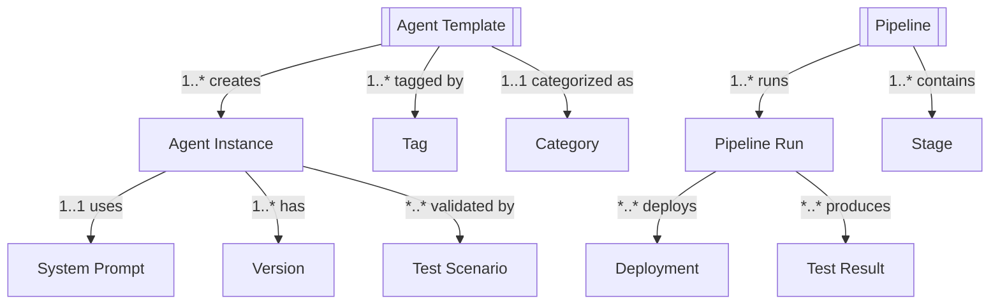

# Agentic System REST API Design Documentation

## Document Change Log

### Version History

| Version | Date | Author | Changes | Breaking Changes |
|---------|------|---------|---------|------------------|
| 1.3.0 | 2025-01-03 | System | - Added pagination to all list endpoints<br>- Enhanced authentication specifications<br>- Standardized error response format<br>- Added document changelog section | No |
| 1.2.0 | 2025-08-28 | adrian | - Updated entity relationship diagrams<br>- Added descriptive matrices<br>- Enhanced documentation | No |
| 1.1.0 | 2025-08-27 | adrian | - Added initial API endpoints<br>- Defined core resources | No |
| 1.0.0 | 2025-08-27 | adrian | - Initial API design documentation | N/A |

### Upcoming Changes (Next Release)

- [ ] Add WebSocket support for real-time updates
- [ ] Implement GraphQL endpoint
- [ ] Add batch operations support
- [ ] Enhanced filtering capabilities

### Deprecation Notices

- None at this time

---

## Table of Contents
1. [Document Change Log](#document-change-log)
2. [Overview](#overview)
3. [Architecture](#architecture)
4. [Entity Model](#entity-model)
5. [Authentication & Authorization](#authentication--authorization)
6. [API Endpoints](#api-endpoints)
7. [Data Models](#data-models)
8. [Pipeline & Deployment](#pipeline--deployment)
9. [Testing & Validation](#testing--validation)
10. [Monitoring & Observability](#monitoring--observability)
11. [Error Handling](#error-handling)

## Overview

This document provides a comprehensive REST API design for the Agentic AI System - a platform for creating, managing, testing, and deploying AI agents with integrated CI/CD pipelines. The system supports multiple agent types, prompt management, testing workbench, and full deployment lifecycle management.

### Key Features
- Multi-provider AI agent orchestration (OpenAI, Google, Anthropic, Ollama)
- Agent template marketplace with categories and popularity tracking
- System prompt and template management with versioning
- Comprehensive testing workbench with A/B testing capabilities
- Full CI/CD pipeline integration for agent deployment
- Multi-environment deployment (development, staging, production)
- Performance monitoring and evaluation metrics
- Cost tracking and optimization

## Architecture

### System Components

```
┌─────────────────────────────────────────────────────────┐
│                   API Gateway                           │
├─────────────────────────────────────────────────────────┤
│              Agent Orchestration Layer                  │
├──────────────────────┬──────────────────────────────────┤
│   Agent Services     │     Pipeline Services            │
├──────────────────────┼──────────────────────────────────┤
│ • Template Engine    │ • Build Pipeline                 │
│ • Prompt Manager     │ • Test Automation                │
│ • Agent Registry     │ • Deployment Manager             │
│ • Version Control    │ • Environment Manager            │
├──────────────────────┼──────────────────────────────────┤
│  Testing Services    │    Monitoring Services           │
├──────────────────────┼──────────────────────────────────┤
│ • Test Workbench     │ • Performance Metrics            │
│ • Scenario Runner    │ • Cost Analytics                 │
│ • A/B Testing        │ • Log Aggregation                │
│ • Validation Engine  │ • Alert Management               │
├──────────────────────┴──────────────────────────────────┤
│                Provider Integration Layer               │
├──────────────────────────────────────────────────────────┤
│ OpenAI │ Google │ Anthropic │ Ollama │ Custom          │
├─────────────────────────────────────────────────────────┤
│                    Data Layer                           │
└─────────────────────────────────────────────────────────┘
```

### Service Hierarchy

```
Agentic System
├── Agent Management
│   ├── Agent Templates
│   ├── Agent Instances
│   ├── Agent Versions
│   └── Agent Registry
├── Prompt Engineering
│   ├── System Prompts
│   ├── Prompt Templates
│   ├── Prompt History
│   └── Prompt Versioning
├── CI/CD Pipeline
│   ├── Build Management
│   ├── Test Automation
│   ├── Deployment Pipeline
│   └── Environment Management
├── Testing & Validation
│   ├── Test Workbench
│   ├── Test Scenarios
│   ├── Test Suites
│   ├── A/B Testing
│   └── Performance Testing
├── Monitoring & Analytics
│   ├── Performance Metrics
│   ├── Cost Analysis
│   ├── Usage Statistics
│   └── Quality Metrics
└── Provider Management
    ├── Provider Configuration
    ├── Endpoint Management
    ├── Authentication
    └── Rate Limiting
```

## Entity Model

### Core Entities and Relationships

<!-- Visual: Mermaid graph for quick comprehension; followed by a relationship matrix for accessibility -->



Legend: 1 = one, * = many, 1..* = one-to-many, *..* = many-to-many, 1..1 = one-to-one

| From           | Relationship      | To            | Cardinality |
|----------------|-------------------|---------------|-------------|
| Agent Template | creates           | Agent Instance| 1..*        |
| Agent Template | tagged by         | Tag           | 1..*        |
| Agent Template | categorized as    | Category      | 1..1        |
| Agent Instance | uses              | System Prompt | 1..1        |
| Agent Instance | has               | Version       | 1..*        |
| Agent Instance | validated by      | Test Scenario | *..*        |
| Pipeline       | runs              | Pipeline Run  | 1..*        |
| Pipeline       | contains          | Stage         | 1..*        |
| Pipeline Run   | deploys           | Deployment    | *..*        |
| Pipeline Run   | produces          | Test Result   | *..*        |

### Entity Hierarchy

1. **Agent Template** (Blueprint Level)
   - Reusable agent configurations
   - Category and tag classification
   - Popularity and usage tracking

2. **Agent Instance** (Runtime Level)
   - Deployed agent with specific configuration
   - Version tracking
   - Provider-specific implementation

3. **System Prompt** (Configuration Level)
   - Agent behavior definition
   - Version control
   - Template variables

4. **Pipeline** (Automation Level)
   - Build, test, deploy automation
   - Multi-stage workflow
   - Environment progression

5. **Test Scenario** (Validation Level)
   - Behavior validation
   - Performance benchmarking
   - Quality assurance

## Authentication & Authorization

### Authentication Flow

```
POST /api/v1/auth/login
Authorization: Bearer {token}
X-Agent-Key: {agent-key} (for agent-to-agent communication)
```

### Authorization Model

```json
{
  "authorization": {
    "type": "RBAC + API Key",
    "scopes": {
      "agent:read": "View agents and templates",
      "agent:write": "Create and modify agents",
      "agent:execute": "Execute agent actions",
      "pipeline:read": "View pipeline status",
      "pipeline:write": "Modify pipeline configuration",
      "pipeline:execute": "Run pipeline actions",
      "test:read": "View test results",
      "test:write": "Create and modify tests",
      "test:execute": "Run tests",
      "deployment:read": "View deployments",
      "deployment:write": "Deploy to environments",
      "deployment:approve": "Approve production deployments"
    }
  }
}
```

## API Endpoints

### Base URL
```
https://api.agentic.example.com/v1
```

### Agent Template Management

```
# Agent Templates
GET    /templates?page={page}&limit={limit}&sort={field}&order={asc|desc}  # List all agent templates
       Authorization: Bearer {token}
       X-Agent-Key: {agent-key} (optional for agent-to-agent communication)
GET    /templates/{templateId}              # Get template details
       Authorization: Bearer {token}
POST   /templates                           # Create new template
       Authorization: Bearer {token}
       Content-Type: application/json
       Required: name, category, description, configuration
       Validation: name (3-100 chars), category (valid enum), configuration (valid schema)
PUT    /templates/{templateId}              # Update template
       Authorization: Bearer {token}
       Content-Type: application/json
       Validation: partial update schema validation
DELETE /templates/{templateId}              # Delete template
       Authorization: Bearer {token}
POST   /templates/{templateId}/clone        # Clone template
       Authorization: Bearer {token}
       Content-Type: application/json
       Required: name (for cloned template)

# Template Categories
GET    /templates/categories?page={page}&limit={limit}  # List all categories
       Authorization: Bearer {token}
GET    /templates/categories/{category}?page={page}&limit={limit}  # Get templates by category
       Authorization: Bearer {token}

# Template Search & Filter
GET    /templates/search?q={query}&page={page}&limit={limit}  # Search templates
       Authorization: Bearer {token}
GET    /templates/filter?page={page}&limit={limit}      # Advanced filtering
       Authorization: Bearer {token}
GET    /templates/popular?page={page}&limit={limit}     # Get popular templates
       Authorization: Bearer {token}
GET    /templates/recommended?page={page}&limit={limit}  # Get recommended templates
       Authorization: Bearer {token}

# Template Tags
GET    /templates/{templateId}/tags        # Get template tags
PUT    /templates/{templateId}/tags        # Update tags
POST   /templates/{templateId}/rate        # Rate template

# Template Usage
GET    /templates/{templateId}/usage       # Get usage statistics
GET    /templates/{templateId}/instances   # List instances from template
```

### Agent Instance Management

```
# Agent Instances
GET    /agents?page={page}&limit={limit}&status={status}&environment={env}  # List all agent instances
       Authorization: Bearer {token}
       X-Agent-Key: {agent-key} (for agent-to-agent communication)
GET    /agents/{agentId}                   # Get agent details
       Authorization: Bearer {token}
POST   /agents                             # Create agent from template
       Authorization: Bearer {token}
       Content-Type: application/json
       Required: templateId, name, environment
       Validation: templateId (valid UUID), name (3-100 chars), environment (dev|staging|prod)
PUT    /agents/{agentId}                   # Update agent
       Authorization: Bearer {token}
       Content-Type: application/json
       Validation: partial update schema validation
DELETE /agents/{agentId}                   # Delete agent
       Authorization: Bearer {token}
PATCH  /agents/{agentId}/status            # Update agent status
       Authorization: Bearer {token}
       Content-Type: application/json
       Required: status
       Validation: status (active|inactive|maintenance|error)

# Agent Execution
POST   /agents/{agentId}/execute           # Execute agent
POST   /agents/{agentId}/stop              # Stop agent execution
GET    /agents/{agentId}/status            # Get execution status

# Agent Versions
GET    /agents/{agentId}/versions          # List agent versions
GET    /agents/{agentId}/versions/{ver}    # Get specific version
POST   /agents/{agentId}/versions          # Create new version
POST   /agents/{agentId}/rollback          # Rollback to version

# Agent Configuration
GET    /agents/{agentId}/config            # Get configuration
PUT    /agents/{agentId}/config            # Update configuration
GET    /agents/{agentId}/environment       # Get environment variables
PUT    /agents/{agentId}/environment       # Update environment

# Agent Providers
GET    /agents/providers                   # List available providers
GET    /agents/providers/{provider}        # Get provider details
POST   /agents/providers/{provider}/test   # Test provider connection
```

### System Prompt Management

```
# System Prompts
GET    /prompts?page={page}&limit={limit}&category={category}  # List all system prompts
       Authorization: Bearer {token}
GET    /prompts/{promptId}                 # Get prompt details
       Authorization: Bearer {token}
POST   /prompts                            # Create new prompt
       Authorization: Bearer {token}
       Content-Type: application/json
       Required: name, content, type
       Validation: name (3-100 chars), content (10-4000 chars), type (system|user|assistant)
PUT    /prompts/{promptId}                 # Update prompt
       Authorization: Bearer {token}
       Content-Type: application/json
       Validation: partial update schema validation
DELETE /prompts/{promptId}                 # Delete prompt
       Authorization: Bearer {token}

# Prompt Versions
GET    /prompts/{promptId}/versions        # List prompt versions
GET    /prompts/{promptId}/versions/{ver}  # Get specific version
POST   /prompts/{promptId}/versions        # Create new version
POST   /prompts/{promptId}/rollback        # Rollback to version
GET    /prompts/{promptId}/diff            # Compare versions

# Prompt Templates
GET    /prompts/templates                  # List prompt templates
GET    /prompts/templates/{templateId}     # Get template details
POST   /prompts/templates                  # Create template
PUT    /prompts/templates/{templateId}     # Update template
POST   /prompts/templates/{templateId}/apply # Apply template

# Prompt History
GET    /prompts/{promptId}/history         # Get prompt history
GET    /prompts/{promptId}/audit           # Get audit trail
```

### CI/CD Pipeline Management

```
# Pipeline Configuration
GET    /pipelines                          # List all pipelines
GET    /pipelines/{pipelineId}            # Get pipeline details
POST   /pipelines                          # Create pipeline
PUT    /pipelines/{pipelineId}            # Update pipeline
DELETE /pipelines/{pipelineId}            # Delete pipeline

# Pipeline Execution
POST   /pipelines/{pipelineId}/run        # Run pipeline
POST   /pipelines/{pipelineId}/stop       # Stop pipeline
GET    /pipelines/{pipelineId}/status     # Get pipeline status
POST   /pipelines/{pipelineId}/retry      # Retry failed pipeline

# Pipeline Runs
GET    /pipelines/{pipelineId}/runs       # List pipeline runs
GET    /pipelines/runs/{runId}            # Get run details
GET    /pipelines/runs/{runId}/logs       # Get run logs
GET    /pipelines/runs/{runId}/artifacts  # Get run artifacts

# Pipeline Stages
GET    /pipelines/{pipelineId}/stages     # Get pipeline stages
PUT    /pipelines/{pipelineId}/stages     # Update stages
POST   /pipelines/{pipelineId}/stages/{stageId}/approve # Approve stage

# Build Management
POST   /pipelines/{pipelineId}/build      # Trigger build
GET    /pipelines/builds                  # List builds
GET    /pipelines/builds/{buildId}        # Get build details
GET    /pipelines/builds/{buildId}/logs   # Get build logs

# Test Automation
POST   /pipelines/{pipelineId}/test       # Run tests
GET    /pipelines/tests/{testId}          # Get test results
POST   /pipelines/tests/scenarios         # Add test scenarios
```

### Deployment Management

```
# Deployments
GET    /deployments                        # List all deployments
GET    /deployments/{deploymentId}        # Get deployment details
POST   /deployments                        # Create deployment
PUT    /deployments/{deploymentId}        # Update deployment
DELETE /deployments/{deploymentId}        # Cancel deployment

# Environment Management
GET    /environments                       # List environments
GET    /environments/{env}                # Get environment details
PUT    /environments/{env}/config         # Update environment config
GET    /environments/{env}/status         # Get environment status

# Deployment Actions
POST   /deployments/deploy/development    # Deploy to development
POST   /deployments/deploy/staging        # Deploy to staging
POST   /deployments/deploy/production     # Deploy to production
POST   /deployments/{deploymentId}/rollback # Rollback deployment
POST   /deployments/{deploymentId}/promote  # Promote to next env

# Deployment Strategies
GET    /deployments/strategies            # List deployment strategies
POST   /deployments/strategies/{strategy} # Apply strategy
GET    /deployments/strategies/{strategy}/config # Get strategy config

# Deployment Approval
GET    /deployments/approvals/pending     # List pending approvals
POST   /deployments/{deploymentId}/approve # Approve deployment
POST   /deployments/{deploymentId}/reject  # Reject deployment

# Deployment History
GET    /deployments/history               # Get deployment history
GET    /deployments/history/{env}         # Get environment history
```

### Testing & Validation

```
# Test Workbench
GET    /workbench/scenarios               # List test scenarios
POST   /workbench/scenarios               # Create test scenario
PUT    /workbench/scenarios/{scenarioId}  # Update scenario
DELETE /workbench/scenarios/{scenarioId}  # Delete scenario

# Test Execution
POST   /workbench/run                     # Run test
POST   /workbench/run/batch               # Run batch tests
GET    /workbench/runs/{runId}           # Get test run details
POST   /workbench/runs/{runId}/stop      # Stop test run

# Test Suites
GET    /workbench/suites                  # List test suites
POST   /workbench/suites                  # Create test suite
PUT    /workbench/suites/{suiteId}       # Update suite
POST   /workbench/suites/{suiteId}/run   # Run test suite

# A/B Testing
GET    /workbench/experiments             # List A/B experiments
POST   /workbench/experiments             # Create experiment
GET    /workbench/experiments/{expId}     # Get experiment details
POST   /workbench/experiments/{expId}/conclude # Conclude experiment

# Validation Datasets
GET    /workbench/datasets                # List validation datasets
POST   /workbench/datasets                # Upload dataset
GET    /workbench/datasets/{datasetId}    # Get dataset details
PUT    /workbench/datasets/{datasetId}    # Update dataset

# Test Results
GET    /workbench/results                 # List all test results
GET    /workbench/results/{resultId}      # Get test result details
GET    /workbench/results/report          # Generate test report
POST   /workbench/results/export          # Export test results

# Performance Testing
POST   /workbench/performance/run         # Run performance test
GET    /workbench/performance/metrics     # Get performance metrics
GET    /workbench/performance/benchmarks  # Get benchmarks
```

### Monitoring & Analytics

```
# Performance Metrics
GET    /metrics                           # Get all metrics
GET    /metrics/agents/{agentId}          # Get agent metrics
GET    /metrics/pipelines/{pipelineId}    # Get pipeline metrics
GET    /metrics/deployments/{deploymentId} # Get deployment metrics

# Evaluation Metrics
GET    /metrics/evaluation                # List evaluation metrics
POST   /metrics/evaluation/run            # Run evaluation
GET    /metrics/evaluation/{evalId}       # Get evaluation results

# Cost Analytics
GET    /analytics/cost                    # Get cost breakdown
GET    /analytics/cost/agents             # Get agent costs
GET    /analytics/cost/forecast           # Get cost forecast
GET    /analytics/cost/optimization       # Get optimization suggestions

# Usage Statistics
GET    /analytics/usage                   # Get usage statistics
GET    /analytics/usage/agents            # Get agent usage
GET    /analytics/usage/templates         # Get template usage
GET    /analytics/usage/trends            # Get usage trends

# Quality Metrics
GET    /analytics/quality                 # Get quality metrics
GET    /analytics/quality/accuracy        # Get accuracy metrics
GET    /analytics/quality/latency         # Get latency metrics
GET    /analytics/quality/consistency     # Get consistency metrics
GET    /analytics/quality/safety          # Get safety metrics

# Reports
GET    /reports                           # List available reports
POST   /reports/generate                  # Generate report
GET    /reports/{reportId}                # Get report
POST   /reports/{reportId}/schedule       # Schedule report
```

### Notification & Alert Management

```
# Notifications
GET    /notifications                     # List notifications
POST   /notifications                     # Create notification
PUT    /notifications/{notificationId}    # Update notification
DELETE /notifications/{notificationId}    # Delete notification

# Notification Channels
GET    /notifications/channels            # List channels
POST   /notifications/channels            # Add channel
PUT    /notifications/channels/{channelId} # Update channel
DELETE /notifications/channels/{channelId} # Remove channel

# Alert Rules
GET    /alerts/rules                      # List alert rules
POST   /alerts/rules                      # Create alert rule
PUT    /alerts/rules/{ruleId}            # Update rule
DELETE /alerts/rules/{ruleId}            # Delete rule

# Active Alerts
GET    /alerts                            # List active alerts
GET    /alerts/{alertId}                 # Get alert details
POST   /alerts/{alertId}/acknowledge     # Acknowledge alert
POST   /alerts/{alertId}/resolve         # Resolve alert
```

## Data Models

### Agent Template Model

```json
{
  "id": "template_123",
  "name": "Research Assistant",
  "icon": "pi pi-search-plus",
  "category": "Knowledge Processing",
  "description": "An agent that can search, analyze, and synthesize information from multiple sources",
  "version": "1.2.3",
  "popularity": 5,
  "rating": 4.8,
  "usageCount": 1245,
  "lastUpdated": "2024-01-18T10:00:00Z",
  "createdAt": "2023-06-01T00:00:00Z",
  "author": {
    "id": "user_456",
    "name": "John Doe",
    "organization": "AI Labs"
  },
  "tags": [
    {
      "id": "tag_1",
      "label": "Knowledge Processing",
      "severity": "info"
    },
    {
      "id": "tag_2",
      "label": "Information Retrieval",
      "severity": "success"
    }
  ],
  "configuration": {
    "provider": "openai",
    "model": "gpt-4",
    "temperature": 0.7,
    "maxTokens": 2000,
    "topP": 0.9,
    "frequencyPenalty": 0,
    "presencePenalty": 0
  },
  "capabilities": [
    "text_analysis",
    "summarization",
    "question_answering",
    "information_extraction"
  ],
  "requirements": {
    "minMemory": "2GB",
    "minCPU": "1 core",
    "providers": ["openai", "anthropic"],
    "apiVersion": ">=1.0.0"
  },
  "pricing": {
    "model": "per_request",
    "baseCost": 0.002,
    "additionalCosts": {
      "perToken": 0.00001,
      "perMinute": 0.001
    }
  },
  "metadata": {
    "isPublic": true,
    "isCertified": true,
    "license": "MIT",
    "documentation": "https://docs.example.com/templates/research-assistant"
  }
}
```

### Agent Instance Model

```json
{
  "id": "agent_789",
  "templateId": "template_123",
  "name": "Research Assistant - Production",
  "status": "active",
  "version": "1.2.3",
  "environment": "production",
  "createdAt": "2024-01-01T00:00:00Z",
  "updatedAt": "2024-01-20T10:00:00Z",
  "deployedAt": "2024-01-15T00:00:00Z",
  "provider": {
    "name": "openai",
    "endpoint": "https://api.openai.com/v1/chat/completions",
    "apiKeyRef": "secret_key_123",
    "region": "us-east-1"
  },
  "configuration": {
    "model": "gpt-4",
    "temperature": 0.7,
    "maxTokens": 2000,
    "systemPromptId": "prompt_456",
    "customSettings": {
      "retryAttempts": 3,
      "timeout": 30000,
      "rateLimit": 100
    }
  },
  "resources": {
    "cpu": "2 cores",
    "memory": "4GB",
    "storage": "10GB",
    "replicas": 3
  },
  "monitoring": {
    "healthCheckUrl": "/health",
    "metricsEnabled": true,
    "loggingLevel": "info",
    "alertingEnabled": true
  },
  "performance": {
    "avgResponseTime": 245,
    "successRate": 99.5,
    "totalRequests": 45678,
    "errorRate": 0.5,
    "cost": {
      "total": 125.50,
      "perRequest": 0.0027
    }
  },
  "metadata": {
    "owner": "platform-team",
    "project": "research-platform",
    "costCenter": "CC-123",
    "tags": ["production", "critical", "research"]
  }
}
```

### System Prompt Model

```json
{
  "id": "prompt_456",
  "agentId": "agent_789",
  "name": "Research Assistant System Prompt",
  "type": "system",
  "version": "1.2.3",
  "status": "active",
  "content": "You are a research assistant specialized in analyzing academic papers and generating comprehensive summaries...",
  "variables": [
    {
      "name": "domain",
      "type": "string",
      "required": true,
      "default": "general",
      "description": "Research domain focus"
    },
    {
      "name": "depth",
      "type": "enum",
      "values": ["shallow", "medium", "deep"],
      "default": "medium",
      "description": "Analysis depth level"
    }
  ],
  "createdAt": "2024-01-01T00:00:00Z",
  "updatedAt": "2024-01-18T10:00:00Z",
  "createdBy": "user_123",
  "lastModifiedBy": "user_456",
  "history": [
    {
      "version": "1.2.2",
      "timestamp": "2024-01-10T00:00:00Z",
      "changes": "Updated research methodology section",
      "modifiedBy": "user_456"
    }
  ],
  "validation": {
    "maxLength": 4000,
    "minLength": 100,
    "requiredSections": ["role", "capabilities", "limitations"],
    "forbiddenTerms": []
  },
  "metadata": {
    "category": "research",
    "effectiveness": 0.92,
    "lastTested": "2024-01-15T00:00:00Z",
    "approvedBy": "ml-team",
    "compliance": ["GDPR", "CCPA"]
  }
}
```

### Pipeline Configuration Model

```json
{
  "id": "pipeline_123",
  "name": "Agent Deployment Pipeline",
  "agentId": "agent_789",
  "status": "active",
  "gitRepo": "https://github.com/organization/agent-repo.git",
  "branch": "main",
  "trigger": {
    "type": "push",
    "branches": ["main", "develop"],
    "paths": ["src/**", "config/**"],
    "schedule": "0 2 * * *"
  },
  "stages": [
    {
      "name": "build",
      "order": 1,
      "parallel": false,
      "steps": [
        {
          "name": "checkout",
          "command": "git checkout"
        },
        {
          "name": "install",
          "command": "npm install"
        },
        {
          "name": "build",
          "command": "npm run build"
        }
      ],
      "timeout": 600,
      "retryCount": 2
    },
    {
      "name": "test",
      "order": 2,
      "parallel": true,
      "steps": [
        {
          "name": "unit-tests",
          "command": "npm run test:unit"
        },
        {
          "name": "integration-tests",
          "command": "npm run test:integration"
        },
        {
          "name": "prompt-validation",
          "command": "npm run test:prompts"
        }
      ],
      "timeout": 1200,
      "continueOnError": false
    },
    {
      "name": "deploy",
      "order": 3,
      "parallel": false,
      "steps": [
        {
          "name": "deploy-dev",
          "command": "npm run deploy:dev",
          "environment": "development",
          "autoApprove": true
        },
        {
          "name": "deploy-staging",
          "command": "npm run deploy:staging",
          "environment": "staging",
          "autoApprove": false,
          "approvers": ["team-lead", "qa-team"]
        },
        {
          "name": "deploy-prod",
          "command": "npm run deploy:prod",
          "environment": "production",
          "autoApprove": false,
          "approvers": ["product-owner", "security-team"]
        }
      ]
    }
  ],
  "notifications": {
    "channels": [
      {
        "type": "email",
        "recipients": ["team@example.com"],
        "events": ["failure", "success"]
      },
      {
        "type": "slack",
        "webhook": "https://hooks.slack.com/...",
        "channel": "#deployments",
        "events": ["all"]
      }
    ]
  },
  "artifacts": {
    "storage": "s3://artifacts-bucket/",
    "retention": "30 days",
    "types": ["logs", "reports", "binaries"]
  }
}
```

### Test Scenario Model

```json
{
  "id": "scenario_123",
  "name": "Basic Conversation Flow",
  "category": "Conversation",
  "type": "conversation",
  "agentId": "agent_789",
  "complexity": "Low",
  "estimatedDuration": 15,
  "description": "Tests the agent's ability to maintain coherent conversation",
  "status": "active",
  "createdAt": "2024-01-01T00:00:00Z",
  "updatedAt": "2024-01-15T00:00:00Z",
  "testCases": [
    {
      "id": "case_1",
      "name": "Greeting",
      "input": {
        "message": "Hello, can you help me?",
        "context": {}
      },
      "expectedOutput": {
        "responseContains": ["help", "assist"],
        "sentiment": "positive",
        "maxResponseTime": 1000
      }
    },
    {
      "id": "case_2",
      "name": "Follow-up Question",
      "input": {
        "message": "What kind of research can you do?",
        "context": {
          "previousMessage": "Hello, can you help me?"
        }
      },
      "expectedOutput": {
        "responseContains": ["research", "analyze", "information"],
        "minLength": 50,
        "maxLength": 500
      }
    }
  ],
  "validation": {
    "successCriteria": {
      "minPassRate": 80,
      "maxAverageLatency": 2000,
      "maxErrorRate": 5
    },
    "metrics": [
      "responseTime",
      "accuracy",
      "coherence",
      "relevance"
    ]
  },
  "datasets": [
    {
      "id": "dataset_1",
      "name": "Standard Conversations",
      "size": 100,
      "type": "conversation"
    }
  ],
  "results": {
    "lastRun": "2024-01-20T10:00:00Z",
    "passRate": 87,
    "avgResponseTime": 1450,
    "totalRuns": 25,
    "failureReasons": [
      {
        "reason": "Timeout exceeded",
        "count": 3
      },
      {
        "reason": "Incorrect response format",
        "count": 2
      }
    ]
  }
}
```

### Pipeline Run Model

```json
{
  "id": "run_456",
  "pipelineId": "pipeline_123",
  "agentName": "Research Assistant",
  "version": "v1.2.3",
  "status": "completed",
  "trigger": {
    "type": "manual",
    "triggeredBy": "user_123",
    "timestamp": "2024-01-20T08:00:00Z"
  },
  "startTime": "2024-01-20T08:00:00Z",
  "endTime": "2024-01-20T08:03:45Z",
  "duration": "3m 45s",
  "stages": [
    {
      "name": "build",
      "status": "success",
      "startTime": "2024-01-20T08:00:00Z",
      "endTime": "2024-01-20T08:01:00Z",
      "duration": "1m",
      "logs": "logs/run_456/build.log"
    },
    {
      "name": "test",
      "status": "success",
      "startTime": "2024-01-20T08:01:00Z",
      "endTime": "2024-01-20T08:02:30Z",
      "duration": "1m 30s",
      "testResults": {
        "total": 50,
        "passed": 48,
        "failed": 2,
        "skipped": 0
      }
    },
    {
      "name": "deploy",
      "status": "success",
      "startTime": "2024-01-20T08:02:30Z",
      "endTime": "2024-01-20T08:03:45Z",
      "duration": "1m 15s",
      "deployments": [
        {
          "environment": "development",
          "status": "success",
          "url": "https://dev.agents.example.com"
        }
      ]
    }
  ],
  "artifacts": [
    {
      "name": "build-output.tar.gz",
      "type": "binary",
      "size": "45MB",
      "url": "s3://artifacts/run_456/build-output.tar.gz"
    },
    {
      "name": "test-report.html",
      "type": "report",
      "size": "2MB",
      "url": "s3://artifacts/run_456/test-report.html"
    }
  ],
  "metrics": {
    "buildTime": 60,
    "testCoverage": 85,
    "deploymentSuccess": true,
    "qualityScore": 92
  }
}
```

### Deployment Status Model

```json
{
  "id": "deployment_789",
  "agentId": "agent_789",
  "pipelineRunId": "run_456",
  "environments": {
    "development": {
      "version": "v1.3.0-dev",
      "status": "deployed",
      "deployedAt": "2024-01-20T08:00:00Z",
      "deployedBy": "pipeline",
      "url": "https://dev.agents.example.com",
      "health": "healthy",
      "metrics": {
        "uptime": "99.9%",
        "requestCount": 1234,
        "errorRate": 0.1
      }
    },
    "staging": {
      "version": "v1.2.4-beta",
      "status": "deploying",
      "startedAt": "2024-01-20T09:00:00Z",
      "progress": 75,
      "estimatedCompletion": "2024-01-20T09:15:00Z"
    },
    "production": {
      "version": "v1.2.3",
      "status": "awaiting_approval",
      "pendingSince": "2024-01-20T10:00:00Z",
      "approvers": [
        {
          "name": "product-owner",
          "status": "pending"
        },
        {
          "name": "security-team",
          "status": "approved",
          "approvedAt": "2024-01-20T10:30:00Z"
        }
      ],
      "scheduledFor": "2024-01-21T02:00:00Z"
    }
  },
  "rollback": {
    "available": true,
    "previousVersion": "v1.2.2",
    "rollbackWindow": "7 days"
  }
}
```

### Performance Metrics Model

```json
{
  "id": "metrics_123",
  "agentId": "agent_789",
  "period": {
    "start": "2024-01-20T00:00:00Z",
    "end": "2024-01-20T23:59:59Z"
  },
  "performance": {
    "avgResponseTime": 245,
    "p50ResponseTime": 200,
    "p95ResponseTime": 450,
    "p99ResponseTime": 800,
    "maxResponseTime": 2500,
    "minResponseTime": 50
  },
  "reliability": {
    "uptime": 99.95,
    "availability": 99.9,
    "successRate": 87,
    "errorRate": 13,
    "totalRequests": 1243,
    "failedRequests": 161
  },
  "quality": {
    "accuracy": 92.5,
    "consistency": 88.3,
    "safety": 99.8,
    "relevance": 85.7
  },
  "cost": {
    "total": 28.75,
    "perRequest": 0.023,
    "perToken": 0.00002,
    "projectedMonthly": 862.50,
    "budget": {
      "allocated": 1000,
      "used": 28.75,
      "remaining": 971.25
    }
  },
  "evaluation": {
    "promptRegression": {
      "passed": 12,
      "failed": 3,
      "total": 15,
      "passRate": 80
    },
    "responseQuality": {
      "passed": 8,
      "failed": 2,
      "total": 10,
      "passRate": 80
    },
    "edgeCases": {
      "passed": 18,
      "failed": 2,
      "total": 20,
      "passRate": 90
    }
  },
  "alerts": [
    {
      "type": "latency",
      "severity": "warning",
      "message": "P95 latency exceeded threshold",
      "timestamp": "2024-01-20T15:30:00Z"
    }
  ]
}
```

## Pipeline & Deployment

### Build Pipeline

```yaml
stages:
  - build:
      steps:
        - checkout
        - restore_cache
        - install_dependencies
        - compile
        - run_linters
        - save_cache
        - create_artifact
      
  - test:
      parallel: true
      steps:
        - unit_tests
        - integration_tests
        - prompt_validation
        - security_scan
        - performance_benchmark
      
  - evaluate:
      steps:
        - accuracy_evaluation
        - safety_check
        - bias_detection
        - cost_analysis
      
  - deploy:
      steps:
        - deploy_dev
        - smoke_tests
        - deploy_staging
        - acceptance_tests
        - await_approval
        - deploy_production
        - monitor_rollout
```

### Deployment Strategies

1. **Blue-Green Deployment**
   - Zero-downtime deployments
   - Quick rollback capability
   - Full environment switch

2. **Canary Deployment**
   - Gradual traffic shift
   - Risk mitigation
   - Performance monitoring

3. **Rolling Deployment**
   - Progressive update
   - Minimal resource overhead
   - Continuous availability

4. **A/B Testing Deployment**
   - Feature comparison
   - User segment targeting
   - Performance analytics

## Testing & Validation

### Test Categories

1. **Functional Testing**
   - Prompt validation
   - Response accuracy
   - Context handling
   - Multi-turn conversations

2. **Performance Testing**
   - Latency benchmarks
   - Throughput testing
   - Load testing
   - Stress testing

3. **Quality Testing**
   - Output quality
   - Consistency checks
   - Bias detection
   - Safety validation

4. **Integration Testing**
   - Provider integration
   - API compatibility
   - Data flow validation
   - Error handling

### Evaluation Metrics

```json
{
  "metrics": [
    {
      "name": "accuracy",
      "weight": 0.3,
      "threshold": 0.85,
      "measurement": "percentage"
    },
    {
      "name": "latency",
      "weight": 0.25,
      "threshold": 500,
      "measurement": "milliseconds"
    },
    {
      "name": "consistency",
      "weight": 0.25,
      "threshold": 0.80,
      "measurement": "percentage"
    },
    {
      "name": "safety",
      "weight": 0.2,
      "threshold": 0.95,
      "measurement": "percentage"
    }
  ]
}
```

## Monitoring & Observability

### Key Metrics

1. **Performance Metrics**
   - Response time (p50, p95, p99)
   - Throughput (requests/second)
   - Error rate
   - Success rate

2. **Quality Metrics**
   - Accuracy score
   - Relevance score
   - Coherence score
   - Safety score

3. **Business Metrics**
   - Cost per request
   - Usage by template
   - User satisfaction
   - ROI metrics

4. **System Metrics**
   - CPU utilization
   - Memory usage
   - API calls to providers
   - Queue depths

### Alerting Rules

```json
{
  "alerts": [
    {
      "name": "High Error Rate",
      "condition": "error_rate > 5%",
      "severity": "critical",
      "action": "page_oncall"
    },
    {
      "name": "Slow Response Time",
      "condition": "p95_latency > 2000ms",
      "severity": "warning",
      "action": "notify_team"
    },
    {
      "name": "Budget Exceeded",
      "condition": "daily_cost > budget * 1.1",
      "severity": "high",
      "action": "throttle_requests"
    },
    {
      "name": "Low Quality Score",
      "condition": "quality_score < 0.7",
      "severity": "medium",
      "action": "trigger_evaluation"
    }
  ]
}
```

## Error Handling

### Error Response Format

```json
{
  "error": {
    "code": "AGENT_EXECUTION_FAILED",
    "message": "Agent execution failed due to provider timeout",
    "details": {
      "agentId": "agent_789",
      "provider": "openai",
      "timeout": 30000,
      "timestamp": "2024-01-20T15:30:00Z",
      "retryable": true,
      "suggestedAction": "Retry request with longer timeout or check provider status"
    },
    "requestId": "req_abc123xyz",
    "traceId": "trace_def456",
    "documentation": "https://api.agentic.example.com/docs/errors#AGENT_EXECUTION_FAILED"
  },
  "metadata": {
    "timestamp": "2024-01-20T15:30:00Z",
    "version": "v1",
    "service": "agentic-api"
  }
}
```

### Error Codes

```
# Agent Errors
AGENT_001: Agent not found
AGENT_002: Agent execution failed
AGENT_003: Agent timeout
AGENT_004: Agent rate limited
AGENT_005: Invalid agent configuration

# Template Errors
TEMPLATE_001: Template not found
TEMPLATE_002: Invalid template format
TEMPLATE_003: Template version conflict
TEMPLATE_004: Template category invalid

# Prompt Errors
PROMPT_001: Prompt not found
PROMPT_002: Prompt too long
PROMPT_003: Invalid prompt variables
PROMPT_004: Prompt validation failed

# Pipeline Errors
PIPELINE_001: Pipeline not found
PIPELINE_002: Pipeline execution failed
PIPELINE_003: Stage failed
PIPELINE_004: Approval required
PIPELINE_005: Build failed

# Deployment Errors
DEPLOY_001: Deployment failed
DEPLOY_002: Environment not ready
DEPLOY_003: Rollback failed
DEPLOY_004: Health check failed
DEPLOY_005: Resource limit exceeded

# Test Errors
TEST_001: Test scenario not found
TEST_002: Test execution failed
TEST_003: Validation failed
TEST_004: Dataset not found
TEST_005: Insufficient test coverage

# Provider Errors
PROVIDER_001: Provider unavailable
PROVIDER_002: Authentication failed
PROVIDER_003: Rate limit exceeded
PROVIDER_004: Invalid API key
PROVIDER_005: Model not available
```

## Security Considerations

### API Security

1. **Authentication**
   - OAuth 2.0 / JWT tokens
   - API key management
   - Service accounts for agents

2. **Authorization**
   - Role-based access control
   - Scope-based permissions
   - Resource-level authorization

3. **Data Protection**
   - End-to-end encryption
   - PII redaction
   - Secure credential storage
   - Audit logging

4. **Provider Security**
   - API key rotation
   - Secure key storage
   - Provider authentication
   - Request signing

### Compliance

1. **Data Privacy**
   - GDPR compliance
   - CCPA compliance
   - Data retention policies
   - Right to deletion

2. **Security Standards**
   - SOC 2 compliance
   - ISO 27001
   - OWASP guidelines
   - Security scanning

## Implementation Guidelines

### API Standards

1. **RESTful Design**
   - Resource-based URLs
   - HTTP method semantics
   - Status code consistency
   - HATEOAS where applicable

2. **Versioning**
   - URL path versioning (/v1/, /v2/)
   - Header versioning support
   - Backward compatibility
   - Deprecation notices

3. **Pagination**
   ```json
   {
     "data": [...],
     "pagination": {
       "page": 1,
       "limit": 20,
       "offset": 0,
       "totalPages": 10,
       "totalCount": 200,
       "hasNext": true,
       "hasPrevious": false,
       "nextPage": 2,
       "previousPage": null
     },
     "links": {
       "self": "/templates?page=1&limit=20",
       "next": "/templates?page=2&limit=20",
       "prev": null,
       "first": "/templates?page=1&limit=20",
       "last": "/templates?page=10&limit=20"
     }
   }
   ```

4. **Rate Limiting**
   ```
   X-RateLimit-Limit: 1000
   X-RateLimit-Remaining: 999
   X-RateLimit-Reset: 1642680000
   X-RateLimit-Policy: "standard"
   ```

### Development Workflow

1. **Agent Development**
   - Template selection/creation
   - Prompt engineering
   - Local testing
   - Integration testing
   - Deployment

2. **Testing Workflow**
   - Scenario creation
   - Dataset preparation
   - Test execution
   - Result analysis
   - Performance optimization

3. **Deployment Workflow**
   - Code commit
   - Pipeline trigger
   - Build & test
   - Staging deployment
   - Production approval
   - Production deployment
   - Monitoring

## Conclusion

This comprehensive REST API design for the Agentic System provides:

1. **Complete Agent Lifecycle**: From template creation to production deployment
2. **Robust Testing**: Comprehensive testing workbench with A/B testing
3. **Full CI/CD Integration**: Automated build, test, and deployment pipelines
4. **Multi-Provider Support**: Integration with OpenAI, Google, Anthropic, and others
5. **Enterprise Features**: Security, compliance, monitoring, and cost management
6. **Scalability**: Designed for high-volume agent operations
7. **Flexibility**: Support for various agent types and deployment strategies

The API enables organizations to build, test, deploy, and manage AI agents at scale with enterprise-grade reliability and security.