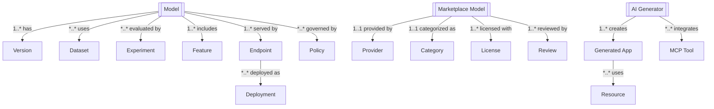

# AI System REST API Design Documentation

## Table of Contents
1. [Overview](#overview)
2. [Architecture](#architecture)
3. [Entity Model](#entity-model)
4. [Authentication & Authorization](#authentication--authorization)
5. [API Endpoints](#api-endpoints)
6. [Data Models](#data-models)
7. [AI Model Management](#ai-model-management)
8. [Training & Experimentation](#training--experimentation)
9. [Monitoring & Analytics](#monitoring--analytics)
10. [Error Handling](#error-handling)

## Overview

This document provides a comprehensive REST API design for the AI System - a platform for managing AI models, datasets, experiments, and deployments. The system includes AI catalog management, model marketplace, application generation, model comparison, and complete MLOps lifecycle management.

### Key Features
- AI Model Marketplace with categorized models from multiple providers
- Dataset management for various data types (text, image, audio, tabular)
- Experiment tracking and model training orchestration
- Model comparison and benchmarking capabilities
- AI-powered application generation with MCP tools
- Feature store management
- Model endpoint deployment and management
- Governance and compliance policies
- Complete provenance tracking and audit trail
- Cost optimization and performance monitoring

## Architecture

### System Components

```
┌─────────────────────────────────────────────────────────┐
│                   API Gateway                           │
├─────────────────────────────────────────────────────────┤
│              AI Orchestration Layer                     │
├──────────────────────┬──────────────────────────────────┤
│   Model Services     │     Data Services                │
├──────────────────────┼──────────────────────────────────┤
│ • Model Registry     │ • Dataset Management             │
│ • Model Training     │ • Feature Store                  │
│ • Model Serving      │ • Data Versioning                │
│ • Model Comparison   │ • Data Transformation            │
├──────────────────────┼──────────────────────────────────┤
│ Experiment Services  │    Generation Services           │
├──────────────────────┼──────────────────────────────────┤
│ • Experiment Tracking│ • App Generation                 │
│ • Hyperparameter Opt │ • Code Generation                │
│ • A/B Testing        │ • Architecture Design            │
│ • Model Evaluation   │ • MCP Tool Integration           │
├──────────────────────┼──────────────────────────────────┤
│ Marketplace Services │    Governance Services           │
├──────────────────────┼──────────────────────────────────┤
│ • Model Marketplace  │ • Policy Management              │
│ • Provider Integration│ • Compliance Tracking            │
│ • Licensing         │ • Provenance Recording            │
│ • Billing           │ • Audit Logging                   │
├──────────────────────┴──────────────────────────────────┤
│              Infrastructure Services                    │
├──────────────────────────────────────────────────────────┤
│ • Compute Resources  │ • Storage Services               │
│ • GPU Management     │ • Monitoring & Alerting          │
└─────────────────────────────────────────────────────────┘
```

### Service Hierarchy

```
AI System
├── AI Catalog
│   ├── Models
│   ├── Datasets
│   ├── Experiments
│   ├── Pipelines
│   ├── Feature Sets
│   └── Endpoints
├── Model Marketplace
│   ├── Company Models
│   ├── Categories
│   ├── Providers
│   └── Licensing
├── AI Generator
│   ├── Application Generation
│   ├── MCP Tool Integration
│   ├── Code Generation
│   └── Architecture Design
├── Model Management
│   ├── Model Registry
│   ├── Model Versioning
│   ├── Model Comparison
│   └── Model Deployment
├── Training & Experimentation
│   ├── Training Jobs
│   ├── Hyperparameter Tuning
│   ├── Experiment Tracking
│   └── Model Evaluation
├── Data Management
│   ├── Dataset Registry
│   ├── Feature Engineering
│   ├── Data Versioning
│   └── Data Transformation
└── Governance & Compliance
    ├── Policies
    ├── Provenance
    ├── Audit Trail
    └── Compliance
```

## Entity Model

### Core Entities and Relationships



Legend: 1 = one, * = many, 1..* = one-to-many, *..* = many-to-many, 1..1 = one-to-one

| From             | Relationship   | To            | Cardinality |
|------------------|----------------|---------------|-------------|
| Model            | has            | Version       | 1..*        |
| Model            | uses           | Dataset       | *..*        |
| Model            | evaluated by   | Experiment    | *..*        |
| Model            | includes       | Feature       | 1..*        |
| Model            | served by      | Endpoint      | 1..*        |
| Endpoint         | deployed as    | Deployment    | *..*        |
| Model            | governed by    | Policy        | *..*        |
| Marketplace Model| provided by    | Provider      | 1..1        |
| Marketplace Model| categorized as | Category      | 1..1        |
| Marketplace Model| licensed with  | License       | 1..*        |
| Marketplace Model| reviewed by    | Review        | 1..*        |
| AI Generator     | creates        | Generated App | 1..*        |
| AI Generator     | integrates     | MCP Tool      | *..*        |
| Generated App    | uses           | Resource      | *..*        |

### Entity Hierarchy

1. **AI Model** (Core Entity)
   - Central entity for all AI models
   - Versioning and lifecycle management
   - Training configuration and metrics

2. **Dataset** (Data Entity)
   - Various data types (text, image, audio, tabular)
   - Version control and lineage
   - Privacy and compliance metadata

3. **Experiment** (Training Entity)
   - Training runs and results
   - Hyperparameter tracking
   - Model evaluation metrics

4. **Pipeline** (Workflow Entity)
   - Data processing pipelines
   - Training pipelines
   - Deployment pipelines

5. **Endpoint** (Serving Entity)
   - Model serving configuration
   - API endpoints
   - Load balancing and scaling

6. **Policy** (Governance Entity)
   - Access control policies
   - Data governance rules
   - Compliance requirements

## Authentication & Authorization

### Authentication Flow

```
POST /api/v1/auth/login
Authorization: Bearer {token}
X-API-Key: {api-key} (for programmatic access)
X-Model-Key: {model-key} (for model serving)
```

### Authorization Model

```json
{
  "authorization": {
    "type": "RBAC + ABAC",
    "roles": {
      "ml_engineer": ["model:*", "dataset:*", "experiment:*"],
      "data_scientist": ["model:read", "dataset:*", "experiment:write"],
      "ml_ops": ["endpoint:*", "deployment:*", "monitoring:*"],
      "data_engineer": ["dataset:*", "feature:*", "pipeline:*"],
      "business_user": ["model:read", "endpoint:read", "report:*"]
    },
    "attributes": {
      "department": "string",
      "project": "string",
      "clearance_level": "integer",
      "cost_center": "string"
    }
  }
}
```

## API Endpoints

### Base URL
```
https://api.ai-system.example.com/v1
```

### AI Catalog - Models

```
# Model Management
GET    /catalog/models                         # List all models
GET    /catalog/models/{modelId}              # Get model details
POST   /catalog/models                        # Register new model
PUT    /catalog/models/{modelId}              # Update model
DELETE /catalog/models/{modelId}              # Delete model
PATCH  /catalog/models/{modelId}/status       # Update model status

# Model Versions
GET    /catalog/models/{modelId}/versions     # List model versions
GET    /catalog/models/{modelId}/versions/{version} # Get version details
POST   /catalog/models/{modelId}/versions     # Create new version
PUT    /catalog/models/{modelId}/versions/{version} # Update version
POST   /catalog/models/{modelId}/versions/{version}/promote # Promote version
POST   /catalog/models/{modelId}/rollback     # Rollback to previous version

# Model Metadata
GET    /catalog/models/{modelId}/metadata     # Get model metadata
PUT    /catalog/models/{modelId}/metadata     # Update metadata
GET    /catalog/models/{modelId}/metrics      # Get model metrics
GET    /catalog/models/{modelId}/lineage      # Get model lineage

# Model Comparison
POST   /catalog/models/compare                # Compare multiple models
GET    /catalog/models/compare/{comparisonId} # Get comparison results
POST   /catalog/models/benchmark              # Run benchmark
GET    /catalog/models/rankings               # Get model rankings

# Model Search
GET    /catalog/models/search?q={query}       # Search models
POST   /catalog/models/filter                 # Advanced filtering
GET    /catalog/models/recommended            # Get recommendations
GET    /catalog/models/trending               # Get trending models
```

### AI Catalog - Datasets

```
# Dataset Management
GET    /catalog/datasets                      # List all datasets
GET    /catalog/datasets/{datasetId}         # Get dataset details
POST   /catalog/datasets                      # Create dataset
PUT    /catalog/datasets/{datasetId}         # Update dataset
DELETE /catalog/datasets/{datasetId}         # Delete dataset

# Dataset Versions
GET    /catalog/datasets/{datasetId}/versions # List versions
POST   /catalog/datasets/{datasetId}/versions # Create version
GET    /catalog/datasets/{datasetId}/versions/{version} # Get version

# Dataset Operations
POST   /catalog/datasets/{datasetId}/upload   # Upload data
GET    /catalog/datasets/{datasetId}/download # Download data
POST   /catalog/datasets/{datasetId}/split    # Split dataset
POST   /catalog/datasets/{datasetId}/transform # Transform dataset
POST   /catalog/datasets/{datasetId}/validate # Validate dataset

# Dataset Analysis
GET    /catalog/datasets/{datasetId}/statistics # Get statistics
GET    /catalog/datasets/{datasetId}/profile   # Get data profile
GET    /catalog/datasets/{datasetId}/quality   # Get quality metrics
POST   /catalog/datasets/{datasetId}/analyze   # Run analysis

# Dataset Sharing
POST   /catalog/datasets/{datasetId}/share    # Share dataset
GET    /catalog/datasets/{datasetId}/access   # Get access list
PUT    /catalog/datasets/{datasetId}/access   # Update access
```

### AI Catalog - Experiments

```
# Experiment Management
GET    /catalog/experiments                   # List experiments
GET    /catalog/experiments/{experimentId}    # Get experiment details
POST   /catalog/experiments                   # Create experiment
PUT    /catalog/experiments/{experimentId}    # Update experiment
DELETE /catalog/experiments/{experimentId}    # Delete experiment

# Experiment Runs
POST   /catalog/experiments/{experimentId}/runs # Start run
GET    /catalog/experiments/{experimentId}/runs # List runs
GET    /catalog/experiments/runs/{runId}      # Get run details
POST   /catalog/experiments/runs/{runId}/stop # Stop run
GET    /catalog/experiments/runs/{runId}/logs # Get run logs
GET    /catalog/experiments/runs/{runId}/metrics # Get run metrics

# Hyperparameter Optimization
POST   /catalog/experiments/{experimentId}/optimize # Start optimization
GET    /catalog/experiments/{experimentId}/trials # Get trials
GET    /catalog/experiments/{experimentId}/best-params # Get best params

# Experiment Comparison
POST   /catalog/experiments/compare           # Compare experiments
GET    /catalog/experiments/leaderboard       # Get leaderboard
```

### AI Catalog - Pipelines

```
# Pipeline Management
GET    /catalog/pipelines                     # List pipelines
GET    /catalog/pipelines/{pipelineId}       # Get pipeline details
POST   /catalog/pipelines                     # Create pipeline
PUT    /catalog/pipelines/{pipelineId}       # Update pipeline
DELETE /catalog/pipelines/{pipelineId}       # Delete pipeline

# Pipeline Execution
POST   /catalog/pipelines/{pipelineId}/run   # Run pipeline
POST   /catalog/pipelines/{pipelineId}/schedule # Schedule pipeline
GET    /catalog/pipelines/{pipelineId}/runs  # Get pipeline runs
POST   /catalog/pipelines/{pipelineId}/stop  # Stop pipeline

# Pipeline Components
GET    /catalog/pipelines/{pipelineId}/components # List components
POST   /catalog/pipelines/{pipelineId}/components # Add component
PUT    /catalog/pipelines/{pipelineId}/components/{componentId} # Update
DELETE /catalog/pipelines/{pipelineId}/components/{componentId} # Remove

# Pipeline Monitoring
GET    /catalog/pipelines/{pipelineId}/status # Get status
GET    /catalog/pipelines/{pipelineId}/metrics # Get metrics
GET    /catalog/pipelines/{pipelineId}/logs  # Get logs
```

### AI Catalog - Feature Sets

```
# Feature Set Management
GET    /catalog/features                      # List feature sets
GET    /catalog/features/{featureSetId}      # Get feature set details
POST   /catalog/features                      # Create feature set
PUT    /catalog/features/{featureSetId}      # Update feature set
DELETE /catalog/features/{featureSetId}      # Delete feature set

# Feature Engineering
POST   /catalog/features/{featureSetId}/compute # Compute features
POST   /catalog/features/{featureSetId}/transform # Transform features
GET    /catalog/features/{featureSetId}/statistics # Get statistics
POST   /catalog/features/{featureSetId}/validate # Validate features

# Feature Store
POST   /catalog/features/{featureSetId}/store # Store features
GET    /catalog/features/{featureSetId}/retrieve # Retrieve features
POST   /catalog/features/{featureSetId}/materialize # Materialize features
GET    /catalog/features/{featureSetId}/lineage # Get lineage
```

### AI Catalog - Endpoints

```
# Endpoint Management
GET    /catalog/endpoints                     # List endpoints
GET    /catalog/endpoints/{endpointId}       # Get endpoint details
POST   /catalog/endpoints                     # Create endpoint
PUT    /catalog/endpoints/{endpointId}       # Update endpoint
DELETE /catalog/endpoints/{endpointId}       # Delete endpoint

# Endpoint Deployment
POST   /catalog/endpoints/{endpointId}/deploy # Deploy model
POST   /catalog/endpoints/{endpointId}/undeploy # Undeploy model
GET    /catalog/endpoints/{endpointId}/status # Get status
POST   /catalog/endpoints/{endpointId}/scale # Scale endpoint

# Endpoint Monitoring
GET    /catalog/endpoints/{endpointId}/metrics # Get metrics
GET    /catalog/endpoints/{endpointId}/health # Health check
GET    /catalog/endpoints/{endpointId}/logs  # Get logs
POST   /catalog/endpoints/{endpointId}/test  # Test endpoint

# Endpoint Inference
POST   /catalog/endpoints/{endpointId}/predict # Make prediction
POST   /catalog/endpoints/{endpointId}/batch-predict # Batch prediction
GET    /catalog/endpoints/{endpointId}/explain # Get explanation
```

### Model Marketplace

```
# Marketplace Models
GET    /marketplace/models                    # List marketplace models
GET    /marketplace/models/{modelId}         # Get model details
POST   /marketplace/models                    # Publish model
PUT    /marketplace/models/{modelId}         # Update listing
DELETE /marketplace/models/{modelId}         # Remove listing

# Categories & Providers
GET    /marketplace/categories                # List categories
GET    /marketplace/categories/{category}/models # Models by category
GET    /marketplace/providers                 # List providers
GET    /marketplace/providers/{provider}/models # Models by provider

# Search & Discovery
GET    /marketplace/search?q={query}          # Search marketplace
GET    /marketplace/trending                  # Trending models
GET    /marketplace/featured                  # Featured models
GET    /marketplace/new                       # New models
GET    /marketplace/popular                   # Popular models

# Reviews & Ratings
GET    /marketplace/models/{modelId}/reviews  # Get reviews
POST   /marketplace/models/{modelId}/reviews  # Add review
PUT    /marketplace/models/{modelId}/reviews/{reviewId} # Update review
DELETE /marketplace/models/{modelId}/reviews/{reviewId} # Delete review
POST   /marketplace/models/{modelId}/rate     # Rate model

# Licensing & Pricing
GET    /marketplace/models/{modelId}/license  # Get license info
GET    /marketplace/models/{modelId}/pricing  # Get pricing
POST   /marketplace/models/{modelId}/subscribe # Subscribe to model
POST   /marketplace/models/{modelId}/purchase # Purchase model
GET    /marketplace/models/{modelId}/usage   # Get usage stats

# Favorites
GET    /marketplace/favorites                 # Get user favorites
POST   /marketplace/favorites/{modelId}      # Add to favorites
DELETE /marketplace/favorites/{modelId}      # Remove from favorites
```

### AI Generator

```
# Application Generation
POST   /generator/apps/generate               # Generate application
GET    /generator/apps                        # List generated apps
GET    /generator/apps/{appId}               # Get app details
PUT    /generator/apps/{appId}               # Update app
DELETE /generator/apps/{appId}               # Delete app

# Generation Process
POST   /generator/analyze-prompt              # Analyze prompt
GET    /generator/architectures               # Get architectures
POST   /generator/select-architecture         # Select architecture
GET    /generator/generation-status/{jobId}   # Get generation status

# MCP Tools
GET    /generator/mcp-tools                   # List MCP tools
GET    /generator/mcp-tools/{toolId}         # Get tool details
POST   /generator/mcp-tools/configure        # Configure tools
POST   /generator/mcp-tools/integrate        # Integrate tools

# App Types & Templates
GET    /generator/app-types                   # List app types
GET    /generator/templates                   # List templates
GET    /generator/templates/{templateId}     # Get template
POST   /generator/templates/{templateId}/apply # Apply template

# Code Generation
POST   /generator/code/generate               # Generate code
POST   /generator/code/optimize               # Optimize code
POST   /generator/code/test                   # Generate tests
POST   /generator/code/documentation          # Generate docs

# Deployment
POST   /generator/apps/{appId}/deploy         # Deploy app
GET    /generator/apps/{appId}/deployment-status # Get status
POST   /generator/apps/{appId}/configure     # Configure deployment
GET    /generator/apps/{appId}/resources     # Get resource requirements

# AI Capabilities
GET    /generator/capabilities                # List AI capabilities
POST   /generator/capabilities/enable        # Enable capability
POST   /generator/capabilities/configure     # Configure capability
GET    /generator/capabilities/{capabilityId}/status # Get status
```

### Training & Fine-tuning

```
# Training Jobs
GET    /training/jobs                         # List training jobs
GET    /training/jobs/{jobId}                # Get job details
POST   /training/jobs                         # Create training job
PUT    /training/jobs/{jobId}                # Update job
DELETE /training/jobs/{jobId}                # Cancel job

# Training Execution
POST   /training/jobs/{jobId}/start          # Start training
POST   /training/jobs/{jobId}/pause          # Pause training
POST   /training/jobs/{jobId}/resume         # Resume training
POST   /training/jobs/{jobId}/stop           # Stop training

# Training Configuration
GET    /training/jobs/{jobId}/config         # Get configuration
PUT    /training/jobs/{jobId}/config         # Update configuration
GET    /training/jobs/{jobId}/hyperparameters # Get hyperparameters
PUT    /training/jobs/{jobId}/hyperparameters # Update hyperparameters

# Training Monitoring
GET    /training/jobs/{jobId}/metrics        # Get metrics
GET    /training/jobs/{jobId}/logs           # Get logs
GET    /training/jobs/{jobId}/checkpoints    # List checkpoints
POST   /training/jobs/{jobId}/checkpoints/{checkpoint}/restore # Restore

# Fine-tuning
POST   /training/fine-tune                    # Start fine-tuning
GET    /training/fine-tune/{jobId}           # Get fine-tuning status
POST   /training/fine-tune/{jobId}/evaluate  # Evaluate fine-tuned model
```

### Model Comparison & Benchmarking

```
# Model Comparison
POST   /comparison/compare                    # Compare models
GET    /comparison/{comparisonId}            # Get comparison results
POST   /comparison/metrics                    # Define metrics
GET    /comparison/metrics                    # List metrics

# Benchmarking
POST   /benchmark/run                         # Run benchmark
GET    /benchmark/{benchmarkId}              # Get benchmark results
GET    /benchmark/leaderboard                # Get leaderboard
POST   /benchmark/submit                      # Submit to benchmark

# Performance Analysis
GET    /analysis/performance/{modelId}       # Get performance analysis
POST   /analysis/cost-efficiency             # Analyze cost efficiency
POST   /analysis/inference-speed             # Analyze inference speed
GET    /analysis/insights                    # Get insights

# Model Scoring
POST   /scoring/calculate                     # Calculate scores
GET    /scoring/{modelId}                    # Get model scores
GET    /scoring/rankings                      # Get rankings
POST   /scoring/custom                        # Custom scoring
```

### Governance & Compliance

```
# Policy Management
GET    /governance/policies                   # List policies
GET    /governance/policies/{policyId}       # Get policy details
POST   /governance/policies                   # Create policy
PUT    /governance/policies/{policyId}       # Update policy
DELETE /governance/policies/{policyId}       # Delete policy

# Policy Enforcement
POST   /governance/policies/{policyId}/enforce # Enforce policy
GET    /governance/policies/{policyId}/violations # Get violations
POST   /governance/policies/{policyId}/evaluate # Evaluate compliance

# Provenance Tracking
GET    /governance/provenance                 # Get provenance records
GET    /governance/provenance/{artifactId}   # Get artifact provenance
POST   /governance/provenance/query          # Query provenance
GET    /governance/provenance/lineage/{id}   # Get lineage graph

# Audit Trail
GET    /governance/audit                      # Get audit logs
GET    /governance/audit/{entityId}          # Get entity audit trail
POST   /governance/audit/search              # Search audit logs
GET    /governance/audit/report              # Generate audit report

# Compliance
GET    /governance/compliance/status          # Get compliance status
POST   /governance/compliance/assess         # Assess compliance
GET    /governance/compliance/certifications  # List certifications
POST   /governance/compliance/certify         # Request certification
```

### Monitoring & Analytics

```
# Performance Monitoring
GET    /monitoring/metrics                    # Get all metrics
GET    /monitoring/metrics/models            # Model metrics
GET    /monitoring/metrics/endpoints         # Endpoint metrics
GET    /monitoring/metrics/infrastructure    # Infrastructure metrics

# Cost Analytics
GET    /analytics/costs                       # Get cost breakdown
GET    /analytics/costs/models               # Model costs
GET    /analytics/costs/forecast              # Cost forecast
POST   /analytics/costs/optimize              # Get optimization suggestions

# Usage Analytics
GET    /analytics/usage                       # Usage statistics
GET    /analytics/usage/models               # Model usage
GET    /analytics/usage/datasets             # Dataset usage
GET    /analytics/usage/trends                # Usage trends

# Quality Metrics
GET    /analytics/quality                     # Quality metrics
GET    /analytics/quality/accuracy           # Accuracy metrics
GET    /analytics/quality/drift               # Data/model drift
GET    /analytics/quality/fairness           # Fairness metrics

# Alerting
GET    /monitoring/alerts                     # List alerts
POST   /monitoring/alerts                     # Create alert
PUT    /monitoring/alerts/{alertId}          # Update alert
DELETE /monitoring/alerts/{alertId}          # Delete alert
POST   /monitoring/alerts/{alertId}/acknowledge # Acknowledge alert
```

## Data Models

### AI Model

```json
{
  "id": "model_123",
  "name": "Customer Sentiment Analyzer",
  "type": "NLP",
  "category": "Natural Language Processing",
  "framework": "PyTorch",
  "architecture": "Transformer-based",
  "version": "2.1.0",
  "status": "active",
  "deploymentType": "cloud",
  "createdAt": "2024-01-01T00:00:00Z",
  "updatedAt": "2024-01-20T00:00:00Z",
  "createdBy": "user_456",
  "parameters": 125000000,
  "contextLength": 8192,
  "capabilities": [
    "sentiment_analysis",
    "emotion_detection",
    "aspect_extraction"
  ],
  "metadata": {
    "description": "Advanced sentiment analysis model for customer feedback",
    "tags": ["nlp", "sentiment", "customer", "production"],
    "documentation": "https://docs.example.com/models/sentiment",
    "paper": "https://arxiv.org/abs/example",
    "license": "Apache-2.0"
  },
  "training": {
    "dataset": "dataset_789",
    "epochs": 50,
    "batchSize": 32,
    "learningRate": 0.001,
    "optimizer": "Adam",
    "loss": "CrossEntropy",
    "trainingTime": "48 hours",
    "computeResources": {
      "gpu": "4x NVIDIA A100",
      "memory": "320GB",
      "storage": "2TB"
    }
  },
  "performance": {
    "accuracy": 0.945,
    "precision": 0.932,
    "recall": 0.928,
    "f1Score": 0.930,
    "latency": {
      "p50": 45,
      "p95": 120,
      "p99": 250
    },
    "throughput": 1000
  },
  "pricing": {
    "model": "per_request",
    "inputTokens": 0.000002,
    "outputTokens": 0.000004,
    "fixedCost": 0,
    "currency": "USD"
  },
  "deployment": {
    "endpoints": ["endpoint_123", "endpoint_456"],
    "replicas": 3,
    "autoScaling": true,
    "minReplicas": 1,
    "maxReplicas": 10,
    "targetUtilization": 70
  }
}
```

### Dataset

```json
{
  "id": "dataset_789",
  "name": "Customer Feedback Dataset",
  "type": "Text",
  "format": "JSON",
  "size": 1258291200,
  "recordCount": 500000,
  "version": "3.2.0",
  "status": "available",
  "createdAt": "2023-01-15T00:00:00Z",
  "updatedAt": "2024-01-20T00:00:00Z",
  "createdBy": "user_123",
  "schema": {
    "fields": [
      {
        "name": "text",
        "type": "string",
        "nullable": false
      },
      {
        "name": "sentiment",
        "type": "string",
        "nullable": false,
        "values": ["positive", "negative", "neutral"]
      },
      {
        "name": "timestamp",
        "type": "datetime",
        "nullable": false
      }
    ]
  },
  "statistics": {
    "nullValues": 0.02,
    "duplicates": 0.05,
    "outliers": 0.01,
    "classDistribution": {
      "positive": 0.45,
      "negative": 0.30,
      "neutral": 0.25
    }
  },
  "quality": {
    "completeness": 0.98,
    "consistency": 0.95,
    "accuracy": 0.97,
    "validity": 0.96
  },
  "splits": {
    "train": 0.7,
    "validation": 0.15,
    "test": 0.15
  },
  "privacy": {
    "containsPII": true,
    "anonymized": true,
    "encryptionType": "AES-256",
    "compliance": ["GDPR", "CCPA"]
  },
  "storage": {
    "location": "s3://datasets/customer-feedback/",
    "compression": "gzip",
    "partitioning": "date",
    "retention": "2 years"
  },
  "metadata": {
    "source": "Customer Support System",
    "collection_period": "2023-01-01 to 2023-12-31",
    "languages": ["en", "es", "fr"],
    "tags": ["customer", "feedback", "sentiment", "production"]
  }
}
```

### Experiment

```json
{
  "id": "experiment_456",
  "name": "Sentiment Model Hyperparameter Tuning",
  "modelId": "model_123",
  "datasetId": "dataset_789",
  "status": "completed",
  "type": "hyperparameter_optimization",
  "objective": "maximize_accuracy",
  "createdAt": "2024-01-15T00:00:00Z",
  "startedAt": "2024-01-15T10:00:00Z",
  "completedAt": "2024-01-18T15:30:00Z",
  "duration": "77.5 hours",
  "configuration": {
    "searchSpace": {
      "learning_rate": {
        "type": "float",
        "min": 0.0001,
        "max": 0.01,
        "scale": "log"
      },
      "batch_size": {
        "type": "choice",
        "values": [16, 32, 64, 128]
      },
      "dropout": {
        "type": "float",
        "min": 0.1,
        "max": 0.5
      }
    },
    "strategy": "bayesian_optimization",
    "maxTrials": 50,
    "parallelTrials": 4,
    "earlyStopping": {
      "enabled": true,
      "patience": 5,
      "minDelta": 0.001
    }
  },
  "bestTrial": {
    "id": "trial_23",
    "parameters": {
      "learning_rate": 0.0023,
      "batch_size": 32,
      "dropout": 0.25
    },
    "metrics": {
      "accuracy": 0.952,
      "loss": 0.134,
      "validationAccuracy": 0.945
    }
  },
  "trials": [
    {
      "id": "trial_1",
      "status": "completed",
      "parameters": {
        "learning_rate": 0.001,
        "batch_size": 64,
        "dropout": 0.3
      },
      "metrics": {
        "accuracy": 0.938,
        "loss": 0.156
      }
    }
  ],
  "resources": {
    "totalGpuHours": 308,
    "totalCost": 462.50,
    "peakMemory": "120GB",
    "computeType": "ml.p3.8xlarge"
  },
  "artifacts": {
    "bestModel": "s3://experiments/exp_456/best_model.pt",
    "logs": "s3://experiments/exp_456/logs/",
    "visualizations": "s3://experiments/exp_456/plots/",
    "report": "s3://experiments/exp_456/report.html"
  }
}
```

### Marketplace Model

```json
{
  "id": "market_model_123",
  "name": "SmartVision AI",
  "category": "Computer Vision",
  "provider": {
    "id": "provider_456",
    "name": "AI Solutions Inc.",
    "verified": true,
    "rating": 4.8,
    "totalModels": 15
  },
  "version": "3.2.1",
  "releaseDate": "2024-01-15",
  "lastUpdated": "2024-01-20",
  "status": "available",
  "visibility": "public",
  "description": "Advanced computer vision model for object detection and image classification",
  "features": [
    "Object detection",
    "Image segmentation",
    "Real-time processing",
    "Multi-language support"
  ],
  "specifications": {
    "accuracy": 0.96,
    "speed": "50 FPS",
    "modelSize": "450MB",
    "supportedFormats": ["JPEG", "PNG", "BMP", "TIFF"],
    "minInputSize": "224x224",
    "maxInputSize": "4096x4096"
  },
  "pricing": {
    "model": "subscription",
    "tiers": [
      {
        "name": "Basic",
        "price": 299,
        "requests": 10000,
        "features": ["Standard processing"]
      },
      {
        "name": "Pro",
        "price": 499,
        "requests": 50000,
        "features": ["Priority processing", "Custom models"]
      },
      {
        "name": "Enterprise",
        "price": "Contact",
        "requests": "Unlimited",
        "features": ["Dedicated support", "SLA", "On-premise"]
      }
    ],
    "currency": "USD",
    "billing": "monthly"
  },
  "ratings": {
    "overall": 4.7,
    "performance": 4.8,
    "accuracy": 4.9,
    "easeOfUse": 4.5,
    "support": 4.6,
    "value": 4.7,
    "reviewCount": 128
  },
  "usage": {
    "totalDownloads": 5432,
    "activeUsers": 892,
    "totalRequests": 12500000,
    "averageLatency": 45
  },
  "license": {
    "type": "Commercial",
    "restrictions": ["No redistribution", "Attribution required"],
    "commercialUse": true,
    "modificationAllowed": false
  },
  "support": {
    "documentation": "https://docs.example.com/smartvision",
    "email": "support@aisolutions.com",
    "responseTime": "24 hours",
    "languages": ["English", "Spanish", "Chinese"]
  },
  "tags": ["computer-vision", "object-detection", "production-ready", "enterprise"],
  "badges": ["popular", "verified", "trending"]
}
```

### Generated Application

```json
{
  "id": "gen_app_789",
  "name": "Customer Analytics Dashboard",
  "description": "Real-time monitoring dashboard with intelligent alerts and predictive analytics",
  "type": "Dashboard",
  "status": "ready_to_deploy",
  "generatedAt": "2024-01-20T10:00:00Z",
  "generationTime": "3 minutes 45 seconds",
  "prompt": "Create a dashboard for monitoring customer behavior with ML insights",
  "configuration": {
    "appType": "dashboard",
    "framework": "Vue.js",
    "backend": "Node.js",
    "database": "PostgreSQL",
    "styling": "Tailwind CSS"
  },
  "features": [
    "Real-time data visualization",
    "Predictive analytics",
    "Anomaly detection",
    "Custom alerts",
    "Export functionality"
  ],
  "architecture": {
    "pattern": "microservices",
    "components": [
      {
        "name": "Frontend",
        "technology": "Vue.js",
        "description": "Responsive dashboard UI"
      },
      {
        "name": "API Gateway",
        "technology": "Express.js",
        "description": "RESTful API service"
      },
      {
        "name": "Analytics Engine",
        "technology": "Python/Pandas",
        "description": "Data processing and ML"
      },
      {
        "name": "Cache Layer",
        "technology": "Redis",
        "description": "Performance optimization"
      }
    ]
  },
  "mcpTools": [
    {
      "id": "database",
      "name": "Database Connector",
      "configuration": {
        "type": "PostgreSQL",
        "poolSize": 10
      }
    },
    {
      "id": "ai",
      "name": "AI/ML Services",
      "configuration": {
        "models": ["anomaly_detection", "forecasting"]
      }
    },
    {
      "id": "notifications",
      "name": "Notifications",
      "configuration": {
        "channels": ["email", "slack", "webhook"]
      }
    }
  ],
  "resources": {
    "estimatedCost": {
      "development": 0,
      "monthly": 150,
      "perRequest": 0.001
    },
    "requirements": {
      "cpu": "2 cores",
      "memory": "4GB",
      "storage": "20GB",
      "bandwidth": "100GB/month"
    },
    "scaling": {
      "autoScale": true,
      "minInstances": 1,
      "maxInstances": 10,
      "targetCpuUtilization": 70
    }
  },
  "deployment": {
    "estimatedTime": "5-10 minutes",
    "platforms": ["AWS", "Azure", "GCP", "On-premise"],
    "containerized": true,
    "orchestration": "Kubernetes",
    "cicd": {
      "pipeline": "GitHub Actions",
      "stages": ["build", "test", "deploy"]
    }
  },
  "code": {
    "repository": "https://github.com/generated/customer-analytics",
    "language": "JavaScript/TypeScript",
    "linesOfCode": 12500,
    "testCoverage": 85,
    "documentation": true
  },
  "aiCapabilities": {
    "codeGeneration": {
      "completeness": 0.95,
      "quality": 0.92
    },
    "optimization": {
      "performance": "optimized",
      "security": "hardened"
    },
    "testing": {
      "unitTests": true,
      "integrationTests": true,
      "e2eTests": false
    }
  }
}
```

### Model Comparison Result

```json
{
  "id": "comparison_123",
  "models": [
    {
      "modelId": "model_1",
      "modelName": "GPT-4",
      "overallScore": 92.5
    },
    {
      "modelId": "model_2",
      "modelName": "Claude-3",
      "overallScore": 90.8
    },
    {
      "modelId": "model_3",
      "modelName": "Llama-2",
      "overallScore": 85.3
    }
  ],
  "metrics": [
    {
      "key": "performance",
      "label": "Performance",
      "weight": 0.25,
      "scores": {
        "model_1": 95,
        "model_2": 92,
        "model_3": 88
      }
    },
    {
      "key": "cost_efficiency",
      "label": "Cost Efficiency",
      "weight": 0.20,
      "scores": {
        "model_1": 75,
        "model_2": 85,
        "model_3": 95
      }
    },
    {
      "key": "context_size",
      "label": "Context Size",
      "weight": 0.15,
      "scores": {
        "model_1": 100,
        "model_2": 95,
        "model_3": 70
      }
    },
    {
      "key": "capabilities",
      "label": "Capabilities",
      "weight": 0.20,
      "scores": {
        "model_1": 98,
        "model_2": 95,
        "model_3": 85
      }
    },
    {
      "key": "deployment_flexibility",
      "label": "Deployment Flexibility",
      "weight": 0.10,
      "scores": {
        "model_1": 90,
        "model_2": 85,
        "model_3": 95
      }
    },
    {
      "key": "reliability",
      "label": "Reliability",
      "weight": 0.10,
      "scores": {
        "model_1": 95,
        "model_2": 92,
        "model_3": 88
      }
    }
  ],
  "rankings": {
    "model_1": {
      "overall": 1,
      "performance": 1,
      "cost_efficiency": 3,
      "context_size": 1,
      "capabilities": 1,
      "deployment_flexibility": 2,
      "reliability": 1
    },
    "model_2": {
      "overall": 2,
      "performance": 2,
      "cost_efficiency": 2,
      "context_size": 2,
      "capabilities": 2,
      "deployment_flexibility": 3,
      "reliability": 2
    },
    "model_3": {
      "overall": 3,
      "performance": 3,
      "cost_efficiency": 1,
      "context_size": 3,
      "capabilities": 3,
      "deployment_flexibility": 1,
      "reliability": 3
    }
  },
  "insights": [
    "GPT-4 has the highest overall score of 92.5",
    "Llama-2 offers the best cost efficiency",
    "GPT-4 has the largest context window",
    "All models show strong performance metrics above 85"
  ],
  "recommendations": {
    "bestOverall": "model_1",
    "bestValue": "model_3",
    "bestPerformance": "model_1",
    "mostFlexible": "model_3"
  },
  "timestamp": "2024-01-20T10:00:00Z"
}
```

## AI Model Management

### Model Lifecycle

```
Development → Training → Validation → Deployment → Monitoring → Retirement
```

### Model Versioning Strategy

1. **Semantic Versioning**: MAJOR.MINOR.PATCH
   - MAJOR: Breaking changes
   - MINOR: New features, backward compatible
   - PATCH: Bug fixes

2. **Git-based Versioning**: Track with git commits
3. **Experiment-based**: Link to experiment runs
4. **Date-based**: YYYY-MM-DD format

### Model Registry

Centralized repository for:
- Model artifacts
- Metadata
- Performance metrics
- Deployment history
- Access control

## Training & Experimentation

### Training Pipeline

```yaml
stages:
  - data_preparation:
      - load_dataset
      - preprocess
      - augmentation
      - split
  
  - model_training:
      - initialize_model
      - train
      - validate
      - checkpoint
  
  - evaluation:
      - test
      - calculate_metrics
      - generate_report
  
  - registration:
      - save_model
      - register_metadata
      - update_lineage
```

### Hyperparameter Optimization

Supported strategies:
- Grid Search
- Random Search
- Bayesian Optimization
- Genetic Algorithms
- Population-based Training

## Monitoring & Analytics

### Key Performance Indicators

1. **Model Performance**
   - Accuracy, Precision, Recall, F1
   - Latency (p50, p95, p99)
   - Throughput (requests/second)

2. **Business Metrics**
   - Cost per prediction
   - ROI
   - User satisfaction

3. **Operational Metrics**
   - Uptime/Availability
   - Error rate
   - Resource utilization

4. **Data Quality**
   - Data drift
   - Feature drift
   - Prediction drift

### Alerting Framework

```json
{
  "alerts": [
    {
      "name": "Model Performance Degradation",
      "condition": "accuracy < baseline - 0.05",
      "severity": "high",
      "action": "trigger_retraining"
    },
    {
      "name": "High Latency",
      "condition": "p95_latency > 500ms",
      "severity": "medium",
      "action": "scale_up"
    },
    {
      "name": "Data Drift Detected",
      "condition": "drift_score > 0.3",
      "severity": "medium",
      "action": "notify_data_team"
    }
  ]
}
```

## Error Handling

### Error Response Format

```json
{
  "error": {
    "code": "MODEL_NOT_FOUND",
    "message": "The specified model does not exist",
    "details": {
      "modelId": "model_999",
      "timestamp": "2024-01-20T15:30:00Z"
    },
    "requestId": "req_abc123xyz",
    "documentation": "https://api.ai-system.example.com/docs/errors#MODEL_NOT_FOUND"
  }
}
```

### Error Codes

```
# Model Errors
MODEL_001: Model not found
MODEL_002: Model version conflict
MODEL_003: Model deployment failed
MODEL_004: Model validation failed
MODEL_005: Model training failed

# Dataset Errors
DATA_001: Dataset not found
DATA_002: Data validation failed
DATA_003: Data transformation error
DATA_004: Insufficient data
DATA_005: Data privacy violation

# Training Errors
TRAIN_001: Training job failed
TRAIN_002: Insufficient resources
TRAIN_003: Hyperparameter invalid
TRAIN_004: Checkpoint corrupted
TRAIN_005: Early stopping triggered

# Inference Errors
INFER_001: Prediction failed
INFER_002: Input validation failed
INFER_003: Model timeout
INFER_004: Rate limit exceeded
INFER_005: Endpoint unavailable

# Generator Errors
GEN_001: Generation failed
GEN_002: Invalid prompt
GEN_003: Template not found
GEN_004: MCP tool error
GEN_005: Resource limit exceeded
```

## Security & Compliance

### Security Measures

1. **Data Security**
   - Encryption at rest and in transit
   - PII detection and masking
   - Access control and audit logging

2. **Model Security**
   - Model signing and verification
   - Adversarial attack detection
   - Input validation and sanitization

3. **API Security**
   - Rate limiting
   - API key management
   - OAuth 2.0 authentication

### Compliance Standards

- GDPR (Data Privacy)
- SOC 2 (Security)
- ISO 27001 (Information Security)
- HIPAA (Healthcare)
- FedRAMP (Government)

## Implementation Guidelines

### Best Practices

1. **Model Development**
   - Version control all artifacts
   - Document assumptions and limitations
   - Implement comprehensive testing
   - Monitor for bias and fairness

2. **Data Management**
   - Maintain data lineage
   - Implement data quality checks
   - Version datasets
   - Ensure privacy compliance

3. **Deployment**
   - Use blue-green deployments
   - Implement canary releases
   - Monitor performance continuously
   - Maintain rollback capability

4. **Operations**
   - Automate routine tasks
   - Implement comprehensive logging
   - Set up alerting and monitoring
   - Regular security audits

## Conclusion

This comprehensive REST API design for the AI System provides:

1. **Complete ML Lifecycle**: From data preparation to model deployment
2. **Model Marketplace**: Discovery and distribution platform
3. **AI-Powered Generation**: Application and code generation capabilities
4. **Advanced Analytics**: Model comparison and benchmarking
5. **Enterprise Features**: Governance, compliance, and security
6. **Scalability**: Designed for large-scale AI operations
7. **Flexibility**: Support for multiple frameworks and providers

The API enables organizations to build, train, deploy, and manage AI models at scale with enterprise-grade reliability, security, and compliance.