# Assets Platform REST API Design Documentation

## Document Change Log

### Version History

| Version | Date | Author | Changes | Breaking Changes |
|---------|------|---------|---------|------------------|
| 1.3.0 | 2025-01-03 | System | - Added pagination to all list endpoints<br>- Enhanced authentication specifications<br>- Standardized error response format<br>- Added document changelog section | No |
| 1.2.0 | 2025-08-28 | adrian | - Updated entity relationship diagrams<br>- Added descriptive matrices<br>- Enhanced documentation | No |
| 1.1.0 | 2025-08-27 | adrian | - Added initial API endpoints<br>- Defined core resources | No |
| 1.0.0 | 2025-08-27 | adrian | - Initial API design documentation | N/A |

### Upcoming Changes (Next Release)

- [ ] Add WebSocket support for real-time updates
- [ ] Implement GraphQL endpoint
- [ ] Add batch operations support
- [ ] Enhanced filtering capabilities

### Deprecation Notices

- None at this time

---

## Table of Contents
1. [Document Change Log](#document-change-log)
2. [Overview](#overview)
3. [Architecture](#architecture)
4. [Entity Model](#entity-model)
5. [Authentication & Authorization](#authentication--authorization)
6. [API Endpoints](#api-endpoints)
7. [Data Models](#data-models)
8. [Service Management](#service-management)
9. [Budget & Financial Management](#budget--financial-management)
10. [Federated Learning Operations](#federated-learning-operations)
11. [Testing & Workbench](#testing--workbench)
12. [Monitoring & Analytics](#monitoring--analytics)
13. [Error Handling](#error-handling)

## Overview

This document provides a comprehensive REST API design for the Assets Platform - a unified system for managing enterprise assets including service infrastructure, budget management, federated learning operations, testing workbench, and comprehensive monitoring capabilities. The platform supports distributed client management, multi-cluster operations, and complete financial governance.

### Key Features
- Service tree management with hierarchical relationships
- Budget planning and financial governance
- Distributed client management across multiple geographic zones
- Federated learning operations and model training
- Comprehensive testing workbench with A/B testing
- Performance monitoring and analytics
- Multi-cluster Kubernetes orchestration
- Real-time logging and execution tracking
- Chart data visualization and metrics
- Model versioning and lifecycle management

## Architecture

### System Components

```
┌─────────────────────────────────────────────────────────┐
│                   API Gateway                           │
├─────────────────────────────────────────────────────────┤
│             Asset Orchestration Layer                   │
├──────────────────────┬──────────────────────────────────┤
│  Service Management  │    Financial Management          │
├──────────────────────┼──────────────────────────────────┤
│ • Service Registry   │ • Budget Planning                │
│ • Service Tree       │ • Approval Workflows             │
│ • Load Balancing     │ • Cost Tracking                  │
│ • Job Orchestration  │ • Category Management            │
├──────────────────────┼──────────────────────────────────┤
│   Client Services    │    FL Operations                 │
├──────────────────────┼──────────────────────────────────┤
│ • Client Registry    │ • Training Execution             │
│ • Zone Management    │ • Model Aggregation              │
│ • Dataset Mapping    │ • Round Management               │
│ • Cluster Assignment │ • Performance Tracking           │
├──────────────────────┼──────────────────────────────────┤
│  Testing Services    │    Monitoring Services           │
├──────────────────────┼──────────────────────────────────┤
│ • Test Suites        │ • Log Aggregation                │
│ • Test Scenarios     │ • Metrics Collection             │
│ • A/B Testing        │ • Chart Visualization            │
│ • Performance Tests  │ • Alert Management               │
├──────────────────────┴──────────────────────────────────┤
│              Infrastructure Layer                       │
├──────────────────────────────────────────────────────────┤
│ • Kubernetes Clusters │ • Storage Services              │
│ • AI Zones           │ • Database Services              │
└─────────────────────────────────────────────────────────┘
```

### Service Hierarchy

```
Assets Platform
├── Service Infrastructure
│   ├── Service Tree
│   │   ├── API Gateway (Root)
│   │   ├── Auth Service
│   │   ├── User Service
│   │   ├── Notification Service
│   │   └── Worker Jobs
│   ├── Load Balancers
│   ├── Node Ports
│   └── Job Management
├── Financial Management
│   ├── Budget Planning
│   │   ├── Budget Categories
│   │   ├── Budget Approvers
│   │   └── Budget Alerts
│   ├── Cost Tracking
│   ├── Approval Workflows
│   └── Financial Reporting
├── Federated Learning
│   ├── Client Management
│   │   ├── Client Registry
│   │   ├── Dataset Assignment
│   │   └── Zone Allocation
│   ├── Training Operations
│   │   ├── Execution Management
│   │   ├── Round Coordination
│   │   └── Model Aggregation
│   └── Performance Monitoring
│       ├── Training Metrics
│       ├── Validation Scores
│       └── Bias Assessment
├── Testing Workbench
│   ├── Test Management
│   │   ├── Test Suites
│   │   ├── Test Scenarios
│   │   └── Test Reports
│   ├── A/B Testing
│   ├── Performance Testing
│   └── Integration Testing
└── Analytics & Monitoring
    ├── Log Management
    ├── Metrics Dashboard
    ├── Chart Visualization
    └── Alert System
```

## Entity Model

### Core Entities and Relationships

```mermaid
graph TD
  Service[[Service]] -- "1..* has child" --> ChildService[Child Service]
  Service -- "1..1 has type" --> Type[Type]
  Service -- "1..* runs" --> Job[Job]
  Service -- "*..* in" --> Namespace[Namespace]

  Budget[[Budget]] -- "1..* has" --> Category[Category]
  Budget -- "*..* approved by" --> Approver[Approver]
  Budget -- "*..* triggers" --> Alert[Alert]
  Budget -- "*..* notifies" --> Notification[Notification]

  Client[[Client]] -- "1..1 located at" --> Location[Location]
  Client -- "1..1 uses" --> Dataset[Dataset]
  Client -- "1..1 assigned to" --> AIZone[AI Zone]
  Client -- "1..* executes" --> Execution[Execution]
  Client -- "1..* has" --> TrainingRound[Training Round]

  Execution[[Execution]] -- "1..* has" --> LogEntry[Log Entry]
  Execution -- "1..* includes" --> Round[Round]
  Execution -- "1..* records" --> Metric[Metric]
  Execution -- "1..1 uses" --> Model[Model]

  TestSuite[[Test Suite]] -- "1..* includes" --> TestScenario[Test Scenario]
  TestSuite -- "1..* has" --> TestRun[Test Run]
  TestSuite -- "1..* produces" --> TestResult[Test Result]
  TestSuite -- "1..* generates" --> Report[Report]

  ChartData[[Chart Data]] -- "1..* uses" --> CDataset[Dataset]
  ChartData -- "*..* tracks" --> CMetric[Metric]
  ChartData -- "*..* contains" --> TimeSeries[Time Series]
```



Legend: 1 = one, * = many, 1..* = one-to-many, *..* = many-to-many, 1..1 = one-to-one

| From         | Relationship  | To             | Cardinality |
|--------------|---------------|----------------|-------------|
| Service      | has child     | Child Service  | 1..*        |
| Service      | has type      | Type           | 1..1        |
| Service      | runs          | Job            | 1..*        |
| Service      | in            | Namespace      | *..*        |
| Budget       | has           | Category       | 1..*        |
| Budget       | approved by   | Approver       | *..*        |
| Budget       | triggers      | Alert          | *..*        |
| Budget       | notifies      | Notification   | *..*        |
| Client       | located at    | Location       | 1..1        |
| Client       | uses          | Dataset        | 1..1        |
| Client       | assigned to   | AI Zone        | 1..1        |
| Client       | executes      | Execution      | 1..*        |
| Client       | has           | Training Round | 1..*        |
| Execution    | has           | Log Entry      | 1..*        |
| Execution    | includes      | Round          | 1..*        |
| Execution    | records       | Metric         | 1..*        |
| Execution    | uses          | Model          | 1..1        |
| Test Suite   | includes      | Test Scenario  | 1..*        |
| Test Suite   | has           | Test Run       | 1..*        |
| Test Suite   | produces      | Test Result    | 1..*        |
| Test Suite   | generates     | Report         | 1..*        |
| Chart Data   | uses          | Dataset        | 1..*        |
| Chart Data   | tracks        | Metric         | *..*        |
| Chart Data   | contains      | Time Series    | *..*        |

### Entity Hierarchy

1. **Service Infrastructure** (Foundation Level)
   - Microservices with parent-child relationships
   - Load balancers and node ports
   - Job orchestration

2. **Financial Management** (Governance Level)
   - Budget allocation and tracking
   - Approval hierarchies
   - Cost categories and notifications

3. **Federated Learning** (Operational Level)
   - Distributed client management
   - Multi-zone deployments
   - Training coordination

4. **Testing Platform** (Quality Level)
   - Comprehensive test suites
   - Performance benchmarking
   - A/B testing experiments

5. **Monitoring & Analytics** (Observability Level)
   - Real-time metrics
   - Log aggregation
   - Visualization dashboards

## Authentication & Authorization

### Authentication Flow

```
POST /api/v1/auth/login
Authorization: Bearer {token}
X-Service-Key: {service-key} (for service-to-service)
X-Client-Key: {client-key} (for FL clients)
```

### Authorization Model

```json
{
  "authorization": {
    "type": "RBAC + Service Mesh",
    "roles": {
      "platform_admin": {
        "permissions": ["*"],
        "description": "Full platform administration"
      },
      "service_owner": {
        "permissions": [
          "service:*",
          "budget:read",
          "monitoring:*"
        ],
        "description": "Service management and monitoring"
      },
      "financial_controller": {
        "permissions": [
          "budget:*",
          "approval:*",
          "report:*"
        ],
        "description": "Financial management and approvals"
      },
      "ml_engineer": {
        "permissions": [
          "client:*",
          "execution:*",
          "model:*",
          "test:write"
        ],
        "description": "ML operations and training"
      },
      "test_engineer": {
        "permissions": [
          "test:*",
          "report:write",
          "monitoring:read"
        ],
        "description": "Testing and quality assurance"
      },
      "operator": {
        "permissions": [
          "service:read",
          "monitoring:*",
          "alert:*",
          "log:read"
        ],
        "description": "Operations and monitoring"
      },
      "analyst": {
        "permissions": [
          "report:read",
          "chart:read",
          "metric:read",
          "log:read"
        ],
        "description": "Analytics and reporting"
      }
    },
    "service_mesh": {
      "mtls": true,
      "service_accounts": true,
      "network_policies": true
    }
  }
}
```

## API Endpoints

### Base URL
```
https://api.assets-platform.example.com/v1
```

### Service Management

```
# Service Registry
GET    /services                              # List all services
GET    /services/{serviceId}                  # Get service details
POST   /services                              # Register service
PUT    /services/{serviceId}                  # Update service
DELETE /services/{serviceId}                  # Deregister service
PATCH  /services/{serviceId}/status           # Update service status

# Service Tree
GET    /services/tree                         # Get service tree
GET    /services/{serviceId}/children         # Get child services
GET    /services/{serviceId}/parent           # Get parent service
POST   /services/{serviceId}/attach           # Attach to parent
DELETE /services/{serviceId}/detach           # Detach from parent
GET    /services/tree/visualize               # Get tree visualization

# Service Types
GET    /services/types                        # List service types
GET    /services/types/{type}                 # Get services by type
GET    /services/loadbalancers                # List load balancers
GET    /services/nodeports                     # List node ports
GET    /services/jobs                         # List jobs

# Service Operations
POST   /services/{serviceId}/restart          # Restart service
POST   /services/{serviceId}/scale            # Scale service
GET    /services/{serviceId}/health           # Health check
GET    /services/{serviceId}/metrics          # Get metrics
GET    /services/{serviceId}/logs             # Get logs

# Namespace Management
GET    /namespaces                            # List namespaces
GET    /namespaces/{namespace}/services       # Services in namespace
POST   /namespaces                            # Create namespace
DELETE /namespaces/{namespace}                # Delete namespace
```

### Budget & Financial Management

```
# Budget Planning
GET    /budgets                               # List budgets
GET    /budgets/{budgetId}                    # Get budget details
POST   /budgets                               # Create budget
PUT    /budgets/{budgetId}                    # Update budget
DELETE /budgets/{budgetId}                    # Delete budget
PATCH  /budgets/{budgetId}/status             # Update status

# Budget Categories
GET    /budgets/categories                    # List categories
GET    /budgets/categories/{category}         # Get category details
POST   /budgets/categories                    # Create category
PUT    /budgets/categories/{category}         # Update category
GET    /budgets/categories/{category}/spending # Get spending by category

# Budget Approvers
GET    /budgets/approvers                     # List approvers
GET    /budgets/approvers/{approverId}        # Get approver details
POST   /budgets/approvers                     # Add approver
PUT    /budgets/approvers/{approverId}        # Update approver
DELETE /budgets/approvers/{approverId}        # Remove approver
GET    /budgets/approvers/{approverId}/limit  # Get approval limit

# Budget Approval Workflow
GET    /budgets/{budgetId}/approvals          # List approvals
POST   /budgets/{budgetId}/request-approval   # Request approval
POST   /budgets/{budgetId}/approve            # Approve budget
POST   /budgets/{budgetId}/reject             # Reject budget
GET    /budgets/{budgetId}/approval-history   # Approval history

# Budget Notifications
GET    /budgets/notifications                 # List notifications
POST   /budgets/notifications                 # Create notification rule
PUT    /budgets/notifications/{notificationId} # Update notification
DELETE /budgets/notifications/{notificationId} # Delete notification
GET    /budgets/notifications/recipients      # List recipients

# Financial Reporting
GET    /budgets/reports                       # List reports
GET    /budgets/reports/{reportId}            # Get report
POST   /budgets/reports/generate              # Generate report
GET    /budgets/spending/summary              # Spending summary
GET    /budgets/spending/forecast             # Spending forecast
GET    /budgets/spending/trends               # Spending trends

# Cost Tracking
GET    /costs                                 # Get costs
GET    /costs/by-service                      # Costs by service
GET    /costs/by-category                     # Costs by category
GET    /costs/by-period                       # Costs by period
POST   /costs/allocate                        # Allocate costs
```

### Federated Learning Client Management

```
# Client Registry
GET    /fl/clients                            # List FL clients
GET    /fl/clients/{clientId}                 # Get client details
POST   /fl/clients                            # Register client
PUT    /fl/clients/{clientId}                 # Update client
DELETE /fl/clients/{clientId}                 # Unregister client
PATCH  /fl/clients/{clientId}/status          # Update status

# Client Location & Zones
GET    /fl/clients/by-location                # Clients by location
GET    /fl/clients/by-zone                    # Clients by AI zone
GET    /fl/zones                              # List AI zones
GET    /fl/zones/{zoneId}                     # Get zone details
POST   /fl/zones                              # Create zone
PUT    /fl/zones/{zoneId}                     # Update zone

# Client Dataset Management
GET    /fl/clients/{clientId}/dataset         # Get client dataset
PUT    /fl/clients/{clientId}/dataset         # Update dataset
GET    /fl/datasets                           # List all datasets
POST   /fl/datasets/assign                    # Assign dataset to client
DELETE /fl/datasets/unassign                  # Unassign dataset

# Client Cluster Assignment
GET    /fl/clients/{clientId}/cluster         # Get assigned cluster
PUT    /fl/clients/{clientId}/cluster         # Assign to cluster
GET    /fl/clusters                           # List clusters
GET    /fl/clusters/{clusterId}/clients       # Clients in cluster
```

### Federated Learning Executions

```
# Execution Management
GET    /fl/executions                         # List executions
GET    /fl/executions/{executionId}           # Get execution details
POST   /fl/executions                         # Start execution
PUT    /fl/executions/{executionId}           # Update execution
DELETE /fl/executions/{executionId}           # Cancel execution
PATCH  /fl/executions/{executionId}/status    # Update status

# Training Rounds
GET    /fl/executions/{executionId}/rounds    # List rounds
GET    /fl/executions/rounds/{roundId}        # Get round details
POST   /fl/executions/{executionId}/rounds    # Start new round
PUT    /fl/executions/rounds/{roundId}        # Update round
GET    /fl/executions/rounds/{roundId}/clients # Participating clients

# Model Management
GET    /fl/models                             # List models
GET    /fl/models/{modelId}                   # Get model details
POST   /fl/models                             # Register model
GET    /fl/models/{modelId}/versions          # List versions
POST   /fl/models/{modelId}/aggregate         # Aggregate model
GET    /fl/models/{modelId}/download          # Download model

# Training Logs
GET    /fl/executions/{executionId}/logs      # Get execution logs
GET    /fl/logs                               # List all logs
GET    /fl/logs/by-training/{trainingId}      # Logs by training
POST   /fl/logs                               # Add log entry
GET    /fl/logs/search                        # Search logs

# Performance Metrics
GET    /fl/executions/{executionId}/metrics   # Get metrics
GET    /fl/metrics/loss                       # Loss metrics
GET    /fl/metrics/accuracy                   # Accuracy metrics
GET    /fl/metrics/precision-recall           # Precision/Recall
GET    /fl/metrics/f1                         # F1 scores
GET    /fl/metrics/validation                 # Validation scores
GET    /fl/metrics/bias                       # Bias assessment
```

### Testing Workbench

```
# Test Suite Management
GET    /testing/suites                        # List test suites
GET    /testing/suites/{suiteId}              # Get suite details
POST   /testing/suites                        # Create test suite
PUT    /testing/suites/{suiteId}              # Update suite
DELETE /testing/suites/{suiteId}              # Delete suite
POST   /testing/suites/{suiteId}/run          # Run test suite

# Test Scenarios
GET    /testing/scenarios                     # List scenarios
GET    /testing/scenarios/{scenarioId}        # Get scenario details
POST   /testing/scenarios                     # Create scenario
PUT    /testing/scenarios/{scenarioId}        # Update scenario
DELETE /testing/scenarios/{scenarioId}        # Delete scenario
GET    /testing/scenarios/categories          # List categories
GET    /testing/scenarios/complexity-levels   # List complexity levels

# Test Execution
POST   /testing/execute                       # Execute test
GET    /testing/executions                    # List executions
GET    /testing/executions/{executionId}      # Get execution details
POST   /testing/executions/{executionId}/stop # Stop execution
GET    /testing/executions/{executionId}/results # Get results

# A/B Testing
GET    /testing/ab-tests                      # List A/B tests
GET    /testing/ab-tests/{testId}             # Get A/B test details
POST   /testing/ab-tests                      # Create A/B test
PUT    /testing/ab-tests/{testId}             # Update A/B test
POST   /testing/ab-tests/{testId}/start       # Start A/B test
POST   /testing/ab-tests/{testId}/conclude    # Conclude test
GET    /testing/ab-tests/{testId}/results     # Get results

# Performance Testing
GET    /testing/performance                   # List performance tests
POST   /testing/performance/run               # Run performance test
GET    /testing/performance/{testId}          # Get test details
GET    /testing/performance/metrics           # Get metrics
GET    /testing/performance/benchmarks        # Get benchmarks

# Test Reports
GET    /testing/reports                       # List reports
GET    /testing/reports/{reportId}            # Get report
POST   /testing/reports/generate              # Generate report
GET    /testing/reports/download/{reportId}   # Download report
POST   /testing/reports/schedule              # Schedule report

# Test Environments
GET    /testing/environments                  # List environments
GET    /testing/environments/{envId}          # Get environment
POST   /testing/environments                  # Create environment
PUT    /testing/environments/{envId}          # Update environment
DELETE /testing/environments/{envId}          # Delete environment

# Available Agents
GET    /testing/agents                        # List available agents
GET    /testing/agents/{agentId}              # Get agent details
POST   /testing/agents                        # Register agent
PUT    /testing/agents/{agentId}              # Update agent
DELETE /testing/agents/{agentId}              # Unregister agent
GET    /testing/agents/{agentId}/status       # Get agent status
```

### Chart Data & Visualization

```
# Chart Data Management
GET    /charts                                # List charts
GET    /charts/{chartId}                      # Get chart data
POST   /charts                                # Create chart
PUT    /charts/{chartId}                      # Update chart
DELETE /charts/{chartId}                      # Delete chart

# Chart Datasets
GET    /charts/{chartId}/datasets             # Get datasets
POST   /charts/{chartId}/datasets             # Add dataset
PUT    /charts/{chartId}/datasets/{datasetId} # Update dataset
DELETE /charts/{chartId}/datasets/{datasetId} # Remove dataset

# Time Series Data
GET    /charts/{chartId}/timeseries           # Get time series
POST   /charts/{chartId}/timeseries           # Add data point
GET    /charts/{chartId}/timeseries/range     # Get range
DELETE /charts/{chartId}/timeseries/old       # Clean old data

# Chart Types
GET    /charts/types                          # List chart types
GET    /charts/types/{type}                   # Charts by type
POST   /charts/convert                        # Convert chart type

# Real-time Updates
GET    /charts/{chartId}/stream               # Stream updates (SSE)
POST   /charts/{chartId}/subscribe            # Subscribe to updates
DELETE /charts/{chartId}/unsubscribe          # Unsubscribe

# Chart Export
GET    /charts/{chartId}/export               # Export chart
GET    /charts/{chartId}/export/image         # Export as image
GET    /charts/{chartId}/export/data          # Export raw data
```

### Monitoring & Logging

```
# Log Management
GET    /logs                                  # List logs
GET    /logs/{logId}                          # Get log entry
POST   /logs                                  # Create log entry
GET    /logs/search                           # Search logs
GET    /logs/by-type/{type}                   # Logs by type
GET    /logs/by-timestamp                     # Logs by timestamp
GET    /logs/by-service/{serviceId}           # Logs by service

# Log Streaming
GET    /logs/stream                           # Stream logs (SSE)
GET    /logs/tail                             # Tail logs
POST   /logs/filter                           # Apply filter
GET    /logs/download                         # Download logs

# Performance Metrics
GET    /metrics                               # List all metrics
GET    /metrics/performance                   # Performance metrics
GET    /metrics/validation-score              # Validation scores
GET    /metrics/bias-assessment              # Bias assessments
GET    /metrics/by-execution/{executionId}    # Metrics by execution

# Alert Management
GET    /alerts                                # List alerts
GET    /alerts/{alertId}                      # Get alert details
POST   /alerts                                # Create alert rule
PUT    /alerts/{alertId}                      # Update alert
DELETE /alerts/{alertId}                      # Delete alert
POST   /alerts/{alertId}/acknowledge          # Acknowledge alert
POST   /alerts/{alertId}/resolve              # Resolve alert

# System Monitoring
GET    /monitoring/health                     # System health
GET    /monitoring/status                     # System status
GET    /monitoring/resources                  # Resource usage
GET    /monitoring/services                   # Service status
GET    /monitoring/clusters                   # Cluster status
```

### Model Operations

```
# Model Management
GET    /models                                # List models
GET    /models/{modelId}                      # Get model details
POST   /models                                # Register model
PUT    /models/{modelId}                      # Update model
DELETE /models/{modelId}                      # Delete model

# Model Versions
GET    /models/{modelId}/versions             # List versions
GET    /models/{modelId}/versions/{version}   # Get version details
POST   /models/{modelId}/versions             # Create version
PUT    /models/{modelId}/versions/{version}   # Update version
POST   /models/{modelId}/rollback             # Rollback version

# Model Training
POST   /models/{modelId}/train                # Start training
GET    /models/{modelId}/training-status      # Get training status
POST   /models/{modelId}/stop-training        # Stop training
GET    /models/{modelId}/training-history     # Training history

# Model Performance
GET    /models/{modelId}/performance          # Performance metrics
GET    /models/{modelId}/validation           # Validation results
GET    /models/{modelId}/bias                 # Bias analysis
POST   /models/{modelId}/evaluate             # Evaluate model
```

## Data Models

### Service Entity

```json
{
  "id": "service_001",
  "name": "api-gateway",
  "type": "LoadBalancer",
  "namespace": "default",
  "status": "active",
  "parent": null,
  "children": ["service_002", "service_003", "service_004"],
  "created": "2024-01-01T00:00:00Z",
  "updated": "2024-01-20T10:00:00Z",
  "configuration": {
    "loadbalancer_ip": "10.0.0.1",
    "port": 8080,
    "protocol": "HTTP",
    "healthCheck": {
      "path": "/health",
      "interval": 30,
      "timeout": 10
    }
  },
  "resources": {
    "cpu": "2 cores",
    "memory": "4GB",
    "replicas": 3
  },
  "metrics": {
    "requests_per_second": 1000,
    "latency_p50": 45,
    "latency_p99": 150,
    "error_rate": 0.001,
    "uptime": 99.99
  },
  "dependencies": {
    "services": ["database", "cache"],
    "external": ["auth-provider"]
  },
  "labels": {
    "environment": "production",
    "team": "platform",
    "criticality": "high"
  }
}
```

### Budget Entity

```json
{
  "id": "budget_001",
  "name": "Q1 2024 Infrastructure Budget",
  "status": "approved",
  "period": {
    "start": "2024-01-01",
    "end": "2024-03-31"
  },
  "total": 500000,
  "allocated": 450000,
  "spent": 125000,
  "committed": 75000,
  "available": 250000,
  "categories": [
    {
      "name": "Infrastructure",
      "value": "infrastructure",
      "color": "#10B981",
      "budget": 200000,
      "spent": 50000
    },
    {
      "name": "Personnel",
      "value": "personnel",
      "color": "#3B82F6",
      "budget": 150000,
      "spent": 45000
    },
    {
      "name": "Software & Licenses",
      "value": "software",
      "color": "#8B5CF6",
      "budget": 100000,
      "spent": 30000
    }
  ],
  "approvers": [
    {
      "id": 1,
      "name": "Michael Chen",
      "role": "CFO",
      "email": "michael.chen@company.com",
      "limit": 1000000,
      "approved": true,
      "approvedAt": "2023-12-15T00:00:00Z"
    }
  ],
  "notifications": [
    {
      "recipient": "finance@company.com",
      "triggers": [75, 90, 100],
      "method": "email"
    }
  ],
  "metadata": {
    "department": "Engineering",
    "project": "Platform Modernization",
    "cost_center": "CC-001"
  }
}
```

### FL Client Entity

```json
{
  "id": "client_001",
  "alias": "Client-1",
  "status": "active",
  "client_image": "flclient:latest",
  "location": {
    "name": "Germany",
    "code": "DE",
    "label": "DE",
    "coordinates": {
      "lat": 52.520008,
      "lng": 13.404954
    }
  },
  "dataset": {
    "name": "Dataset A",
    "size": 5000000,
    "type": "tabular",
    "features": 150,
    "samples": 100000
  },
  "aiZone": {
    "clusterName": "nstarx-azure-demo-de",
    "id": "nstarx-azure-demo",
    "region": "eu-central-1",
    "provider": "azure"
  },
  "resources": {
    "cpu": "8 cores",
    "memory": "32GB",
    "gpu": "1x V100",
    "storage": "500GB"
  },
  "performance": {
    "training_time": 3600,
    "accuracy": 0.945,
    "loss": 0.125,
    "rounds_completed": 100
  },
  "connectivity": {
    "bandwidth": "1Gbps",
    "latency": 10,
    "reliability": 99.9
  },
  "metadata": {
    "version": "2.1.0",
    "framework": "tensorflow",
    "last_sync": "2024-01-20T10:00:00Z"
  }
}
```

### Execution Entity

```json
{
  "id": "f47ac10b-58cc-4372-a567-0e02b2c3d479",
  "name": "BERT Fine-tuning",
  "status": "COMPLETED",
  "date": "2025-04-04T15:05:31",
  "icon": "pi-check-circle",
  "rounds": 100,
  "model": {
    "name": "BERT",
    "version": "1.2.0",
    "architecture": "transformer",
    "parameters": 110000000
  },
  "participants": {
    "total": 5,
    "active": 5,
    "clients": ["client_001", "client_002", "client_003", "client_004", "client_005"]
  },
  "configuration": {
    "learning_rate": 0.001,
    "batch_size": 32,
    "epochs": 10,
    "optimizer": "Adam"
  },
  "metrics": {
    "final_loss": 0.004982716049382716,
    "final_accuracy": 0.9721604938271605,
    "precision": 0.9972222222222222,
    "recall": 0.9523456790123457,
    "f1": 0.9721604938271605
  },
  "performance": {
    "total_time": 10800,
    "avg_round_time": 108,
    "convergence_round": 75,
    "communication_overhead": 0.15
  },
  "resources": {
    "total_compute": "40 GPU hours",
    "network_bandwidth": "50GB",
    "storage_used": "100GB"
  }
}
```

### Test Suite Entity

```json
{
  "id": "suite_001",
  "name": "Daily Regression Suite",
  "type": "regression",
  "status": "passed",
  "scenarios": 15,
  "lastRun": "2024-01-15T00:00:00Z",
  "passRate": 93,
  "duration": 3600,
  "configuration": {
    "parallel": true,
    "timeout": 7200,
    "retry": 3,
    "environment": "staging"
  },
  "scenarios": [
    {
      "id": "scenario_001",
      "name": "API Gateway Test",
      "category": "integration",
      "complexity": "medium",
      "status": "passed",
      "duration": 120
    },
    {
      "id": "scenario_002",
      "name": "Load Balancer Test",
      "category": "performance",
      "complexity": "high",
      "status": "passed",
      "duration": 300
    }
  ],
  "results": {
    "total": 15,
    "passed": 14,
    "failed": 1,
    "skipped": 0,
    "errors": []
  },
  "coverage": {
    "code": 85,
    "api": 92,
    "ui": 78
  },
  "artifacts": {
    "logs": "s3://test-results/suite_001/logs/",
    "reports": "s3://test-results/suite_001/reports/",
    "screenshots": "s3://test-results/suite_001/screenshots/"
  }
}
```

### Log Entry Entity

```json
{
  "id": "log_001",
  "type": "info",
  "timestamp": "2025-04-04T15:05:31Z",
  "trainingId": "f47ac10b-58cc-4372-a567-0e02b2c3d479",
  "service": "training-service",
  "message": "val {'loss': 0.007004390936344862, 'MSE': 0.007004390936344862, 'MAE': 0.05071960389614105, 'RMSE': 0.08369223773479462, 'R2': 0.8926278948783875, 'Precision': 0.9947368421052631, 'Recall': 0.8957345971563981, 'F1': 0.942643391521197}",
  "details": {
    "round": 1,
    "epoch": 1,
    "batch": 32,
    "client": "client_001"
  },
  "metrics": {
    "loss": 0.007004390936344862,
    "MSE": 0.007004390936344862,
    "MAE": 0.05071960389614105,
    "RMSE": 0.08369223773479462,
    "R2": 0.8926278948783875,
    "Precision": 0.9947368421052631,
    "Recall": 0.8957345971563981,
    "F1": 0.942643391521197
  },
  "context": {
    "hostname": "training-node-001",
    "container": "fl-training",
    "namespace": "ml-platform"
  },
  "level": "INFO",
  "correlation_id": "corr_123456"
}
```

### Chart Data Entity

```json
{
  "id": "chart_001",
  "name": "Training Metrics",
  "type": "line",
  "labels": ["Round 1", "Round 2", "Round 3", "Round 4", "Round 5"],
  "datasets": [
    {
      "label": "Loss",
      "data": [0.007, 0.0061, 0.0059, 0.0057, 0.0054],
      "fill": false,
      "borderColor": "#42A5F5",
      "tension": 0.4,
      "yAxisID": "y-loss"
    },
    {
      "label": "Precision",
      "data": [0.9947, 0.9875, 0.9901, 0.9933, 0.9945],
      "fill": false,
      "borderColor": "#66BB6A",
      "tension": 0.4,
      "yAxisID": "y-metrics"
    },
    {
      "label": "Recall",
      "data": [0.8957, 0.9123, 0.9254, 0.9351, 0.9376],
      "fill": false,
      "borderColor": "#FFA726",
      "tension": 0.4,
      "yAxisID": "y-metrics"
    },
    {
      "label": "F1",
      "data": [0.9426, 0.9481, 0.9561, 0.9630, 0.9652],
      "fill": false,
      "borderColor": "#EC407A",
      "tension": 0.4,
      "yAxisID": "y-metrics"
    }
  ],
  "options": {
    "responsive": true,
    "plugins": {
      "legend": {
        "position": "top"
      },
      "title": {
        "display": true,
        "text": "Training Metrics Over Time"
      }
    },
    "scales": {
      "y-loss": {
        "type": "linear",
        "display": true,
        "position": "left",
        "title": {
          "display": true,
          "text": "Loss"
        }
      },
      "y-metrics": {
        "type": "linear",
        "display": true,
        "position": "right",
        "title": {
          "display": true,
          "text": "Score"
        },
        "min": 0,
        "max": 1
      }
    }
  },
  "metadata": {
    "created": "2024-01-20T10:00:00Z",
    "updated": "2024-01-20T15:00:00Z",
    "refresh_interval": 60,
    "data_source": "training_metrics_db"
  }
}
```

### A/B Test Experiment Entity

```json
{
  "id": "ab_test_001",
  "name": "Response Time Optimization",
  "description": "Testing different caching strategies",
  "status": "running",
  "startDate": "2024-01-10T00:00:00Z",
  "endDate": null,
  "variants": [
    {
      "id": "variant_a",
      "name": "Standard Cache",
      "allocation": 50,
      "participants": 250,
      "configuration": {
        "cache_ttl": 300,
        "cache_size": "1GB"
      },
      "metrics": {
        "score": 82,
        "conversion": 0.15,
        "latency": 120
      }
    },
    {
      "id": "variant_b",
      "name": "Enhanced Cache",
      "allocation": 50,
      "participants": 250,
      "configuration": {
        "cache_ttl": 600,
        "cache_size": "2GB",
        "preload": true
      },
      "metrics": {
        "score": 87,
        "conversion": 0.18,
        "latency": 95
      }
    }
  ],
  "sampleSize": 500,
  "confidence": 0.95,
  "significance": 0.05,
  "winner": null,
  "analysis": {
    "p_value": 0.03,
    "effect_size": 0.15,
    "statistical_power": 0.80
  }
}
```

## Service Management

### Service Tree Structure

```
api-gateway (LoadBalancer)
├── auth-service (NodePort)
├── user-service (NodePort)
│   └── database-migration (Job - Completed)
└── notification-service (NodePort)
    ├── email-worker (Job - Running)
    └── sms-worker (Job - Pending)
```

### Service Types

1. **LoadBalancer**: External-facing services
2. **NodePort**: Internal services
3. **ClusterIP**: Cluster-internal services
4. **Job**: One-time or scheduled tasks
5. **CronJob**: Recurring scheduled tasks

## Budget & Financial Management

### Budget Lifecycle

```
Planning → Submission → Approval → Active → Monitoring → Close
```

### Approval Hierarchy

1. **Budget Analyst**: Up to $100,000
2. **Finance Director**: Up to $250,000
3. **VP Finance**: Up to $500,000
4. **CFO**: Above $500,000

### Budget Categories

- Personnel (salaries, benefits)
- Infrastructure (cloud, hardware)
- Software & Licenses
- Consulting
- Training
- Operations
- Marketing
- Contingency

## Federated Learning Operations

### FL Training Process

```
1. Client Registration
2. Dataset Assignment
3. Model Initialization
4. Training Rounds
   a. Local Training
   b. Model Upload
   c. Aggregation
   d. Model Distribution
5. Validation
6. Deployment
```

### Client Coordination

- Geographic distribution across zones
- Cluster-based management
- Synchronized training rounds
- Asynchronous aggregation support

## Testing & Workbench

### Test Categories

1. **Unit Tests**: Component-level testing
2. **Integration Tests**: Service interaction testing
3. **Performance Tests**: Load and stress testing
4. **Regression Tests**: Functionality verification
5. **A/B Tests**: Feature comparison

### Test Execution Flow

```
Test Suite → Scenarios → Execution → Results → Report
```

## Monitoring & Analytics

### Key Metrics

1. **Service Metrics**
   - Uptime/Availability
   - Latency (p50, p95, p99)
   - Throughput
   - Error rates

2. **Financial Metrics**
   - Budget utilization
   - Cost per service
   - Spending trends
   - Forecast accuracy

3. **FL Training Metrics**
   - Model accuracy
   - Convergence rate
   - Client participation
   - Training efficiency

4. **Test Metrics**
   - Pass rate
   - Code coverage
   - Defect density
   - Test execution time

### Alerting Rules

```json
{
  "alerts": [
    {
      "name": "High Error Rate",
      "condition": "error_rate > 0.01",
      "severity": "critical",
      "action": "page_oncall"
    },
    {
      "name": "Budget Overrun",
      "condition": "spending > budget * 0.9",
      "severity": "high",
      "action": "notify_finance"
    },
    {
      "name": "Training Failure",
      "condition": "training_status == 'failed'",
      "severity": "medium",
      "action": "notify_ml_team"
    }
  ]
}
```

## Error Handling

### Error Response Format

```json
{
  "error": {
    "code": "ASSET_001",
    "message": "Service not found",
    "details": {
      "serviceId": "service_999",
      "timestamp": "2024-01-20T15:30:00Z"
    },
    "requestId": "req_abc123xyz",
    "documentation": "https://api.assets-platform.example.com/docs/errors#ASSET_001"
  }
}
```

### Error Codes

```
# Service Errors
SERVICE_001: Service not found
SERVICE_002: Service unavailable
SERVICE_003: Circular dependency
SERVICE_004: Resource limit exceeded
SERVICE_005: Health check failed

# Budget Errors
BUDGET_001: Budget exceeded
BUDGET_002: Approval required
BUDGET_003: Invalid category
BUDGET_004: Insufficient funds
BUDGET_005: Approval limit exceeded

# FL Errors
FL_001: Client not registered
FL_002: Training failed
FL_003: Aggregation error
FL_004: Dataset mismatch
FL_005: Round timeout

# Test Errors
TEST_001: Test suite not found
TEST_002: Scenario failed
TEST_003: Environment unavailable
TEST_004: Timeout exceeded
TEST_005: Resource conflict
```

## Implementation Guidelines

### Best Practices

1. **Service Management**
   - Use health checks for all services
   - Implement circuit breakers
   - Monitor resource usage
   - Regular dependency updates

2. **Financial Governance**
   - Regular budget reviews
   - Automated approval workflows
   - Cost allocation tags
   - Spending alerts

3. **Federated Learning**
   - Secure client communication
   - Data privacy preservation
   - Model validation
   - Bias monitoring

4. **Testing**
   - Comprehensive test coverage
   - Automated test execution
   - Performance baselines
   - Regular security testing

### API Standards

1. **RESTful Design**
   - Resource-based URLs
   - Standard HTTP methods
   - Consistent naming
   - Proper status codes

2. **Pagination**
   ```json
   {
     "data": [...],
     "pagination": {
       "page": 1,
       "pageSize": 20,
       "totalCount": 100,
       "hasNext": true
     }
   }
   ```

3. **Filtering**
   ```
   GET /services?type=LoadBalancer&namespace=default&status=active
   ```

4. **Versioning**
   - URL path versioning (/v1/, /v2/)
   - Backward compatibility
   - Deprecation notices

## Conclusion

This comprehensive REST API design for the Assets Platform provides:

1. **Service Infrastructure**: Complete service tree management with Kubernetes integration
2. **Financial Management**: Budget planning, approval workflows, and cost tracking
3. **Federated Learning**: Distributed client management and training coordination
4. **Testing Platform**: Comprehensive testing with A/B experiments
5. **Monitoring**: Real-time metrics, logging, and alerting
6. **Scalability**: Multi-cluster, multi-zone architecture
7. **Enterprise Features**: Security, compliance, and governance

The API enables organizations to manage their complete asset portfolio including infrastructure services, financial resources, ML operations, and quality assurance in a unified platform with enterprise-grade capabilities.