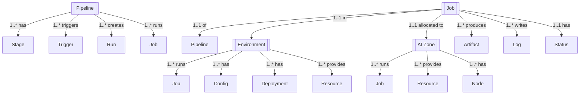

# CI/CD Platform REST API Design Documentation

## Table of Contents
1. [Overview](#overview)
2. [Architecture](#architecture)
3. [Entity Model](#entity-model)
4. [Authentication & Authorization](#authentication--authorization)
5. [API Endpoints](#api-endpoints)
6. [Data Models](#data-models)
7. [Pipeline Management](#pipeline-management)
8. [Job Orchestration](#job-orchestration)
9. [Environment Management](#environment-management)
10. [AI Zone Integration](#ai-zone-integration)
11. [Monitoring & Analytics](#monitoring--analytics)
12. [Error Handling](#error-handling)

## Overview

This document provides a comprehensive REST API design for the CI/CD Platform - a complete continuous integration and continuous deployment system designed for AI/ML workloads. The platform supports multi-environment deployments, AI zone orchestration, pipeline automation, and comprehensive job management across development, staging, and production environments.

### Key Features
- Multi-stage pipeline orchestration with customizable stages
- Environment-specific job management (Dev, Staging, Production)
- AI Zone integration for distributed workload management
- Multiple trigger mechanisms (Push, Pull Request, Manual, Schedule)
- Canary releases and rollback capabilities
- Security scanning and quality checks
- Performance testing and integration testing
- Real-time job monitoring and statistics
- Comprehensive audit trail and logging
- Support for AI model building and deployment

## Architecture

### System Components

```
┌─────────────────────────────────────────────────────────┐
│                   API Gateway                           │
├─────────────────────────────────────────────────────────┤
│              CI/CD Orchestration Layer                  │
├──────────────────────┬──────────────────────────────────┤
│  Pipeline Services   │    Job Execution Services        │
├──────────────────────┼──────────────────────────────────┤
│ • Pipeline Registry  │ • Job Scheduler                  │
│ • Stage Management   │ • Job Executor                   │
│ • Trigger Handler    │ • Job Queue Manager              │
│ • Pipeline Templates │ • Job Status Tracker             │
├──────────────────────┼──────────────────────────────────┤
│ Environment Services │    AI Zone Services              │
├──────────────────────┼──────────────────────────────────┤
│ • Dev Environment    │ • Zone Registry                  │
│ • Staging Environment│ • Zone Allocator                 │
│ • Production Env     │ • Zone Load Balancer             │
│ • Config Management  │ • Zone Health Monitor            │
├──────────────────────┼──────────────────────────────────┤
│  Quality Services    │    Deployment Services           │
├──────────────────────┼──────────────────────────────────┤
│ • Unit Testing       │ • Build Management               │
│ • Integration Tests  │ • Artifact Registry              │
│ • Security Scanning  │ • Deployment Strategies          │
│ • Code Quality       │ • Rollback Management            │
├──────────────────────┴──────────────────────────────────┤
│              Infrastructure Layer                       │
├──────────────────────────────────────────────────────────┤
│ • Container Runtime  │ • Artifact Storage               │
│ • AI Compute Zones   │ • Log Storage                    │
└─────────────────────────────────────────────────────────┘
```

### Service Hierarchy

```
CI/CD Platform
├── Pipeline Management
│   ├── Pipeline Definitions
│   │   ├── AI Build Pipeline
│   │   ├── Test Pipeline
│   │   ├── Deploy Pipeline
│   │   ├── Security Pipeline
│   │   └── Quality Pipeline
│   ├── Pipeline Stages
│   │   ├── Source Control
│   │   ├── Build & Compile
│   │   ├── Test Execution
│   │   ├── Security Scan
│   │   ├── Package & Artifact
│   │   ├── Deploy
│   │   └── Verify & Notify
│   └── Pipeline Triggers
│       ├── Push Events
│       ├── Pull Request
│       ├── Manual Trigger
│       └── Scheduled Runs
├── Job Management
│   ├── Development Jobs
│   │   ├── Build Jobs
│   │   ├── Unit Test Jobs
│   │   ├── Quality Check Jobs
│   │   └── Security Scan Jobs
│   ├── Staging Jobs
│   │   ├── Integration Tests
│   │   ├── Performance Tests
│   │   └── Deployment Jobs
│   └── Production Jobs
│       ├── Production Deployment
│       ├── Canary Release
│       ├── Blue-Green Deployment
│       └── Rollback Jobs
├── Environment Management
│   ├── Development
│   ├── Staging
│   ├── Production
│   └── AI Zones (zone-1, zone-2, zone-3)
└── Quality & Security
    ├── Code Quality Checks
    ├── Security Scanning
    ├── Test Execution
    └── Performance Testing
```

## Entity Model

### Core Entities and Relationships



Legend: 1 = one, * = many, 1..* = one-to-many, *..* = many-to-many, 1..1 = one-to-one

| From        | Relationship  | To         | Cardinality |
|-------------|---------------|------------|-------------|
| Pipeline    | has           | Stage      | 1..*        |
| Pipeline    | triggers      | Trigger    | 1..*        |
| Pipeline    | creates       | Run        | 1..*        |
| Pipeline    | runs          | Job        | 1..*        |
| Job         | of            | Pipeline   | 1..1        |
| Job         | in            | Environment| 1..1        |
| Job         | allocated to  | AI Zone    | 1..1        |
| Job         | produces      | Artifact   | 1..*        |
| Job         | writes        | Log        | 1..*        |
| Job         | has           | Status     | 1..1        |
| Environment | runs          | Job        | 1..*        |
| Environment | has           | Config     | 1..*        |
| Environment | has           | Deployment | 1..*        |
| Environment | provides      | Resource   | 1..*        |
| AI Zone     | runs          | Job        | 1..*        |
| AI Zone     | provides      | Resource   | 1..*        |
| AI Zone     | has           | Node       | 1..*        |

### Entity Hierarchy

1. **Pipeline** (Definition Level)
   - Pipeline configuration and stages
   - Trigger mechanisms
   - Average duration and success metrics

2. **Job** (Execution Level)
   - Individual job execution
   - Environment-specific configuration
   - AI Zone allocation

3. **Environment** (Deployment Level)
   - Development, Staging, Production
   - Environment-specific configurations
   - Resource allocation

4. **AI Zone** (Infrastructure Level)
   - Distributed compute zones
   - Resource pools
   - Job allocation and scheduling

5. **Stage** (Workflow Level)
   - Sequential or parallel execution
   - Dependencies and conditions
   - Stage-specific configurations

## Authentication & Authorization

### Authentication Flow

```
POST /api/v1/auth/login
Authorization: Bearer {token}
X-Pipeline-Key: {pipeline-api-key}
X-Environment: {environment} (dev|staging|production)
```

### Authorization Model

```json
{
  "authorization": {
    "type": "RBAC + Environment-based",
    "roles": {
      "admin": {
        "permissions": ["*"],
        "environments": ["*"],
        "description": "Full platform administration"
      },
      "release_manager": {
        "permissions": [
          "pipeline:*",
          "job:*",
          "deployment:*",
          "rollback:*"
        ],
        "environments": ["*"],
        "description": "Release management across all environments"
      },
      "developer": {
        "permissions": [
          "pipeline:read",
          "pipeline:trigger",
          "job:create",
          "job:read",
          "job:cancel",
          "artifact:*"
        ],
        "environments": ["dev", "staging"],
        "description": "Development and staging access"
      },
      "qa_engineer": {
        "permissions": [
          "pipeline:read",
          "pipeline:trigger",
          "job:read",
          "test:*",
          "report:*"
        ],
        "environments": ["dev", "staging"],
        "description": "Quality assurance and testing"
      },
      "ops_engineer": {
        "permissions": [
          "job:read",
          "deployment:*",
          "rollback:*",
          "monitoring:*",
          "log:*"
        ],
        "environments": ["staging", "production"],
        "description": "Operations and deployment management"
      },
      "security_engineer": {
        "permissions": [
          "security:*",
          "scan:*",
          "vulnerability:*",
          "compliance:*"
        ],
        "environments": ["*"],
        "description": "Security scanning and compliance"
      },
      "viewer": {
        "permissions": [
          "pipeline:read",
          "job:read",
          "log:read",
          "report:read"
        ],
        "environments": ["*"],
        "description": "Read-only access"
      }
    },
    "environment_restrictions": {
      "production": {
        "required_roles": ["release_manager", "ops_engineer"],
        "approval_required": true,
        "change_window": true
      }
    }
  }
}
```

## API Endpoints

### Base URL
```
https://api.cicd-platform.example.com/v1
```

### Pipeline Management

```
# Pipeline Registry
GET    /pipelines                             # List all pipelines
GET    /pipelines/{pipelineId}                # Get pipeline details
POST   /pipelines                             # Create pipeline
PUT    /pipelines/{pipelineId}                # Update pipeline
DELETE /pipelines/{pipelineId}                # Delete pipeline
PATCH  /pipelines/{pipelineId}/status         # Enable/disable pipeline

# Pipeline Configuration
GET    /pipelines/{pipelineId}/config         # Get configuration
PUT    /pipelines/{pipelineId}/config         # Update configuration
GET    /pipelines/{pipelineId}/stages         # Get stages
PUT    /pipelines/{pipelineId}/stages         # Update stages
POST   /pipelines/{pipelineId}/stages         # Add stage
DELETE /pipelines/{pipelineId}/stages/{stageId} # Remove stage

# Pipeline Triggers
GET    /pipelines/{pipelineId}/triggers       # List triggers
POST   /pipelines/{pipelineId}/triggers       # Add trigger
PUT    /pipelines/{pipelineId}/triggers/{triggerId} # Update trigger
DELETE /pipelines/{pipelineId}/triggers/{triggerId} # Remove trigger
POST   /pipelines/{pipelineId}/trigger        # Manually trigger pipeline

# Pipeline Runs
GET    /pipelines/{pipelineId}/runs           # List pipeline runs
GET    /pipelines/runs/{runId}                # Get run details
POST   /pipelines/{pipelineId}/run            # Start new run
POST   /pipelines/runs/{runId}/cancel         # Cancel run
POST   /pipelines/runs/{runId}/retry          # Retry run
GET    /pipelines/runs/{runId}/logs           # Get run logs

# Pipeline Templates
GET    /pipelines/templates                   # List templates
GET    /pipelines/templates/{templateId}      # Get template
POST   /pipelines/from-template               # Create from template
POST   /pipelines/templates                   # Create template

# Pipeline Metrics
GET    /pipelines/{pipelineId}/metrics        # Get metrics
GET    /pipelines/{pipelineId}/statistics     # Get statistics
GET    /pipelines/{pipelineId}/history        # Get run history
GET    /pipelines/{pipelineId}/performance    # Performance metrics
```

### Job Management

```
# Job Registry
GET    /jobs                                  # List all jobs
GET    /jobs/{jobId}                          # Get job details
POST   /jobs                                  # Create job
PUT    /jobs/{jobId}                          # Update job
DELETE /jobs/{jobId}                          # Delete job
PATCH  /jobs/{jobId}/status                   # Update job status

# Job Execution
POST   /jobs/{jobId}/start                    # Start job
POST   /jobs/{jobId}/stop                     # Stop job
POST   /jobs/{jobId}/restart                  # Restart job
POST   /jobs/{jobId}/cancel                   # Cancel job
GET    /jobs/{jobId}/status                   # Get execution status

# Job by Environment
GET    /jobs/environment/dev                  # List dev jobs
GET    /jobs/environment/staging              # List staging jobs
GET    /jobs/environment/production           # List production jobs
POST   /jobs/environment/{env}/deploy         # Deploy to environment

# Job Logs & Artifacts
GET    /jobs/{jobId}/logs                     # Get job logs
GET    /jobs/{jobId}/logs/stream              # Stream logs (SSE)
GET    /jobs/{jobId}/artifacts                # List artifacts
GET    /jobs/{jobId}/artifacts/{artifactId}   # Get artifact
POST   /jobs/{jobId}/artifacts                # Upload artifact
DELETE /jobs/{jobId}/artifacts/{artifactId}   # Delete artifact

# Job Dependencies
GET    /jobs/{jobId}/dependencies             # Get dependencies
POST   /jobs/{jobId}/dependencies             # Add dependency
DELETE /jobs/{jobId}/dependencies/{depId}     # Remove dependency

# Job Queue
GET    /jobs/queue                            # Get job queue
GET    /jobs/queue/{queueId}                  # Get queue details
POST   /jobs/queue/{jobId}/priority          # Set job priority
POST   /jobs/queue/{jobId}/reschedule        # Reschedule job
```

### Environment Management

```
# Environment Registry
GET    /environments                          # List environments
GET    /environments/{environmentId}          # Get environment details
POST   /environments                          # Create environment
PUT    /environments/{environmentId}          # Update environment
DELETE /environments/{environmentId}          # Delete environment

# Environment Configuration
GET    /environments/{environmentId}/config   # Get configuration
PUT    /environments/{environmentId}/config   # Update configuration
GET    /environments/{environmentId}/variables # Get variables
PUT    /environments/{environmentId}/variables # Update variables
GET    /environments/{environmentId}/secrets  # List secrets
POST   /environments/{environmentId}/secrets  # Add secret

# Environment Resources
GET    /environments/{environmentId}/resources # Get resources
PUT    /environments/{environmentId}/resources # Update resources
GET    /environments/{environmentId}/limits   # Get resource limits
PUT    /environments/{environmentId}/limits   # Set resource limits

# Environment Status
GET    /environments/{environmentId}/status   # Get status
GET    /environments/{environmentId}/health   # Health check
GET    /environments/{environmentId}/jobs     # List jobs in environment
GET    /environments/{environmentId}/deployments # List deployments

# Environment Promotion
POST   /environments/promote                  # Promote between environments
GET    /environments/promotion-path           # Get promotion path
POST   /environments/promote/dev-to-staging   # Promote dev to staging
POST   /environments/promote/staging-to-prod  # Promote staging to production
```

### AI Zone Management

```
# AI Zone Registry
GET    /ai-zones                              # List AI zones
GET    /ai-zones/{zoneId}                     # Get zone details
POST   /ai-zones                              # Register zone
PUT    /ai-zones/{zoneId}                     # Update zone
DELETE /ai-zones/{zoneId}                     # Deregister zone
PATCH  /ai-zones/{zoneId}/status              # Update zone status

# Zone Resources
GET    /ai-zones/{zoneId}/resources           # Get resources
PUT    /ai-zones/{zoneId}/resources           # Update resources
GET    /ai-zones/{zoneId}/capacity            # Get capacity
GET    /ai-zones/{zoneId}/utilization         # Get utilization

# Zone Job Allocation
GET    /ai-zones/{zoneId}/jobs                # List jobs in zone
POST   /ai-zones/{zoneId}/allocate            # Allocate job to zone
DELETE /ai-zones/{zoneId}/deallocate/{jobId}  # Deallocate job
GET    /ai-zones/{zoneId}/schedule            # Get zone schedule

# Zone Health & Monitoring
GET    /ai-zones/{zoneId}/health              # Health check
GET    /ai-zones/{zoneId}/metrics             # Get metrics
GET    /ai-zones/{zoneId}/nodes               # List nodes in zone
POST   /ai-zones/{zoneId}/scale               # Scale zone
```

### Build Management

```
# Build Operations
POST   /builds                                # Create build
GET    /builds                                # List builds
GET    /builds/{buildId}                      # Get build details
POST   /builds/{buildId}/start                # Start build
POST   /builds/{buildId}/cancel               # Cancel build
GET    /builds/{buildId}/status               # Get build status

# Build Artifacts
GET    /builds/{buildId}/artifacts            # List artifacts
POST   /builds/{buildId}/artifacts            # Upload artifact
GET    /builds/{buildId}/artifacts/{name}     # Download artifact
DELETE /builds/{buildId}/artifacts/{name}     # Delete artifact

# Build Configuration
GET    /builds/{buildId}/config               # Get build config
PUT    /builds/{buildId}/config               # Update config
GET    /builds/{buildId}/dependencies         # Get dependencies
POST   /builds/{buildId}/tag                  # Tag build

# AI Model Builds
POST   /builds/ai-model                       # Build AI model
GET    /builds/ai-model/{modelId}             # Get model build
POST   /builds/ai-model/{modelId}/package     # Package model
POST   /builds/ai-model/{modelId}/validate    # Validate model
```

### Testing & Quality

```
# Test Execution
POST   /tests/run                             # Run tests
GET    /tests                                 # List test runs
GET    /tests/{testId}                        # Get test details
POST   /tests/{testId}/stop                   # Stop test
GET    /tests/{testId}/results                # Get results

# Test Types
POST   /tests/unit                            # Run unit tests
POST   /tests/integration                     # Run integration tests
POST   /tests/performance                     # Run performance tests
POST   /tests/security                        # Run security tests
POST   /tests/smoke                           # Run smoke tests

# Test Reports
GET    /tests/{testId}/report                 # Get test report
GET    /tests/reports                         # List all reports
POST   /tests/reports/generate                # Generate report
GET    /tests/coverage                        # Get coverage report

# Quality Checks
POST   /quality/scan                          # Run quality scan
GET    /quality/metrics                       # Get quality metrics
GET    /quality/issues                        # List quality issues
POST   /quality/gate                          # Quality gate check

# Security Scanning
POST   /security/scan                         # Run security scan
GET    /security/vulnerabilities              # List vulnerabilities
GET    /security/compliance                   # Compliance status
POST   /security/fix                          # Apply security fixes
```

### Deployment Management

```
# Deployments
GET    /deployments                           # List deployments
GET    /deployments/{deploymentId}            # Get deployment details
POST   /deployments                           # Create deployment
PUT    /deployments/{deploymentId}            # Update deployment
DELETE /deployments/{deploymentId}            # Delete deployment

# Deployment Strategies
POST   /deployments/canary                    # Canary deployment
POST   /deployments/blue-green                # Blue-green deployment
POST   /deployments/rolling                   # Rolling deployment
POST   /deployments/recreate                  # Recreate deployment

# Deployment Operations
POST   /deployments/{deploymentId}/start      # Start deployment
POST   /deployments/{deploymentId}/pause      # Pause deployment
POST   /deployments/{deploymentId}/resume     # Resume deployment
POST   /deployments/{deploymentId}/rollback   # Rollback deployment
POST   /deployments/{deploymentId}/promote    # Promote deployment

# Production Deployments
POST   /deployments/production/approve        # Approve production deployment
GET    /deployments/production/pending        # List pending deployments
POST   /deployments/production/schedule       # Schedule deployment
GET    /deployments/production/window         # Get deployment window

# Rollback Management
GET    /rollbacks                             # List rollback points
POST   /rollbacks/create                      # Create rollback point
POST   /rollbacks/{rollbackId}/execute        # Execute rollback
GET    /rollbacks/{rollbackId}/validate       # Validate rollback
```

### Monitoring & Analytics

```
# Job Statistics
GET    /statistics                            # Overall statistics
GET    /statistics/jobs                       # Job statistics
GET    /statistics/pipelines                  # Pipeline statistics
GET    /statistics/environments               # Environment statistics
GET    /statistics/success-rate               # Success rate metrics
GET    /statistics/duration                   # Duration metrics

# Real-time Monitoring
GET    /monitoring/dashboard                  # Monitoring dashboard
GET    /monitoring/jobs/active                # Active jobs
GET    /monitoring/pipelines/running          # Running pipelines
GET    /monitoring/resources                  # Resource usage
GET    /monitoring/alerts                     # Active alerts

# Historical Analytics
GET    /analytics/trends                      # Trend analysis
GET    /analytics/performance                 # Performance analysis
GET    /analytics/failures                    # Failure analysis
GET    /analytics/bottlenecks                 # Bottleneck analysis
POST   /analytics/report                      # Generate analytics report

# Audit Trail
GET    /audit                                 # Audit log
GET    /audit/jobs/{jobId}                    # Job audit trail
GET    /audit/pipelines/{pipelineId}          # Pipeline audit trail
GET    /audit/deployments/{deploymentId}      # Deployment audit trail
POST   /audit/search                          # Search audit logs
```

### Notification & Alerting

```
# Notifications
GET    /notifications                         # List notifications
POST   /notifications                         # Create notification
PUT    /notifications/{notificationId}        # Update notification
DELETE /notifications/{notificationId}        # Delete notification

# Notification Channels
GET    /notifications/channels                # List channels
POST   /notifications/channels                # Add channel
PUT    /notifications/channels/{channelId}    # Update channel
DELETE /notifications/channels/{channelId}    # Remove channel

# Alert Rules
GET    /alerts/rules                          # List alert rules
POST   /alerts/rules                          # Create alert rule
PUT    /alerts/rules/{ruleId}                 # Update rule
DELETE /alerts/rules/{ruleId}                 # Delete rule
POST   /alerts/rules/{ruleId}/test            # Test alert rule

# Alert Management
GET    /alerts                                # List active alerts
GET    /alerts/{alertId}                      # Get alert details
POST   /alerts/{alertId}/acknowledge          # Acknowledge alert
POST   /alerts/{alertId}/resolve              # Resolve alert
POST   /alerts/{alertId}/escalate             # Escalate alert
```

## Data Models

### Pipeline Entity

```json
{
  "id": "ai-build-pipeline",
  "name": "AI Model Build Pipeline",
  "description": "Builds and packages AI models",
  "status": "active",
  "created": "2023-01-01T00:00:00Z",
  "updated": "2023-06-16T09:00:00Z",
  "lastRun": "2023-06-16T09:00:00Z",
  "avgDuration": "25m",
  "successRate": 92.5,
  "stages": [
    {
      "id": "stage-1",
      "name": "Source",
      "order": 1,
      "parallel": false,
      "condition": "always",
      "timeout": "5m",
      "retry": 3,
      "config": {
        "repository": "https://github.com/org/ai-models",
        "branch": "main"
      }
    },
    {
      "id": "stage-2",
      "name": "Build",
      "order": 2,
      "parallel": false,
      "condition": "on_success",
      "timeout": "20m",
      "config": {
        "dockerfile": "Dockerfile",
        "context": "."
      }
    },
    {
      "id": "stage-3",
      "name": "Test",
      "order": 3,
      "parallel": true,
      "condition": "on_success",
      "timeout": "15m",
      "config": {
        "commands": [
          "pytest tests/",
          "flake8 src/"
        ]
      }
    },
    {
      "id": "stage-4",
      "name": "Package",
      "order": 4,
      "parallel": false,
      "condition": "on_success",
      "timeout": "10m",
      "config": {
        "registry": "registry.example.com",
        "format": "docker"
      }
    }
  ],
  "triggers": [
    {
      "id": "trigger-1",
      "type": "Push",
      "enabled": true,
      "branches": ["main", "develop"],
      "paths": ["src/**", "model/**"]
    },
    {
      "id": "trigger-2",
      "type": "Manual",
      "enabled": true,
      "permissions": ["developer", "release_manager"]
    },
    {
      "id": "trigger-3",
      "type": "Schedule",
      "enabled": true,
      "cron": "0 2 * * *",
      "timezone": "UTC"
    }
  ],
  "parameters": {
    "buildType": {
      "type": "string",
      "default": "release",
      "values": ["debug", "release"]
    },
    "skipTests": {
      "type": "boolean",
      "default": false
    }
  },
  "notifications": {
    "onStart": ["slack:#builds"],
    "onSuccess": ["email:team@example.com"],
    "onFailure": ["slack:#alerts", "email:oncall@example.com"]
  }
}
```

### Job Entity

```json
{
  "id": "dev-1",
  "name": "Build AI Model",
  "pipeline": "ai-build-pipeline",
  "pipelineRunId": "run-123",
  "status": "completed",
  "result": "success",
  "environment": "dev",
  "aiZone": "zone-1",
  "startTime": "2023-06-15T10:30:00Z",
  "endTime": "2023-06-15T11:00:00Z",
  "duration": "30m",
  "createdBy": "system",
  "triggeredBy": {
    "type": "push",
    "user": "developer@example.com",
    "commit": "abc123def",
    "branch": "main"
  },
  "configuration": {
    "image": "python:3.9",
    "resources": {
      "cpu": "4",
      "memory": "8Gi",
      "gpu": "1"
    },
    "environment": {
      "PYTHON_VERSION": "3.9",
      "MODEL_TYPE": "transformer"
    },
    "volumes": [
      {
        "name": "model-data",
        "path": "/data",
        "size": "100Gi"
      }
    ]
  },
  "stages": [
    {
      "name": "Source",
      "status": "completed",
      "startTime": "2023-06-15T10:30:00Z",
      "endTime": "2023-06-15T10:31:00Z",
      "duration": "1m"
    },
    {
      "name": "Build",
      "status": "completed",
      "startTime": "2023-06-15T10:31:00Z",
      "endTime": "2023-06-15T10:45:00Z",
      "duration": "14m"
    },
    {
      "name": "Test",
      "status": "completed",
      "startTime": "2023-06-15T10:45:00Z",
      "endTime": "2023-06-15T10:55:00Z",
      "duration": "10m"
    },
    {
      "name": "Package",
      "status": "completed",
      "startTime": "2023-06-15T10:55:00Z",
      "endTime": "2023-06-15T11:00:00Z",
      "duration": "5m"
    }
  ],
  "artifacts": [
    {
      "id": "artifact-1",
      "name": "model.tar.gz",
      "type": "model",
      "size": "500MB",
      "path": "s3://artifacts/dev-1/model.tar.gz"
    },
    {
      "id": "artifact-2",
      "name": "test-results.xml",
      "type": "test-results",
      "size": "1MB",
      "path": "s3://artifacts/dev-1/test-results.xml"
    }
  ],
  "metrics": {
    "testsPassed": 145,
    "testsFailed": 2,
    "coverage": 85.5,
    "buildSize": "1.2GB",
    "performance": {
      "cpu_usage": 75,
      "memory_usage": 60,
      "network_io": "100MB"
    }
  },
  "logs": {
    "url": "https://logs.example.com/jobs/dev-1",
    "size": "5MB",
    "retention": "30 days"
  }
}
```

### Environment Entity

```json
{
  "id": "env-dev",
  "name": "Development",
  "type": "development",
  "status": "active",
  "created": "2023-01-01T00:00:00Z",
  "updated": "2023-06-15T00:00:00Z",
  "configuration": {
    "cluster": "dev-cluster",
    "namespace": "dev",
    "region": "us-east-1",
    "provider": "aws"
  },
  "resources": {
    "cpu": {
      "limit": "100",
      "allocated": "75",
      "available": "25"
    },
    "memory": {
      "limit": "500Gi",
      "allocated": "350Gi",
      "available": "150Gi"
    },
    "gpu": {
      "limit": "10",
      "allocated": "7",
      "available": "3"
    },
    "storage": {
      "limit": "10Ti",
      "allocated": "6Ti",
      "available": "4Ti"
    }
  },
  "variables": {
    "API_URL": "https://api-dev.example.com",
    "DATABASE_URL": "postgresql://dev-db:5432/app",
    "CACHE_URL": "redis://dev-cache:6379",
    "LOG_LEVEL": "debug"
  },
  "secrets": [
    {
      "name": "database-password",
      "type": "password",
      "lastRotated": "2023-06-01T00:00:00Z"
    },
    {
      "name": "api-key",
      "type": "api_key",
      "lastRotated": "2023-05-15T00:00:00Z"
    }
  ],
  "jobs": {
    "total": 5,
    "active": 2,
    "completed": 2,
    "failed": 1
  },
  "aiZones": ["zone-1", "zone-2", "zone-3"],
  "policies": {
    "maxConcurrentJobs": 10,
    "autoScaling": true,
    "retentionDays": 30,
    "backupEnabled": true
  }
}
```

### AI Zone Entity

```json
{
  "id": "zone-1",
  "name": "AI Compute Zone 1",
  "status": "active",
  "region": "us-east-1",
  "provider": "aws",
  "created": "2023-01-01T00:00:00Z",
  "updated": "2023-06-15T00:00:00Z",
  "capacity": {
    "nodes": 10,
    "cpu": "400",
    "memory": "2Ti",
    "gpu": "40",
    "storage": "50Ti"
  },
  "utilization": {
    "cpu": 65,
    "memory": 70,
    "gpu": 80,
    "storage": 45
  },
  "nodes": [
    {
      "id": "node-1",
      "type": "gpu",
      "status": "active",
      "resources": {
        "cpu": "40",
        "memory": "256Gi",
        "gpu": "8"
      }
    },
    {
      "id": "node-2",
      "type": "cpu",
      "status": "active",
      "resources": {
        "cpu": "64",
        "memory": "128Gi",
        "gpu": "0"
      }
    }
  ],
  "jobs": {
    "running": 15,
    "queued": 5,
    "completed": 250
  },
  "performance": {
    "avgJobDuration": "25m",
    "successRate": 94.5,
    "avgQueueTime": "2m"
  },
  "configuration": {
    "scheduler": "kubernetes",
    "networkPolicy": "calico",
    "storageClass": "fast-ssd",
    "autoScaling": {
      "enabled": true,
      "minNodes": 5,
      "maxNodes": 20,
      "targetUtilization": 70
    }
  }
}
```

### Deployment Entity

```json
{
  "id": "deploy-001",
  "name": "AI Model v2.0 Production Deployment",
  "type": "canary",
  "status": "in_progress",
  "environment": "production",
  "created": "2023-06-15T14:00:00Z",
  "started": "2023-06-15T14:05:00Z",
  "completed": null,
  "createdBy": "release-manager@example.com",
  "approvedBy": "ops-lead@example.com",
  "strategy": {
    "type": "canary",
    "config": {
      "steps": [
        {"weight": 5, "duration": "10m"},
        {"weight": 25, "duration": "30m"},
        {"weight": 50, "duration": "1h"},
        {"weight": 100, "duration": "stable"}
      ],
      "currentStep": 2,
      "autoPromote": false,
      "analysis": {
        "metrics": ["error_rate", "latency", "success_rate"],
        "thresholds": {
          "error_rate": 1,
          "latency": 200,
          "success_rate": 99
        }
      }
    }
  },
  "source": {
    "artifact": "model-v2.0.tar.gz",
    "registry": "registry.example.com/ai-models",
    "tag": "2.0.0",
    "commit": "def456abc"
  },
  "target": {
    "clusters": ["prod-cluster-1", "prod-cluster-2"],
    "namespace": "production",
    "replicas": 10
  },
  "rollback": {
    "enabled": true,
    "automatic": true,
    "previousVersion": "1.9.0",
    "conditions": [
      "error_rate > 5%",
      "latency > 500ms",
      "success_rate < 95%"
    ]
  },
  "metrics": {
    "traffic": {
      "canary": 25,
      "stable": 75
    },
    "performance": {
      "canary": {
        "error_rate": 0.5,
        "latency": 150,
        "success_rate": 99.5
      },
      "stable": {
        "error_rate": 0.3,
        "latency": 120,
        "success_rate": 99.7
      }
    }
  },
  "validation": {
    "preDeployment": {
      "status": "passed",
      "checks": ["security_scan", "integration_test", "load_test"]
    },
    "postDeployment": {
      "status": "in_progress",
      "checks": ["smoke_test", "health_check", "metric_validation"]
    }
  }
}
```

### Job Statistics Entity

```json
{
  "id": "stats-2023-06",
  "period": "2023-06",
  "timestamp": "2023-06-16T12:00:00Z",
  "summary": {
    "total": 11,
    "completed": 5,
    "running": 2,
    "failed": 1,
    "pending": 3,
    "cancelled": 0
  },
  "successRate": 83.3,
  "avgDuration": "32m",
  "lastWeekRuns": 45,
  "lastMonthRuns": 180,
  "environments": {
    "dev": {
      "total": 5,
      "active": 2,
      "completed": 2,
      "failed": 1,
      "successRate": 66.7,
      "avgDuration": "20m"
    },
    "staging": {
      "total": 3,
      "active": 1,
      "completed": 1,
      "failed": 0,
      "pending": 1,
      "successRate": 100,
      "avgDuration": "35m"
    },
    "production": {
      "total": 3,
      "active": 0,
      "completed": 2,
      "failed": 0,
      "pending": 1,
      "successRate": 100,
      "avgDuration": "1h 45m"
    }
  },
  "pipelines": {
    "ai-build-pipeline": {
      "runs": 25,
      "successRate": 92,
      "avgDuration": "25m"
    },
    "test-pipeline": {
      "runs": 30,
      "successRate": 87,
      "avgDuration": "15m"
    },
    "deploy-pipeline": {
      "runs": 15,
      "successRate": 93,
      "avgDuration": "45m"
    }
  },
  "aiZones": {
    "zone-1": {
      "jobs": 6,
      "utilization": 75
    },
    "zone-2": {
      "jobs": 3,
      "utilization": 50
    },
    "zone-3": {
      "jobs": 2,
      "utilization": 30
    }
  },
  "trends": {
    "jobGrowth": "+15%",
    "durationImprovement": "-10%",
    "successRateChange": "+5%"
  }
}
```

## Pipeline Management

### Pipeline Types

1. **AI Build Pipeline**: Build and package AI/ML models
2. **Test Pipeline**: Unit and integration testing
3. **Deploy Pipeline**: Multi-environment deployment
4. **Security Pipeline**: Security scanning and compliance
5. **Quality Pipeline**: Code quality and standards checking

### Pipeline Stages

```
Source → Build → Test → Security Scan → Package → Deploy → Verify → Notify
```

### Trigger Mechanisms

1. **Push Events**: Triggered on code push
2. **Pull Request**: Triggered on PR creation/update
3. **Manual**: Manually triggered by user
4. **Schedule**: Cron-based scheduling
5. **Webhook**: External webhook triggers
6. **Pipeline Chain**: Triggered by another pipeline

## Job Orchestration

### Job Lifecycle

```
Created → Queued → Scheduled → Running → Completed/Failed → Archived
```

### Job Priorities

1. **Critical**: Production deployments, hotfixes
2. **High**: Security updates, release candidates
3. **Normal**: Regular builds and tests
4. **Low**: Non-critical updates, experiments

### Job Dependencies

- Sequential dependencies
- Parallel execution
- Conditional dependencies
- Fan-out/Fan-in patterns

## Environment Management

### Environment Progression

```
Development → Staging → Production
```

### Environment Policies

1. **Development**
   - Automatic deployments allowed
   - No approval required
   - Relaxed resource limits

2. **Staging**
   - Manual approval for sensitive changes
   - Performance testing required
   - Production-like configuration

3. **Production**
   - Strict approval workflow
   - Change window enforcement
   - Automatic rollback on failure

## AI Zone Integration

### Zone Selection Strategy

1. **Resource-based**: Select zone with available resources
2. **Geographic**: Select zone closest to data
3. **Cost-based**: Select most cost-effective zone
4. **Performance-based**: Select highest performing zone

### Zone Load Balancing

- Round-robin distribution
- Least-loaded zone selection
- Weighted distribution
- Affinity-based scheduling

## Monitoring & Analytics

### Key Metrics

1. **Pipeline Metrics**
   - Success rate
   - Average duration
   - Failure reasons
   - Queue time

2. **Job Metrics**
   - Execution time
   - Resource usage
   - Cost per job
   - Error rates

3. **Environment Metrics**
   - Deployment frequency
   - Lead time
   - MTTR (Mean Time To Recovery)
   - Change failure rate

4. **AI Zone Metrics**
   - Utilization
   - Queue depth
   - Job throughput
   - Cost efficiency

### Alerting Rules

```json
{
  "alerts": [
    {
      "name": "High Failure Rate",
      "condition": "success_rate < 80%",
      "severity": "critical",
      "action": "notify_oncall"
    },
    {
      "name": "Long Queue Time",
      "condition": "queue_time > 10m",
      "severity": "warning",
      "action": "scale_resources"
    },
    {
      "name": "Deployment Failed",
      "condition": "deployment_status == 'failed'",
      "severity": "high",
      "action": "rollback_and_notify"
    },
    {
      "name": "Security Vulnerability",
      "condition": "vulnerability_severity == 'critical'",
      "severity": "critical",
      "action": "block_deployment"
    }
  ]
}
```

## Error Handling

### Error Response Format

```json
{
  "error": {
    "code": "CICD_001",
    "message": "Pipeline execution failed",
    "details": {
      "pipelineId": "ai-build-pipeline",
      "runId": "run-123",
      "stage": "test",
      "timestamp": "2023-06-16T10:00:00Z"
    },
    "requestId": "req_abc123xyz",
    "documentation": "https://api.cicd-platform.example.com/docs/errors#CICD_001"
  }
}
```

### Error Codes

```
# Pipeline Errors
PIPELINE_001: Pipeline not found
PIPELINE_002: Pipeline execution failed
PIPELINE_003: Stage failed
PIPELINE_004: Trigger configuration error
PIPELINE_005: Pipeline timeout

# Job Errors
JOB_001: Job not found
JOB_002: Job execution failed
JOB_003: Resource unavailable
JOB_004: Job cancelled
JOB_005: Job timeout

# Environment Errors
ENV_001: Environment not found
ENV_002: Environment unavailable
ENV_003: Resource limit exceeded
ENV_004: Configuration error
ENV_005: Access denied

# Deployment Errors
DEPLOY_001: Deployment failed
DEPLOY_002: Rollback failed
DEPLOY_003: Validation failed
DEPLOY_004: Approval required
DEPLOY_005: Change window violation

# AI Zone Errors
ZONE_001: Zone unavailable
ZONE_002: Capacity exceeded
ZONE_003: Allocation failed
ZONE_004: Node failure
ZONE_005: Network error
```

## Implementation Guidelines

### Best Practices

1. **Pipeline Design**
   - Keep pipelines modular and reusable
   - Implement proper error handling
   - Use caching for dependencies
   - Parallelize where possible

2. **Job Management**
   - Set appropriate timeouts
   - Implement retry logic
   - Clean up resources after completion
   - Use job templates for consistency

3. **Environment Management**
   - Maintain environment parity
   - Use infrastructure as code
   - Implement proper secret management
   - Regular environment validation

4. **Security**
   - Security scanning in every pipeline
   - Signed artifacts
   - Audit trail for all actions
   - Role-based access control

### API Standards

1. **RESTful Design**
   - Resource-based URLs
   - Standard HTTP methods
   - Consistent response formats
   - Proper status codes

2. **Versioning**
   - URL path versioning (/v1/, /v2/)
   - Backward compatibility
   - Deprecation notices
   - Migration guides

3. **Pagination**
   ```json
   {
     "data": [...],
     "pagination": {
       "page": 1,
       "pageSize": 20,
       "totalCount": 100,
       "hasNext": true
     }
   }
   ```

4. **Filtering & Sorting**
   ```
   GET /jobs?environment=dev&status=running&sort=-startTime
   ```

## Conclusion

This comprehensive REST API design for the CI/CD Platform provides:

1. **Complete Pipeline Management**: Multi-stage pipeline orchestration with flexible triggers
2. **Environment Management**: Dev, staging, and production environment progression
3. **AI Zone Integration**: Distributed compute resource management
4. **Job Orchestration**: Comprehensive job scheduling and execution
5. **Quality & Security**: Integrated testing and security scanning
6. **Deployment Strategies**: Canary, blue-green, and rolling deployments
7. **Enterprise Features**: Approval workflows, audit trails, and compliance

The API enables organizations to implement a complete CI/CD workflow for AI/ML workloads with enterprise-grade reliability, security, and scalability across multiple environments and compute zones.