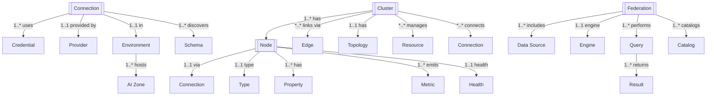

# Connections Platform REST API Design Documentation

## Table of Contents
1. [Overview](#overview)
2. [Architecture](#architecture)
3. [Entity Model](#entity-model)
4. [Authentication & Authorization](#authentication--authorization)
5. [API Endpoints](#api-endpoints)
6. [Data Models](#data-models)
7. [Connection Types](#connection-types)
8. [Cluster Management](#cluster-management)
9. [Data Federation](#data-federation)
10. [Security & Compliance](#security--compliance)
11. [Monitoring & Health](#monitoring--health)
12. [Error Handling](#error-handling)

## Overview

This document provides a comprehensive REST API design for the Connections Platform - an enterprise-grade data connection management system that enables unified access to heterogeneous data sources, cluster orchestration, and data federation capabilities. The platform supports multi-cloud environments, various database systems, object storage, metadata catalogs, and query federation engines like Trino/Presto.

### Key Features
- Multi-cloud data source connectivity (AWS, Azure, GCP)
- Heterogeneous database support (SQL, NoSQL, Data Warehouses)
- Object storage integration (S3, Azure Blob, GCS)
- Metadata catalog management (Glue, Hive, DataHub)
- Query federation with Trino/Presto
- Cluster-based data source orchestration
- Data governance and compliance
- Connection pooling and optimization
- Real-time health monitoring
- Secure credential management
- AI Zone integration for ML workloads

## Architecture

### System Components

```
┌─────────────────────────────────────────────────────────┐
│                   API Gateway                           │
├─────────────────────────────────────────────────────────┤
│            Connection Management Service                 │
├──────────────────────┬──────────────────────────────────┤
│  Connection Registry │    Cluster Orchestration         │
├──────────────────────┼──────────────────────────────────┤
│ • Connection Store   │ • Cluster Manager                │
│ • Credential Vault   │ • Node Registry                  │
│ • Connection Pool    │ • Edge Management                │
│ • Schema Registry    │ • Topology Builder               │
├──────────────────────┼──────────────────────────────────┤
│   Data Federation    │    Cloud Providers               │
├──────────────────────┼──────────────────────────────────┤
│ • Query Engine       │ • AWS Services                  │
│ • Catalog Manager    │ • Azure Services                │
│ • Optimizer          │ • GCP Services                  │
│ • Cache Layer        │ • On-Premise                    │
├──────────────────────┼──────────────────────────────────┤
│  Security Services   │    Monitoring Services           │
├──────────────────────┼──────────────────────────────────┤
│ • Auth Manager       │ • Health Checker                 │
│ • Encryption         │ • Metrics Collector              │
│ • Access Control     │ • Alert Manager                  │
│ • Audit Logger       │ • Performance Monitor            │
├──────────────────────┴──────────────────────────────────┤
│              Infrastructure Layer                       │
├──────────────────────────────────────────────────────────┤
│ • Connection Pools   │ • Message Queues                 │
│ • Cache (Redis)      │ • Service Mesh                   │
└─────────────────────────────────────────────────────────┘
```

### Service Hierarchy

```
Connections Platform
├── Connection Management
│   ├── Database Connections
│   │   ├── PostgreSQL
│   │   ├── MySQL
│   │   ├── MongoDB
│   │   ├── Elasticsearch
│   │   └── SQL Server
│   ├── Cloud Storage
│   │   ├── AWS S3
│   │   ├── Azure Blob
│   │   └── Google Cloud Storage
│   ├── Data Warehouses
│   │   ├── Snowflake
│   │   ├── Redshift
│   │   ├── BigQuery
│   │   └── Synapse
│   └── Metadata Catalogs
│       ├── AWS Glue
│       ├── Hive Metastore
│       └── DataHub
├── Cluster Management
│   ├── Cluster Types
│   │   ├── Data Lake Integration
│   │   ├── Query Federation
│   │   └── Multi-Cloud Platform
│   ├── Node Management
│   │   ├── Master Nodes
│   │   ├── Worker Nodes
│   │   └── Data Source Nodes
│   └── Edge Management
│       ├── Data Flow Edges
│       ├── Query Edges
│       └── Replication Edges
├── Data Federation
│   ├── Query Engines
│   │   ├── Trino/Presto
│   │   ├── Apache Drill
│   │   └── Dremio
│   └── Virtual Data Layer
│       ├── Schema Mapping
│       ├── Query Optimization
│       └── Result Caching
└── Governance & Security
    ├── Access Control
    ├── Encryption
    ├── Compliance
    └── Audit Trail
```

## Entity Model



Legend: 1 = one, * = many, 1..* = one-to-many, *..* = many-to-many, 1..1 = one-to-one

| From        | Relationship | To           | Cardinality |
|-------------|--------------|--------------|-------------|
| Connection  | uses         | Credential   | 1..*        |
| Connection  | provided by  | Provider     | 1..1        |
| Connection  | in           | Environment  | 1..1        |
| Connection  | discovers    | Schema       | 1..*        |
| Environment | hosts        | AI Zone      | 1..*        |
| Cluster     | has          | Node         | 1..*        |
| Cluster     | links via    | Edge         | *..*        |
| Cluster     | has          | Topology     | 1..1        |
| Cluster     | manages      | Resource     | *..*        |
| Cluster     | connects     | Connection   | *..*        |
| Node        | via          | Connection   | 1..1        |
| Node        | type         | Type         | 1..1        |
| Node        | has          | Property     | 1..*        |
| Node        | emits        | Metric       | 1..*        |
| Node        | health       | Health       | 1..1        |
| Federation  | includes     | Data Source  | 1..*        |
| Federation  | engine       | Engine       | 1..1        |
| Federation  | performs     | Query        | 1..*        |
| Federation  | catalogs     | Catalog      | 1..*        |
| Query       | returns      | Result       | 1..*        |

### Entity Hierarchy

1. **Connection** (Foundation Level)
   - Individual data source connections
   - Credential management
   - Connection pooling
   - Schema discovery

2. **Cluster** (Orchestration Level)
   - Grouped connections
   - Node topology
   - Edge relationships
   - Data flow management

3. **Federation** (Query Level)
   - Unified query interface
   - Cross-source joins
   - Query optimization
   - Result aggregation

4. **Governance** (Control Level)
   - Access policies
   - Compliance rules
   - Audit logging
   - Security enforcement

## Authentication & Authorization

### Authentication Flow

```
POST /api/v1/auth/login
Authorization: Bearer {token}
X-API-Key: {api-key}
X-Tenant-Id: {tenant-id}
```

### Authorization Model

```json
{
  "authorization": {
    "type": "RBAC + ABAC",
    "roles": {
      "platform_admin": {
        "permissions": ["*"],
        "description": "Full platform administration"
      },
      "connection_admin": {
        "permissions": [
          "connection:*",
          "cluster:*",
          "credential:*",
          "schema:*"
        ],
        "description": "Connection management administration"
      },
      "data_engineer": {
        "permissions": [
          "connection:create",
          "connection:read",
          "connection:update",
          "cluster:create",
          "cluster:read",
          "federation:*",
          "query:*"
        ],
        "description": "Data engineering operations"
      },
      "data_analyst": {
        "permissions": [
          "connection:read",
          "cluster:read",
          "federation:read",
          "query:execute",
          "schema:read"
        ],
        "description": "Data analysis and querying"
      },
      "security_admin": {
        "permissions": [
          "credential:*",
          "policy:*",
          "audit:read",
          "encryption:*"
        ],
        "description": "Security administration"
      },
      "viewer": {
        "permissions": [
          "*:read"
        ],
        "description": "Read-only access"
      }
    },
    "attributes": {
      "environment": ["dev", "staging", "prod"],
      "dataClassification": ["public", "internal", "confidential", "restricted"],
      "region": ["us-east-1", "eu-west-1", "ap-south-1"],
      "aiZone": ["zone-1", "zone-2", "zone-3"]
    }
  }
}
```

## API Endpoints

### Base URL
```
https://api.connections-platform.example.com/v1
```

### Connection Management

```
# Connection Registry
GET    /connections                           # List all connections
GET    /connections/{connectionId}            # Get connection details
POST   /connections                           # Create connection
PUT    /connections/{connectionId}            # Update connection
DELETE /connections/{connectionId}            # Delete connection
PATCH  /connections/{connectionId}/status     # Update connection status

# Connection Testing
POST   /connections/{connectionId}/test       # Test connection
POST   /connections/{connectionId}/validate   # Validate configuration
GET    /connections/{connectionId}/health     # Health check
POST   /connections/{connectionId}/refresh    # Refresh connection

# Connection Operations
POST   /connections/{connectionId}/connect    # Establish connection
POST   /connections/{connectionId}/disconnect # Close connection
GET    /connections/{connectionId}/pool       # Get pool status
POST   /connections/{connectionId}/reset      # Reset connection

# Schema Discovery
GET    /connections/{connectionId}/schemas    # List schemas
GET    /connections/{connectionId}/schemas/{schema} # Get schema details
GET    /connections/{connectionId}/tables     # List tables
GET    /connections/{connectionId}/tables/{table} # Get table details
POST   /connections/{connectionId}/discover   # Auto-discover schema

# Credentials Management
GET    /connections/{connectionId}/credentials # Get credentials (masked)
PUT    /connections/{connectionId}/credentials # Update credentials
POST   /connections/{connectionId}/rotate     # Rotate credentials
GET    /connections/{connectionId}/certificates # Get certificates
```

### Connection Types

```
# Database Connections
POST   /connections/database/postgres         # Create PostgreSQL connection
POST   /connections/database/mysql            # Create MySQL connection
POST   /connections/database/mongodb          # Create MongoDB connection
POST   /connections/database/elasticsearch    # Create Elasticsearch connection
POST   /connections/database/mssql            # Create SQL Server connection

# Cloud Storage Connections
POST   /connections/storage/s3                # Create S3 connection
POST   /connections/storage/azure-blob        # Create Azure Blob connection
POST   /connections/storage/gcs               # Create GCS connection

# Data Warehouse Connections
POST   /connections/warehouse/snowflake       # Create Snowflake connection
POST   /connections/warehouse/redshift        # Create Redshift connection
POST   /connections/warehouse/bigquery        # Create BigQuery connection
POST   /connections/warehouse/synapse         # Create Synapse connection

# Metadata Catalog Connections
POST   /connections/catalog/glue              # Create Glue connection
POST   /connections/catalog/hive              # Create Hive connection
POST   /connections/catalog/datahub           # Create DataHub connection

# Connection Templates
GET    /connections/templates                 # List connection templates
GET    /connections/templates/{type}          # Get template by type
POST   /connections/from-template             # Create from template
```

### Cluster Management

```
# Cluster Registry
GET    /clusters                              # List all clusters
GET    /clusters/{clusterId}                  # Get cluster details
POST   /clusters                              # Create cluster
PUT    /clusters/{clusterId}                  # Update cluster
DELETE /clusters/{clusterId}                  # Delete cluster
PATCH  /clusters/{clusterId}/status           # Update cluster status

# Node Management
GET    /clusters/{clusterId}/nodes            # List cluster nodes
POST   /clusters/{clusterId}/nodes            # Add node to cluster
GET    /clusters/{clusterId}/nodes/{nodeId}   # Get node details
PUT    /clusters/{clusterId}/nodes/{nodeId}   # Update node
DELETE /clusters/{clusterId}/nodes/{nodeId}   # Remove node
PATCH  /clusters/{clusterId}/nodes/{nodeId}/status # Update node status

# Edge Management
GET    /clusters/{clusterId}/edges            # List cluster edges
POST   /clusters/{clusterId}/edges            # Create edge
GET    /clusters/{clusterId}/edges/{edgeId}   # Get edge details
PUT    /clusters/{clusterId}/edges/{edgeId}   # Update edge
DELETE /clusters/{clusterId}/edges/{edgeId}   # Delete edge

# Cluster Operations
POST   /clusters/{clusterId}/start            # Start cluster
POST   /clusters/{clusterId}/stop             # Stop cluster
POST   /clusters/{clusterId}/restart          # Restart cluster
GET    /clusters/{clusterId}/topology         # Get cluster topology
POST   /clusters/{clusterId}/rebalance        # Rebalance cluster

# Cluster Monitoring
GET    /clusters/{clusterId}/health           # Cluster health
GET    /clusters/{clusterId}/metrics          # Cluster metrics
GET    /clusters/{clusterId}/logs             # Cluster logs
GET    /clusters/{clusterId}/events           # Cluster events
```

### Data Federation

```
# Federation Configuration
GET    /federation/engines                    # List federation engines
POST   /federation/engines                    # Configure engine
GET    /federation/engines/{engineId}         # Get engine details
PUT    /federation/engines/{engineId}         # Update engine
DELETE /federation/engines/{engineId}         # Remove engine

# Federated Queries
POST   /federation/query                      # Execute federated query
GET    /federation/queries                    # List query history
GET    /federation/queries/{queryId}          # Get query details
POST   /federation/queries/{queryId}/cancel   # Cancel query
GET    /federation/queries/{queryId}/results  # Get query results

# Catalog Management
GET    /federation/catalogs                   # List catalogs
POST   /federation/catalogs                   # Create catalog
GET    /federation/catalogs/{catalogId}       # Get catalog details
PUT    /federation/catalogs/{catalogId}       # Update catalog
DELETE /federation/catalogs/{catalogId}       # Delete catalog

# Schema Mapping
GET    /federation/mappings                   # List schema mappings
POST   /federation/mappings                   # Create mapping
GET    /federation/mappings/{mappingId}       # Get mapping details
PUT    /federation/mappings/{mappingId}       # Update mapping
DELETE /federation/mappings/{mappingId}       # Delete mapping

# Query Optimization
POST   /federation/optimize                   # Optimize query plan
GET    /federation/explain/{queryId}          # Explain query plan
GET    /federation/statistics                 # Query statistics
POST   /federation/cache/clear                # Clear query cache
```

### AWS Services

```
# S3 Operations
GET    /aws/s3/buckets                        # List S3 buckets
GET    /aws/s3/buckets/{bucket}               # Get bucket details
GET    /aws/s3/buckets/{bucket}/objects       # List objects
POST   /aws/s3/buckets/{bucket}/upload        # Upload object
GET    /aws/s3/buckets/{bucket}/objects/{key} # Get object
DELETE /aws/s3/buckets/{bucket}/objects/{key} # Delete object

# RDS Operations
GET    /aws/rds/instances                     # List RDS instances
GET    /aws/rds/instances/{instanceId}        # Get instance details
POST   /aws/rds/instances/{instanceId}/snapshot # Create snapshot
GET    /aws/rds/instances/{instanceId}/logs   # Get instance logs
POST   /aws/rds/instances/{instanceId}/restore # Restore instance

# Glue Catalog Operations
GET    /aws/glue/databases                    # List Glue databases
GET    /aws/glue/databases/{database}/tables  # List tables
GET    /aws/glue/crawlers                     # List crawlers
POST   /aws/glue/crawlers/{crawlerId}/run     # Run crawler
GET    /aws/glue/jobs                         # List ETL jobs
```

### Azure Services

```
# Azure Blob Storage
GET    /azure/storage/accounts                # List storage accounts
GET    /azure/storage/{account}/containers    # List containers
GET    /azure/storage/{account}/{container}/blobs # List blobs
POST   /azure/storage/{account}/{container}/upload # Upload blob
GET    /azure/storage/{account}/{container}/blobs/{blob} # Get blob
DELETE /azure/storage/{account}/{container}/blobs/{blob} # Delete blob

# Azure CosmosDB
GET    /azure/cosmos/accounts                 # List CosmosDB accounts
GET    /azure/cosmos/{account}/databases      # List databases
GET    /azure/cosmos/{account}/{db}/containers # List containers
POST   /azure/cosmos/{account}/{db}/query     # Execute query
GET    /azure/cosmos/{account}/metrics        # Get metrics
```

### Metadata Management

```
# Hive Metastore
GET    /hive/databases                        # List Hive databases
GET    /hive/databases/{database}/tables      # List tables
GET    /hive/tables/{table}/partitions        # List partitions
GET    /hive/tables/{table}/schema            # Get table schema
POST   /hive/tables/{table}/compact           # Compact table

# DataHub Integration
GET    /datahub/datasets                      # List datasets
GET    /datahub/datasets/{urn}                # Get dataset details
POST   /datahub/datasets                      # Register dataset
GET    /datahub/lineage/{urn}                 # Get lineage
POST   /datahub/metadata/ingest               # Ingest metadata
```

### Data Governance

```
# Access Control
GET    /governance/policies                   # List access policies
POST   /governance/policies                   # Create policy
GET    /governance/policies/{policyId}        # Get policy details
PUT    /governance/policies/{policyId}        # Update policy
DELETE /governance/policies/{policyId}        # Delete policy

# Data Classification
GET    /governance/classifications            # List classifications
POST   /governance/classifications            # Create classification
GET    /governance/tags                       # List data tags
POST   /governance/tags                       # Create tag
POST   /governance/apply-tags                 # Apply tags to resources

# Compliance
GET    /governance/compliance/status          # Compliance status
GET    /governance/compliance/reports         # Compliance reports
POST   /governance/compliance/scan            # Run compliance scan
GET    /governance/compliance/violations      # List violations
POST   /governance/compliance/remediate       # Remediate violations

# Audit Trail
GET    /governance/audit                      # Audit log
GET    /governance/audit/{connectionId}       # Connection audit trail
GET    /governance/audit/export               # Export audit log
POST   /governance/audit/search               # Search audit entries
```

### Monitoring & Health

```
# Health Checks
GET    /health                                # Platform health
GET    /health/connections                    # All connections health
GET    /health/connections/{connectionId}     # Connection health
GET    /health/clusters                       # All clusters health
GET    /health/clusters/{clusterId}           # Cluster health

# Metrics
GET    /metrics                               # Platform metrics
GET    /metrics/connections/{connectionId}    # Connection metrics
GET    /metrics/clusters/{clusterId}          # Cluster metrics
GET    /metrics/queries                       # Query metrics
POST   /metrics/export                        # Export metrics

# Performance
GET    /performance/connections               # Connection performance
GET    /performance/queries/slow              # Slow queries
GET    /performance/bottlenecks               # Performance bottlenecks
POST   /performance/analyze                   # Performance analysis

# Alerts
GET    /alerts                                # List active alerts
GET    /alerts/{alertId}                      # Get alert details
POST   /alerts                                # Create alert rule
PUT    /alerts/{alertId}                      # Update alert rule
POST   /alerts/{alertId}/acknowledge          # Acknowledge alert
POST   /alerts/{alertId}/resolve              # Resolve alert
```

### AI Zone Integration

```
# AI Zone Management
GET    /aizones                               # List AI zones
GET    /aizones/{zoneId}                      # Get zone details
GET    /aizones/{zoneId}/connections          # Zone connections
POST   /aizones/{zoneId}/connections          # Assign connection
DELETE /aizones/{zoneId}/connections/{connId} # Unassign connection

# ML Workload Support
GET    /ml/datasets                           # List ML datasets
POST   /ml/datasets/register                  # Register dataset
GET    /ml/features                           # List feature stores
POST   /ml/features/compute                   # Compute features
GET    /ml/models/data-sources                # Model data sources
```

## Data Models

### Connection Entity

```json
{
  "id": "conn-001",
  "connectionId": "2732763284",
  "name": "HP Customer Support Tickets Database",
  "type": "database",
  "provider": "aws",
  "subType": "rds-postgres",
  "description": "AWS RDS Server for HP CST tickets, runbooks, Case Histories etc.",
  "owner": "Adrian Paleacu",
  "status": "active",
  "environment": "dev",
  "aiZone": "HP Observability AIZone- Dev",
  "created": "2025-04-15T10:00:00Z",
  "updated": "2025-06-01T14:30:00Z",
  "configuration": {
    "host": "rds-v3243521.us-east-1.rds.aws.com",
    "port": 5432,
    "database": "public",
    "rdbms": "postgres",
    "version": "14.2",
    "ssl": true,
    "certificate": "aws-cm-452219"
  },
  "credentials": {
    "username": "rdsuser",
    "passwordRef": "vault://secrets/rds/conn-001",
    "iam": "my_ec2_rds_readonly_role"
  },
  "network": {
    "region": "us-east-1",
    "vpc": "vpc-12114566",
    "subnets": ["subnet-11882349", "subnet-102294532"],
    "securityGroup": "HP rds SG",
    "availabilityZones": ["us-east-1a", "us-east-1b"]
  },
  "tags": {
    "category": "CST",
    "priority": "high",
    "access": "confidential",
    "department": "support",
    "costCenter": "cc-12345"
  },
  "metadata": {
    "size": "2.5TB",
    "recordCount": 15000000,
    "lastBackup": "2025-06-01T00:00:00Z",
    "indexedFields": ["created_date", "updated_date", "ticket_id"]
  },
  "pooling": {
    "enabled": true,
    "minConnections": 5,
    "maxConnections": 100,
    "idleTimeout": 300,
    "connectionTimeout": 30
  },
  "monitoring": {
    "healthCheckInterval": 60,
    "alerting": true,
    "metricsEnabled": true,
    "logLevel": "info"
  },
  "compliance": {
    "dataClassification": "confidential",
    "encryption": "AES-256",
    "retention": "7 years",
    "gdprCompliant": true,
    "hipaaCompliant": false
  }
}
```

### Cluster Entity

```json
{
  "id": "cluster-3",
  "name": "Trino Query Federation Cluster",
  "description": "Trino master node with federated datasources",
  "type": "query-federation",
  "owner": "Data Engineering Team",
  "status": "active",
  "created": "2023-09-10T00:00:00Z",
  "updated": "2023-10-15T00:00:00Z",
  "tags": ["trino", "query-federation", "data-virtualization"],
  "configuration": {
    "engine": "trino",
    "version": "0.273",
    "workers": 5,
    "memory": "64GB",
    "coordinator": {
      "host": "trino.example.com",
      "port": 8080,
      "webUI": "http://trino.example.com:8080"
    }
  },
  "nodes": [
    {
      "id": "presto-master",
      "name": "Trino Query Engine",
      "type": "presto",
      "role": "coordinator",
      "isMaster": true,
      "status": "active",
      "connectionDetails": {
        "type": "presto",
        "host": "trino.example.com",
        "port": 8080,
        "catalog": "federated"
      },
      "resources": {
        "cpu": "16 cores",
        "memory": "64GB",
        "storage": "500GB"
      },
      "metadata": {
        "version": "0.273",
        "workers": 5,
        "uptime": "45 days"
      }
    },
    {
      "id": "postgres-child",
      "name": "Product Database",
      "type": "postgres",
      "role": "datasource",
      "isMaster": false,
      "parentId": "presto-master",
      "status": "active",
      "connectionDetails": {
        "type": "postgres",
        "host": "products-db.example.com",
        "port": 5432,
        "database": "products"
      },
      "metadata": {
        "version": "14.1",
        "size": "800GB",
        "tables": 150,
        "indexes": 450
      }
    }
  ],
  "edges": [
    {
      "id": "edge-presto-postgres",
      "source": "presto-master",
      "target": "postgres-child",
      "label": "Queries",
      "type": "data-flow",
      "direction": "one-way",
      "metadata": {
        "protocol": "jdbc",
        "avgLatency": "50ms",
        "throughput": "1000 queries/min"
      }
    }
  ],
  "topology": {
    "type": "star",
    "levels": 2,
    "masterNode": "presto-master",
    "dataNodes": ["postgres-child", "mysql-child", "hive-child", "mongodb-child"]
  },
  "performance": {
    "avgQueryTime": "2.5s",
    "throughput": "5000 queries/hour",
    "concurrency": 100,
    "cacheHitRate": 85
  },
  "monitoring": {
    "dashboardUrl": "https://grafana.example.com/d/trino-cluster-3",
    "alerting": true,
    "metrics": ["query-time", "throughput", "error-rate", "resource-usage"]
  }
}
```

### S3 Connection Entity

```json
{
  "id": "s3-conn-001",
  "connectionId": "2732763284",
  "name": "HP Printer logs Data",
  "type": "storage",
  "provider": "aws",
  "subType": "s3",
  "description": "AWS S3 location for HP Printer logs folder, from all geos",
  "owner": "Suresh Kondapuram",
  "status": "active",
  "environment": "dev",
  "aiZone": "HP Observability AIZone- Dev",
  "created": "2025-05-15T00:00:00Z",
  "updated": "2025-05-16T00:00:00Z",
  "configuration": {
    "bucket": "printers-data",
    "region": "us-east-1",
    "prefix": "logs/geos/",
    "storageClass": "STANDARD",
    "versioning": true
  },
  "credentials": {
    "accessKeyRef": "vault://secrets/aws/s3/access-key",
    "secretKeyRef": "vault://secrets/aws/s3/secret-key",
    "sessionToken": null,
    "assumeRole": "arn:aws:iam::123456789012:role/S3ReadOnlyRole"
  },
  "dataManagement": {
    "partitioning": {
      "enabled": true,
      "strategy": "date",
      "format": "yyyy/MM/dd"
    },
    "lifecycle": {
      "archiveAfterDays": 30,
      "deleteAfterDays": 365,
      "transitionToGlacier": true
    },
    "encryption": {
      "type": "AES-256",
      "kmsKeyId": "arn:aws:kms:us-east-1:123456789012:key/abc-123"
    }
  },
  "tags": {
    "category": "telemetry",
    "priority": "low",
    "version": "1.0",
    "dataType": "logs",
    "privacyPreserving": true
  },
  "metadata": {
    "estimatedSize": "15TB",
    "objectCount": 5000000,
    "avgObjectSize": "3MB",
    "lastModified": "2025-05-16T12:00:00Z"
  },
  "access": {
    "publicAccess": false,
    "corsEnabled": false,
    "allowedIPs": ["10.0.0.0/8"],
    "iamPolicies": ["ReadOnlyAccess", "ListBucket"]
  },
  "monitoring": {
    "cloudwatchEnabled": true,
    "s3Analytics": true,
    "inventoryEnabled": true,
    "alertThreshold": {
      "size": "20TB",
      "cost": "$5000/month"
    }
  }
}
```

### Hive Metastore Connection Entity

```json
{
  "id": "hive-conn-001",
  "connectionId": "2732763284",
  "name": "HP Hive Metastore System",
  "type": "catalog",
  "provider": "apache",
  "subType": "hive-metastore",
  "description": "Hive Metastore for cataloging HP datasources",
  "owner": "Sai Khanna",
  "status": "active",
  "environment": "prod",
  "aiZone": "HP Observability AIZone- Dev",
  "created": "2025-04-21T00:00:00Z",
  "updated": "2025-05-16T00:00:00Z",
  "configuration": {
    "metastoreDB": {
      "type": "postgres",
      "host": "rds-122344.aws.us-east-1.rds.com",
      "port": 5432,
      "database": "hive_metastore"
    },
    "thriftServer": {
      "host": "hive.example.com",
      "port": 10000,
      "protocol": "binary"
    },
    "warehouse": {
      "location": "s3://config_path/prod/hive/.metastore/",
      "format": "parquet",
      "compression": "snappy"
    }
  },
  "credentials": {
    "username": "beeline",
    "passwordRef": "vault://secrets/hive/metastore",
    "kerberosEnabled": false
  },
  "deployment": {
    "type": "helm",
    "chart": "hive-metastore",
    "version": "3.1.2",
    "namespace": "data-platform",
    "replicas": 3
  },
  "catalog": {
    "databases": 25,
    "tables": 1500,
    "partitions": 50000,
    "schemas": ["public", "analytics", "staging", "archive"]
  },
  "integration": {
    "sparkEnabled": true,
    "prestoEnabled": true,
    "impalaEnabled": false,
    "glueSync": true
  },
  "tags": {
    "deployment": "Helm Charts- Hive Metastore Deployment",
    "version": "1.0",
    "team": "data-platform",
    "criticality": "high"
  },
  "governance": {
    "dataLineage": true,
    "columnLevelSecurity": true,
    "rowLevelSecurity": false,
    "auditingEnabled": true
  }
}
```

### Node Entity

```json
{
  "id": "node-postgres-01",
  "nodeId": "postgres-child",
  "name": "Product Database Node",
  "type": "postgres",
  "role": "datasource",
  "status": "active",
  "clusterId": "cluster-3",
  "parentId": "presto-master",
  "created": "2023-09-10T00:00:00Z",
  "updated": "2023-10-15T00:00:00Z",
  "connection": {
    "type": "postgres",
    "host": "products-db.example.com",
    "port": 5432,
    "database": "products",
    "poolSize": 20,
    "timeout": 30
  },
  "resources": {
    "cpu": {
      "cores": 8,
      "usage": 45,
      "limit": 80
    },
    "memory": {
      "total": "32GB",
      "used": "18GB",
      "available": "14GB"
    },
    "storage": {
      "total": "1TB",
      "used": "800GB",
      "available": "200GB"
    },
    "network": {
      "bandwidth": "10Gbps",
      "latency": "2ms",
      "packetLoss": 0.01
    }
  },
  "metadata": {
    "version": "14.1",
    "uptime": "120 days",
    "lastRestart": "2023-06-15T00:00:00Z",
    "maintenanceWindow": "Sunday 2-4 AM UTC"
  },
  "schema": {
    "databases": 1,
    "schemas": 5,
    "tables": 150,
    "views": 45,
    "indexes": 450,
    "procedures": 25
  },
  "performance": {
    "qps": 500,
    "avgResponseTime": "50ms",
    "slowQueries": 5,
    "cacheHitRatio": 0.92,
    "connectionPoolUsage": 0.6
  },
  "replication": {
    "enabled": true,
    "mode": "async",
    "lag": "100ms",
    "slaves": ["products-db-slave1", "products-db-slave2"]
  },
  "monitoring": {
    "healthCheck": {
      "interval": 30,
      "timeout": 5,
      "retries": 3
    },
    "metrics": {
      "enabled": true,
      "exportInterval": 60,
      "retention": "30d"
    },
    "alerts": [
      {
        "name": "High CPU",
        "condition": "cpu.usage > 80",
        "severity": "warning"
      },
      {
        "name": "Storage Full",
        "condition": "storage.available < 10%",
        "severity": "critical"
      }
    ]
  }
}
```

### Edge Entity

```json
{
  "id": "edge-001",
  "edgeId": "edge-presto-postgres",
  "name": "Presto to PostgreSQL Query Edge",
  "type": "data-flow",
  "clusterId": "cluster-3",
  "source": {
    "nodeId": "presto-master",
    "nodeName": "Trino Query Engine",
    "nodeType": "presto"
  },
  "target": {
    "nodeId": "postgres-child",
    "nodeName": "Product Database",
    "nodeType": "postgres"
  },
  "label": "Queries",
  "direction": "one-way",
  "status": "active",
  "created": "2023-09-10T00:00:00Z",
  "updated": "2023-10-15T00:00:00Z",
  "configuration": {
    "protocol": "jdbc",
    "connectionString": "jdbc:postgresql://products-db.example.com:5432/products",
    "poolSize": 10,
    "timeout": 30,
    "retries": 3
  },
  "dataFlow": {
    "schedule": "real-time",
    "batchSize": null,
    "compression": "none",
    "encryption": "TLS",
    "format": "sql"
  },
  "performance": {
    "throughput": "1000 queries/min",
    "avgLatency": "50ms",
    "p99Latency": "200ms",
    "errorRate": 0.1,
    "successRate": 99.9
  },
  "traffic": {
    "totalQueries": 5000000,
    "dataTransferred": "500GB",
    "peakThroughput": "2000 queries/min",
    "avgPayloadSize": "100KB"
  },
  "policies": {
    "rateLimit": "5000 queries/min",
    "maxConcurrent": 100,
    "timeout": 300,
    "retryPolicy": "exponential-backoff"
  },
  "monitoring": {
    "metricsEnabled": true,
    "logQueries": true,
    "alertThresholds": {
      "latency": "500ms",
      "errorRate": 1,
      "throughput": "100 queries/min"
    }
  }
}
```

### Federation Query Entity

```json
{
  "id": "query-001",
  "queryId": "q-abc123xyz",
  "name": "Cross-Source Customer Analytics",
  "type": "federated",
  "engine": "trino",
  "status": "completed",
  "created": "2023-10-15T10:00:00Z",
  "started": "2023-10-15T10:00:01Z",
  "completed": "2023-10-15T10:00:45Z",
  "duration": "44s",
  "user": "analyst@example.com",
  "sql": "SELECT c.customer_id, c.name, p.total_purchases, l.last_activity FROM postgres.customers c JOIN mysql.purchases p ON c.customer_id = p.customer_id JOIN hive.activity_logs l ON c.customer_id = l.user_id WHERE c.segment = 'premium' AND p.year = 2023",
  "dataSources": [
    {
      "catalog": "postgres",
      "schema": "public",
      "table": "customers",
      "rows": 50000
    },
    {
      "catalog": "mysql",
      "schema": "sales",
      "table": "purchases",
      "rows": 500000
    },
    {
      "catalog": "hive",
      "schema": "analytics",
      "table": "activity_logs",
      "rows": 10000000
    }
  ],
  "executionPlan": {
    "stages": 4,
    "parallelism": 10,
    "memoryUsage": "2GB",
    "cpuTime": "120s",
    "shuffleData": "500MB"
  },
  "results": {
    "rows": 15000,
    "columns": 4,
    "size": "50MB",
    "format": "json",
    "location": "s3://query-results/q-abc123xyz/results.json"
  },
  "performance": {
    "planningTime": "500ms",
    "executionTime": "43.5s",
    "queueTime": "100ms",
    "peakMemory": "2.5GB",
    "shuffleWritten": "600MB",
    "shuffleRead": "550MB"
  },
  "cost": {
    "computeUnits": 50,
    "dataScan": "10GB",
    "estimatedCost": "$0.25"
  }
}
```

## Connection Types

### Database Connections

#### PostgreSQL
```json
{
  "type": "postgres",
  "configuration": {
    "host": "required",
    "port": 5432,
    "database": "required",
    "schema": "public",
    "ssl": true,
    "sslMode": "require",
    "connectionTimeout": 30,
    "statementTimeout": 0
  }
}
```

#### MongoDB
```json
{
  "type": "mongodb",
  "configuration": {
    "connectionString": "mongodb://host:port",
    "database": "required",
    "authSource": "admin",
    "replicaSet": "optional",
    "ssl": true,
    "readPreference": "primary"
  }
}
```

### Cloud Storage

#### AWS S3
```json
{
  "type": "s3",
  "configuration": {
    "bucket": "required",
    "region": "us-east-1",
    "prefix": "optional",
    "endpoint": "https://s3.amazonaws.com",
    "pathStyleAccess": false,
    "encryption": "AES256"
  }
}
```

#### Azure Blob
```json
{
  "type": "azure-blob",
  "configuration": {
    "accountName": "required",
    "container": "required",
    "sasToken": "optional",
    "connectionString": "optional",
    "endpoint": "https://account.blob.core.windows.net"
  }
}
```

### Data Warehouses

#### Snowflake
```json
{
  "type": "snowflake",
  "configuration": {
    "account": "required",
    "warehouse": "required",
    "database": "required",
    "schema": "public",
    "role": "optional",
    "region": "us-west-2"
  }
}
```

### Metadata Catalogs

#### Hive Metastore
```json
{
  "type": "hive",
  "configuration": {
    "host": "required",
    "port": 10000,
    "database": "default",
    "authType": "none",
    "kerberosEnabled": false,
    "warehouseLocation": "s3://path"
  }
}
```

## Cluster Management

### Cluster Types

1. **Data Lake Integration Cluster**
   - Heterogeneous data sources
   - ETL pipelines
   - Scheduled data flows

2. **Query Federation Cluster**
   - Trino/Presto coordinator
   - Multiple data source nodes
   - Unified query interface

3. **Multi-Cloud Platform**
   - Cross-cloud connectivity
   - Hybrid deployments
   - Data replication

### Topology Patterns

```json
{
  "topologies": {
    "star": {
      "description": "Central coordinator with satellite nodes",
      "useCases": ["query-federation", "data-hub"]
    },
    "mesh": {
      "description": "Fully connected nodes",
      "useCases": ["replication", "high-availability"]
    },
    "pipeline": {
      "description": "Sequential data flow",
      "useCases": ["etl", "data-processing"]
    },
    "hierarchical": {
      "description": "Multi-level tree structure",
      "useCases": ["data-aggregation", "reporting"]
    }
  }
}
```

## Data Federation

### Query Federation Architecture

```json
{
  "federation": {
    "engine": "trino",
    "catalogs": [
      {
        "name": "postgres_catalog",
        "connector": "postgresql",
        "properties": {
          "connection-url": "jdbc:postgresql://host:5432/db",
          "connection-user": "user"
        }
      },
      {
        "name": "hive_catalog",
        "connector": "hive-hadoop2",
        "properties": {
          "hive.metastore.uri": "thrift://hive:9083",
          "hive.s3.path-style-access": true
        }
      }
    ],
    "optimization": {
      "pushdownEnabled": true,
      "costBasedOptimization": true,
      "dynamicFiltering": true,
      "adaptiveJoins": true
    }
  }
}
```

## Security & Compliance

### Encryption Standards

```json
{
  "encryption": {
    "atRest": {
      "algorithm": "AES-256",
      "keyManagement": "AWS KMS",
      "rotation": "90 days"
    },
    "inTransit": {
      "protocol": "TLS 1.3",
      "cipherSuites": ["TLS_AES_256_GCM_SHA384"],
      "certificateValidation": true
    }
  }
}
```

### Compliance Framework

```json
{
  "compliance": {
    "standards": ["GDPR", "HIPAA", "SOC2", "PCI-DSS"],
    "dataClassification": {
      "public": "No restrictions",
      "internal": "Company use only",
      "confidential": "Restricted access",
      "restricted": "Need-to-know basis"
    },
    "retention": {
      "default": "7 years",
      "audit": "10 years",
      "temporary": "30 days"
    }
  }
}
```

## Monitoring & Health

### Health Check Response

```json
{
  "status": "healthy",
  "timestamp": "2023-10-15T12:00:00Z",
  "checks": {
    "database": {
      "status": "healthy",
      "latency": "5ms"
    },
    "storage": {
      "status": "healthy",
      "available": "500GB"
    },
    "federation": {
      "status": "degraded",
      "message": "1 of 5 nodes unhealthy"
    }
  },
  "version": "1.0.0",
  "uptime": "45 days"
}
```

### Metrics Response

```json
{
  "metrics": {
    "connections": {
      "total": 150,
      "active": 120,
      "failed": 5,
      "idle": 25
    },
    "queries": {
      "total": 50000,
      "succeeded": 49500,
      "failed": 500,
      "avgDuration": "250ms"
    },
    "resources": {
      "cpuUsage": 65,
      "memoryUsage": 70,
      "diskUsage": 45,
      "networkIO": "100MB/s"
    }
  }
}
```

## Error Handling

### Error Response Format

```json
{
  "error": {
    "code": "CONN_001",
    "message": "Connection failed",
    "details": {
      "connectionId": "conn-001",
      "reason": "Authentication failed",
      "host": "database.example.com",
      "timestamp": "2023-10-15T12:00:00Z"
    },
    "requestId": "req-abc123",
    "documentation": "https://docs.connections.com/errors#CONN_001"
  }
}
```

### Error Codes

```
# Connection Errors
CONN_001: Connection failed
CONN_002: Connection timeout
CONN_003: Invalid credentials
CONN_004: Connection pool exhausted
CONN_005: SSL/TLS error

# Cluster Errors
CLUS_001: Cluster not found
CLUS_002: Node unreachable
CLUS_003: Topology invalid
CLUS_004: Rebalance failed
CLUS_005: Insufficient resources

# Federation Errors
FED_001: Query failed
FED_002: Catalog not found
FED_003: Schema mismatch
FED_004: Timeout exceeded
FED_005: Memory limit exceeded

# Security Errors
SEC_001: Authentication failed
SEC_002: Authorization denied
SEC_003: Certificate invalid
SEC_004: Encryption required
SEC_005: Compliance violation

# Governance Errors
GOV_001: Policy violation
GOV_002: Classification required
GOV_003: Retention expired
GOV_004: Audit failed
GOV_005: Tag not found
```

## Implementation Guidelines

### Best Practices

1. **Connection Management**
   - Use connection pooling
   - Implement retry logic
   - Monitor connection health
   - Rotate credentials regularly

2. **Cluster Design**
   - Choose appropriate topology
   - Balance load across nodes
   - Implement failover strategies
   - Monitor cluster health

3. **Security**
   - Encrypt all sensitive data
   - Use least privilege access
   - Audit all operations
   - Implement MFA

4. **Performance**
   - Cache frequently accessed data
   - Optimize query plans
   - Use appropriate indexes
   - Monitor slow queries

### API Standards

1. **RESTful Design**
   - Resource-based URLs
   - Standard HTTP methods
   - Consistent response formats
   - Proper status codes

2. **Versioning**
   - URL path versioning (/v1/, /v2/)
   - Backward compatibility
   - Deprecation notices
   - Migration guides

3. **Pagination**
   ```json
   {
     "data": [...],
     "pagination": {
       "page": 1,
       "pageSize": 20,
       "totalCount": 100,
       "hasNext": true
     }
   }
   ```

4. **Filtering**
   ```
   GET /connections?type=database&status=active&environment=prod
   ```

## Conclusion

This comprehensive REST API design for the Connections Platform provides:

1. **Unified Connection Management**: Support for diverse data sources across clouds
2. **Cluster Orchestration**: Advanced cluster and topology management
3. **Data Federation**: Query federation across heterogeneous sources
4. **Enterprise Security**: Comprehensive security and compliance features
5. **Cloud-Native**: Multi-cloud support with native integrations
6. **AI/ML Ready**: AI Zone integration for ML workloads
7. **Governance**: Complete audit trail and compliance management
8. **High Performance**: Connection pooling, caching, and optimization

The API enables organizations to build a robust data connectivity platform that seamlessly integrates diverse data sources, provides unified query capabilities, and ensures enterprise-grade security and governance across multi-cloud environments.