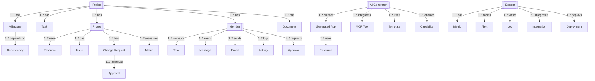

# Data Platform REST API Design Documentation

## Document Change Log

### Version History

| Version | Date | Author | Changes | Breaking Changes |
|---------|------|---------|---------|------------------|
| 1.3.0 | 2025-01-03 | System | - Added pagination to all list endpoints<br>- Enhanced authentication specifications<br>- Standardized error response format<br>- Added document changelog section | No |
| 1.2.0 | 2025-08-28 | adrian | - Updated entity relationship diagrams<br>- Added descriptive matrices<br>- Enhanced documentation | No |
| 1.1.0 | 2025-08-27 | adrian | - Added initial API endpoints<br>- Defined core resources | No |
| 1.0.0 | 2025-08-27 | adrian | - Initial API design documentation | N/A |

### Upcoming Changes (Next Release)

- [ ] Add WebSocket support for real-time updates
- [ ] Implement GraphQL endpoint
- [ ] Add batch operations support
- [ ] Enhanced filtering capabilities

### Deprecation Notices

- None at this time

---

## Table of Contents
1. [Document Change Log](#document-change-log)
2. [Overview](#overview)
3. [Architecture](#architecture)
4. [Entity Model](#entity-model)
5. [Authentication & Authorization](#authentication--authorization)
6. [API Endpoints](#api-endpoints)
7. [Data Models](#data-models)
8. [SDLC Management](#sdlc-management)
9. [Communication Services](#communication-services)
10. [AI Application Generator](#ai-application-generator)
11. [System Monitoring](#system-monitoring)
12. [Document Management](#document-management)
13. [Error Handling](#error-handling)

## Overview

This document provides a comprehensive REST API design for the Data Platform - an integrated enterprise system that combines Software Development Lifecycle (SDLC) management, AI-powered application generation, communication services, task management, and comprehensive monitoring capabilities. The platform enables organizations to manage the entire application lifecycle from requirements to deployment, with built-in AI assistance, collaboration tools, and real-time monitoring.

### Key Features
- Complete SDLC management with phase tracking
- AI-powered application generation with MCP tools
- Integrated chat and email communication
- Task and project management
- Member and stakeholder management
- Document repository with versioning
- Real-time system metrics and monitoring
- Security alerts and compliance tracking
- Deployment status tracking
- User activity monitoring
- Automated approval workflows
- Change request management
- Resource allocation and tracking
- Integration point management

## Architecture

### System Components

```
┌─────────────────────────────────────────────────────────┐
│                   API Gateway                           │
├─────────────────────────────────────────────────────────┤
│              Data Platform Service Layer                │
├──────────────────────┬──────────────────────────────────┤
│   SDLC Management    │    Communication Services        │
├──────────────────────┼──────────────────────────────────┤
│ • Phase Manager      │ • Chat Service                   │
│ • Timeline Tracker   │ • Email Service                  │
│ • Dependency Matrix  │ • Notification Engine            │
│ • Resource Allocator │ • Message Queue                  │
├──────────────────────┼──────────────────────────────────┤
│  AI Generator        │    Project Management            │
├──────────────────────┼──────────────────────────────────┤
│ • App Generator      │ • Task Manager                   │
│ • MCP Tool Manager   │ • Member Directory               │
│ • Code Generator     │ • Stakeholder Registry           │
│ • Architecture AI    │ • Approval Workflows             │
├──────────────────────┼──────────────────────────────────┤
│  Document Services   │    Monitoring Services           │
├──────────────────────┼──────────────────────────────────┤
│ • Document Store     │ • System Metrics                 │
│ • Version Control    │ • Security Monitor               │
│ • Change Tracking    │ • Activity Tracker               │
│ • Approval Engine    │ • Alert Manager                  │
├──────────────────────┴──────────────────────────────────┤
│              Infrastructure Layer                       │
├──────────────────────────────────────────────────────────┤
│ • Database (PostgreSQL) │ • Message Queue (RabbitMQ)    │
│ • Cache (Redis)         │ • File Storage (S3)           │
└─────────────────────────────────────────────────────────┘
```

### Service Hierarchy

```
Data Platform
├── SDLC Management
│   ├── Phases
│   │   ├── Requirements
│   │   ├── Design
│   │   ├── Development
│   │   ├── Testing
│   │   ├── Deployment
│   │   └── Maintenance
│   ├── Resources
│   │   ├── Human Resources
│   │   ├── Infrastructure
│   │   └── Tools
│   ├── Dependencies
│   │   ├── Blocking
│   │   ├── Partial
│   │   └── Optional
│   └── Documentation
│       ├── Requirements Specs
│       ├── Design Docs
│       ├── Technical Docs
│       └── User Guides
├── AI Application Generator
│   ├── Application Types
│   │   ├── Dashboard
│   │   ├── API Service
│   │   ├── Web Application
│   │   ├── Microservice
│   │   └── Analytics Platform
│   ├── MCP Tools
│   │   ├── Database Connector
│   │   ├── API Gateway
│   │   ├── Authentication
│   │   └── AI/ML Services
│   └── Generation Pipeline
│       ├── Analysis
│       ├── Architecture
│       ├── Component Generation
│       └── Optimization
├── Communication
│   ├── Chat
│   │   ├── Direct Messages
│   │   ├── Group Chats
│   │   └── AI Assistant Chat
│   ├── Email
│   │   ├── Inbox
│   │   ├── Sent
│   │   ├── Spam
│   │   └── Archived
│   └── Notifications
│       ├── System Alerts
│       ├── Task Updates
│       └── Approvals
├── Project Management
│   ├── Tasks
│   │   ├── Assignment
│   │   ├── Tracking
│   │   └── Completion
│   ├── Members
│   │   ├── Roles
│   │   ├── Permissions
│   │   └── Activity
│   └── Stakeholders
│       ├── Approvers
│       ├── Reviewers
│       └── Observers
└── Monitoring
    ├── System Metrics
    │   ├── CPU Usage
    │   ├── Memory Usage
    │   └── Network Throughput
    ├── Security
    │   ├── Threat Detection
    │   ├── Access Control
    │   └── Compliance
    └── Analytics
        ├── User Activity
        ├── Query History
        └── Insights
```

## Entity Model



Legend: 1 = one, * = many, 1..* = one-to-many, *..* = many-to-many, 1..1 = one-to-one

| From          | Relationship | To              | Cardinality |
|---------------|--------------|-----------------|-------------|
| Project       | has          | Phase           | 1..*        |
| Project       | has          | Task            | 1..*        |
| Project       | has          | Milestone       | 1..*        |
| Project       | has          | Member          | 1..*        |
| Project       | has          | Document        | 1..*        |
| Milestone     | depends on   | Dependency      | *..*        |
| Phase         | uses         | Resource        | 1..*        |
| Phase         | has          | Issue           | 1..*        |
| Phase         | has          | Change Request  | 1..*        |
| Phase         | measures     | Metric          | 1..*        |
| Change Request| approval     | Approval        | 1..1        |
| Member        | works on     | Task            | 1..*        |
| Member        | sends        | Message         | 1..*        |
| Member        | sends        | Email           | 1..*        |
| Member        | logs         | Activity        | 1..*        |
| Member        | requests     | Approval        | 1..*        |
| AI Generator  | creates      | Generated App   | 1..*        |
| AI Generator  | integrates   | MCP Tool        | *..*        |
| AI Generator  | uses         | Template        | 1..*        |
| AI Generator  | enables      | Capability      | 1..*        |
| Generated App | uses         | Resource        | *..*        |
| System        | has          | Metric          | 1..*        |
| System        | raises       | Alert           | 1..*        |
| System        | writes       | Log             | 1..*        |
| System        | integrates   | Integration     | *..*        |
| System        | deploys      | Deployment      | 1..*        |

### Entity Hierarchy

1. **Project** (Top Level)
   - Complete project lifecycle management
   - Phase orchestration
   - Resource allocation
   - Stakeholder management

2. **SDLC** (Process Level)
   - Phase execution
   - Dependency tracking
   - Change management
   - Quality metrics

3. **Communication** (Collaboration Level)
   - Chat messaging
   - Email management
   - Notifications
   - Activity feeds

4. **AI Generator** (Automation Level)
   - Application generation
   - Code synthesis
   - Architecture design
   - Tool integration

5. **Monitoring** (Operations Level)
   - System metrics
   - Security monitoring
   - Performance tracking
   - Compliance auditing

## Authentication & Authorization

### Authentication Flow

```
POST /api/v1/auth/login
Authorization: Bearer {token}
X-API-Key: {api-key}
X-Project-Id: {project-id}
```

### Authorization Model

```json
{
  "authorization": {
    "type": "RBAC + Project-based",
    "roles": {
      "admin": {
        "permissions": ["*"],
        "description": "Full platform administration"
      },
      "project_manager": {
        "permissions": [
          "project:*",
          "sdlc:*",
          "resource:*",
          "approval:*",
          "document:*"
        ],
        "description": "Project management and oversight"
      },
      "developer": {
        "permissions": [
          "task:*",
          "code:*",
          "ai-generator:*",
          "document:read",
          "chat:*"
        ],
        "description": "Development and implementation"
      },
      "qa_engineer": {
        "permissions": [
          "testing:*",
          "issue:*",
          "document:*",
          "metric:read"
        ],
        "description": "Quality assurance and testing"
      },
      "stakeholder": {
        "permissions": [
          "project:read",
          "approval:*",
          "document:read",
          "metric:read"
        ],
        "description": "Project oversight and approval"
      },
      "analyst": {
        "permissions": [
          "requirement:*",
          "document:*",
          "metric:read",
          "report:*"
        ],
        "description": "Business analysis and requirements"
      },
      "viewer": {
        "permissions": [
          "*:read"
        ],
        "description": "Read-only access"
      }
    },
    "projectRoles": {
      "owner": "Full project control",
      "member": "Active project participant",
      "observer": "Read-only project access"
    }
  }
}
```

## API Endpoints

### Base URL
```
https://api.data-platform.example.com/v1
```

### SDLC Management

```
# Project Management
GET    /projects?page={page}&limit={limit}&status={status}&type={type}&owner={owner}  # List all projects
       Authorization: Bearer {token}
       X-API-Key: {api-key}
       X-Project-Id: {project-id} (optional)
GET    /projects/{projectId}                  # Get project details
       Authorization: Bearer {token}
POST   /projects                              # Create project
       Authorization: Bearer {token}
       Content-Type: application/json
       Required: name, description, type, owner
       Validation: name (3-100 chars), description (max 500 chars), type (platform|application|service), owner (valid user)
PUT    /projects/{projectId}                  # Update project
       Authorization: Bearer {token}
       Content-Type: application/json
       Validation: partial update schema validation
DELETE /projects/{projectId}                  # Delete project
       Authorization: Bearer {token}
PATCH  /projects/{projectId}/status           # Update project status
       Authorization: Bearer {token}
       Content-Type: application/json
       Required: status
       Validation: status (active|inactive|completed|cancelled|on_hold)

# Phase Management
GET    /projects/{projectId}/phases           # List project phases
GET    /phases/{phaseId}                      # Get phase details
POST   /projects/{projectId}/phases           # Create phase
PUT    /phases/{phaseId}                      # Update phase
POST   /phases/{phaseId}/complete             # Mark phase complete
GET    /phases/{phaseId}/metrics              # Get phase metrics

# Milestone Management
GET    /projects/{projectId}/milestones       # List milestones
GET    /milestones/{milestoneId}              # Get milestone details
POST   /projects/{projectId}/milestones       # Create milestone
PUT    /milestones/{milestoneId}              # Update milestone
POST   /milestones/{milestoneId}/achieve      # Mark milestone achieved

# Timeline Management
GET    /projects/{projectId}/timeline         # Get project timeline
PUT    /projects/{projectId}/timeline         # Update timeline
GET    /projects/{projectId}/gantt            # Get Gantt chart data
POST   /projects/{projectId}/reschedule       # Reschedule project

# Dependency Management
GET    /projects/{projectId}/dependencies     # List dependencies
POST   /dependencies                          # Create dependency
PUT    /dependencies/{depId}                  # Update dependency
DELETE /dependencies/{depId}                  # Remove dependency
GET    /dependencies/{depId}/impact           # Analyze impact

# Resource Allocation
GET    /projects/{projectId}/resources        # List resources
POST   /resources/allocate                    # Allocate resource
PUT    /resources/{resourceId}/allocation     # Update allocation
GET    /resources/{resourceId}/utilization    # Get utilization
POST   /resources/optimize                    # Optimize allocation

# Issue Management
GET    /issues                                # List all issues
GET    /issues/{issueId}                      # Get issue details
POST   /issues                                # Create issue
PUT    /issues/{issueId}                      # Update issue
POST   /issues/{issueId}/resolve              # Resolve issue
GET    /phases/{phaseId}/issues               # Get phase issues

# Change Request Management
GET    /change-requests                       # List change requests
GET    /change-requests/{crId}                # Get CR details
POST   /change-requests                       # Submit CR
PUT    /change-requests/{crId}                # Update CR
POST   /change-requests/{crId}/approve        # Approve CR
POST   /change-requests/{crId}/reject         # Reject CR

# Testing Metrics
GET    /projects/{projectId}/test-metrics     # Get test metrics
GET    /test-cases                            # List test cases
POST   /test-cases                            # Create test case
GET    /test-runs/{runId}                     # Get test run
POST   /test-runs                             # Execute test run
GET    /defects                               # List defects

# Training Management
GET    /training/programs                     # List training programs
GET    /training/{programId}                  # Get program details
POST   /training/enroll                       # Enroll in training
GET    /training/progress/{memberId}         # Get training progress
POST   /training/{programId}/complete        # Mark training complete
```

### AI Application Generator

```
# Application Generation
POST   /ai-generator/generate                 # Generate application
GET    /ai-generator/apps                     # List generated apps
GET    /ai-generator/apps/{appId}             # Get app details
POST   /ai-generator/apps/{appId}/deploy      # Deploy application
DELETE /ai-generator/apps/{appId}             # Delete application

# Application Templates
GET    /ai-generator/templates                # List templates
GET    /ai-generator/templates/{templateId}   # Get template
POST   /ai-generator/templates                # Create template
PUT    /ai-generator/templates/{templateId}   # Update template

# MCP Tools Management
GET    /ai-generator/mcp-tools                # List MCP tools
GET    /ai-generator/mcp-tools/{toolId}       # Get tool details
POST   /ai-generator/mcp-tools/configure      # Configure tools
GET    /ai-generator/mcp-tools/status         # Get tools status

# Generation Process
POST   /ai-generator/analyze                  # Analyze requirements
POST   /ai-generator/design                   # Design architecture
POST   /ai-generator/generate-code            # Generate code
POST   /ai-generator/optimize                 # Optimize application
GET    /ai-generator/progress/{jobId}         # Get generation progress

# AI Capabilities
GET    /ai-generator/capabilities             # List AI capabilities
POST   /ai-generator/capabilities/enable      # Enable capability
POST   /ai-generator/capabilities/configure   # Configure capability
GET    /ai-generator/capabilities/status      # Get capability status

# Application Types
GET    /ai-generator/app-types                # List app types
GET    /ai-generator/app-types/{type}         # Get type details
GET    /ai-generator/app-types/{type}/features # Get type features
POST   /ai-generator/estimate                 # Estimate resources

# Generated App Management
GET    /ai-generator/apps/{appId}/code        # Get source code
GET    /ai-generator/apps/{appId}/docs        # Get documentation
GET    /ai-generator/apps/{appId}/tests       # Get test suite
POST   /ai-generator/apps/{appId}/customize   # Customize app
GET    /ai-generator/apps/{appId}/metrics     # Get app metrics
```

### Communication Services

```
# Chat Management
GET    /chat/conversations                    # List conversations
GET    /chat/conversations/{convId}           # Get conversation
POST   /chat/conversations                    # Start conversation
DELETE /chat/conversations/{convId}           # Delete conversation

# Messages
GET    /chat/conversations/{convId}/messages  # Get messages
POST   /chat/conversations/{convId}/messages  # Send message
PUT    /chat/messages/{messageId}             # Edit message
DELETE /chat/messages/{messageId}             # Delete message
POST   /chat/messages/{messageId}/react       # Add reaction

# Chat Users
GET    /chat/users                            # List chat users
GET    /chat/users/{userId}/status            # Get user status
PUT    /chat/users/{userId}/status            # Update status
GET    /chat/users/{userId}/presence          # Get presence

# Email Management
GET    /email/messages                        # List emails
GET    /email/messages/{emailId}              # Get email details
POST   /email/send                            # Send email
DELETE /email/messages/{emailId}              # Delete email
POST   /email/messages/{emailId}/reply        # Reply to email
POST   /email/messages/{emailId}/forward      # Forward email

# Email Folders
GET    /email/folders                         # List folders
POST   /email/folders                         # Create folder
PUT    /email/messages/{emailId}/move         # Move to folder
POST   /email/messages/{emailId}/archive      # Archive email
POST   /email/messages/{emailId}/spam         # Mark as spam

# Email Actions
POST   /email/messages/{emailId}/star         # Star email
POST   /email/messages/{emailId}/important    # Mark important
POST   /email/messages/bulk-action            # Bulk operations
GET    /email/search                          # Search emails
POST   /email/filters                         # Create filter

# Notifications
GET    /notifications                         # List notifications
GET    /notifications/{notifId}               # Get notification
POST   /notifications/mark-read               # Mark as read
POST   /notifications/mark-all-read           # Mark all as read
DELETE /notifications/{notifId}               # Delete notification

# Notification Preferences
GET    /notifications/preferences             # Get preferences
PUT    /notifications/preferences             # Update preferences
POST   /notifications/subscribe               # Subscribe to events
DELETE /notifications/subscribe/{subId}       # Unsubscribe
```

### Task Management

```
# Tasks
GET    /tasks?page={page}&limit={limit}&status={status}&priority={priority}&assignee={assignee}&project={projectId}  # List all tasks
       Authorization: Bearer {token}
       X-API-Key: {api-key}
GET    /tasks/{taskId}                        # Get task details
       Authorization: Bearer {token}
POST   /tasks                                 # Create task
       Authorization: Bearer {token}
       Content-Type: application/json
       Required: title, description, projectId, priority
       Validation: title (3-200 chars), description (max 1000 chars), projectId (valid UUID), priority (low|medium|high|critical)
PUT    /tasks/{taskId}                        # Update task
       Authorization: Bearer {token}
       Content-Type: application/json
       Validation: partial update schema validation
DELETE /tasks/{taskId}                        # Delete task
       Authorization: Bearer {token}
PATCH  /tasks/{taskId}/status                 # Update task status
       Authorization: Bearer {token}
       Content-Type: application/json
       Required: status
       Validation: status (todo|in_progress|review|testing|done|cancelled)

# Task Assignment
POST   /tasks/{taskId}/assign                 # Assign task
POST   /tasks/{taskId}/reassign               # Reassign task
POST   /tasks/{taskId}/unassign               # Unassign task
GET    /tasks/assigned/{memberId}             # Get member's tasks

# Task Tracking
POST   /tasks/{taskId}/start                  # Start task
POST   /tasks/{taskId}/pause                  # Pause task
POST   /tasks/{taskId}/complete               # Complete task
POST   /tasks/{taskId}/reopen                 # Reopen task
GET    /tasks/{taskId}/time-log               # Get time log

# Task Dependencies
GET    /tasks/{taskId}/dependencies           # Get dependencies
POST   /tasks/{taskId}/dependencies           # Add dependency
DELETE /tasks/{taskId}/dependencies/{depId}   # Remove dependency
GET    /tasks/{taskId}/blockers               # Get blockers

# Task Comments
GET    /tasks/{taskId}/comments               # Get comments
POST   /tasks/{taskId}/comments               # Add comment
PUT    /comments/{commentId}                  # Edit comment
DELETE /comments/{commentId}                  # Delete comment
```

### Member Management

```
# Members
GET    /members?page={page}&limit={limit}&role={role}&status={status}&team={teamId}  # List all members
       Authorization: Bearer {token}
       X-API-Key: {api-key}
GET    /members/{memberId}                    # Get member details
       Authorization: Bearer {token}
POST   /members                               # Add member
       Authorization: Bearer {token}
       Content-Type: application/json
       Required: name, email, role
       Validation: name (2-100 chars), email (valid email format), role (admin|project_manager|developer|qa_engineer|stakeholder|analyst|viewer)
PUT    /members/{memberId}                    # Update member
       Authorization: Bearer {token}
       Content-Type: application/json
       Validation: partial update schema validation
DELETE /members/{memberId}                    # Remove member
       Authorization: Bearer {token}
PATCH  /members/{memberId}/status             # Update status
       Authorization: Bearer {token}
       Content-Type: application/json
       Required: status
       Validation: status (active|inactive|suspended)

# Member Roles
GET    /members/{memberId}/roles              # Get member roles
POST   /members/{memberId}/roles              # Assign role
DELETE /members/{memberId}/roles/{roleId}     # Remove role
GET    /roles                                 # List all roles

# Member Activity
GET    /members/{memberId}/activity           # Get activity
GET    /members/{memberId}/contributions      # Get contributions
GET    /members/{memberId}/performance        # Get performance
GET    /members/{memberId}/workload           # Get workload

# Teams
GET    /teams                                 # List teams
GET    /teams/{teamId}                        # Get team details
POST   /teams                                 # Create team
PUT    /teams/{teamId}                        # Update team
POST   /teams/{teamId}/members                # Add team member
DELETE /teams/{teamId}/members/{memberId}     # Remove from team
```

### Stakeholder Management

```
# Stakeholders
GET    /stakeholders                          # List stakeholders
GET    /stakeholders/{stakeholderId}          # Get stakeholder
POST   /stakeholders                          # Add stakeholder
PUT    /stakeholders/{stakeholderId}          # Update stakeholder
DELETE /stakeholders/{stakeholderId}          # Remove stakeholder

# Approval Workflows
GET    /approvals                             # List approvals
GET    /approvals/{approvalId}                # Get approval details
POST   /approvals/request                     # Request approval
POST   /approvals/{approvalId}/approve        # Approve
POST   /approvals/{approvalId}/reject         # Reject
POST   /approvals/{approvalId}/delegate       # Delegate approval

# Approval Templates
GET    /approvals/templates                   # List templates
GET    /approvals/templates/{templateId}      # Get template
POST   /approvals/templates                   # Create template
PUT    /approvals/templates/{templateId}      # Update template

# Automation Rules
GET    /automation/rules                      # List rules
GET    /automation/rules/{ruleId}             # Get rule details
POST   /automation/rules                      # Create rule
PUT    /automation/rules/{ruleId}             # Update rule
POST   /automation/rules/{ruleId}/enable      # Enable rule
POST   /automation/rules/{ruleId}/disable     # Disable rule

# Approval History
GET    /approvals/history                     # Get approval history
GET    /approvals/history/{stakeholderId}     # Get stakeholder history
GET    /approvals/pending                     # Get pending approvals
GET    /approvals/metrics                     # Get approval metrics
```

### Document Management

```
# Documents
GET    /documents?page={page}&limit={limit}&type={type}&phase={phase}&project={projectId}&author={author}  # List documents
       Authorization: Bearer {token}
       X-API-Key: {api-key}
GET    /documents/{documentId}                # Get document
       Authorization: Bearer {token}
POST   /documents                             # Upload document
       Authorization: Bearer {token}
       Content-Type: multipart/form-data
       Required: name, type, phase, projectId, file
       Validation: name (3-200 chars), type (requirements|design|technical|user_guide), phase (requirements|design|development|testing|deployment|maintenance), projectId (valid UUID), file (max 50MB)
PUT    /documents/{documentId}                # Update document
       Authorization: Bearer {token}
       Content-Type: application/json
       Validation: partial update schema validation (exclude file)
DELETE /documents/{documentId}                # Delete document
       Authorization: Bearer {token}

# Document Versions
GET    /documents/{documentId}/versions       # List versions
GET    /documents/{documentId}/versions/{ver} # Get version
POST   /documents/{documentId}/versions       # Create version
POST   /documents/{documentId}/rollback       # Rollback version

# Document Operations
GET    /documents/{documentId}/download       # Download document
POST   /documents/{documentId}/share          # Share document
POST   /documents/{documentId}/lock           # Lock document
POST   /documents/{documentId}/unlock         # Unlock document
GET    /documents/{documentId}/permissions    # Get permissions

# Document Repository
GET    /repository/structure                  # Get repo structure
POST   /repository/folders                    # Create folder
PUT    /repository/folders/{folderId}         # Update folder
DELETE /repository/folders/{folderId}         # Delete folder
POST   /repository/organize                   # Organize documents

# Document Search
GET    /documents/search                      # Search documents
GET    /documents/recent                      # Recent documents
GET    /documents/shared                      # Shared documents
GET    /documents/by-phase/{phase}           # Documents by phase
GET    /documents/by-type/{type}             # Documents by type
```

### System Monitoring

```
# System Metrics
GET    /metrics                               # All system metrics
GET    /metrics/cpu                           # CPU metrics
GET    /metrics/memory                        # Memory metrics
GET    /metrics/storage                       # Storage metrics
GET    /metrics/network                       # Network metrics
GET    /metrics/api                           # API metrics

# Performance Monitoring
GET    /performance/response-times            # Response times
GET    /performance/throughput                # Throughput metrics
GET    /performance/errors                    # Error rates
GET    /performance/bottlenecks               # Bottleneck analysis
POST   /performance/analyze                   # Performance analysis

# Security Monitoring
GET    /security/alerts                       # Security alerts
GET    /security/threats                      # Threat detection
GET    /security/vulnerabilities              # Vulnerabilities
GET    /security/compliance                   # Compliance status
POST   /security/scan                         # Security scan

# User Activity
GET    /activity/users                        # User activity
GET    /activity/users/{userId}               # Specific user activity
GET    /activity/recent                       # Recent activity
GET    /activity/patterns                     # Activity patterns
GET    /activity/anomalies                    # Anomaly detection

# Query History
GET    /queries/history                       # Query history
GET    /queries/frequent                      # Frequent queries
GET    /queries/slow                          # Slow queries
GET    /queries/failed                        # Failed queries
POST   /queries/analyze                       # Query analysis

# Deployment Status
GET    /deployments                           # All deployments
GET    /deployments/{deploymentId}            # Deployment details
GET    /deployments/active                    # Active deployments
GET    /deployments/history                   # Deployment history
POST   /deployments/{deploymentId}/rollback   # Rollback deployment

# System Insights
GET    /insights                              # System insights
GET    /insights/recommendations              # Recommendations
GET    /insights/predictions                  # Predictions
GET    /insights/trends                       # Trend analysis
POST   /insights/generate                     # Generate insights

# Integration Status
GET    /integrations                          # List integrations
GET    /integrations/{integrationId}          # Integration details
GET    /integrations/{integrationId}/health   # Health status
POST   /integrations/{integrationId}/test     # Test integration
POST   /integrations/{integrationId}/sync     # Sync integration
```

## Data Models

### Project Entity

```json
{
  "id": "proj-001",
  "name": "Enterprise Data Platform",
  "description": "Comprehensive data management and analytics platform",
  "status": "active",
  "type": "platform",
  "priority": "high",
  "created": "2024-01-01T00:00:00Z",
  "updated": "2024-01-20T10:30:00Z",
  "owner": "Adrian",
  "team": ["Adrian", "Mike Chen", "Lisa Anderson"],
  "startDate": "2024-01-01",
  "endDate": "2024-03-15",
  "budget": {
    "allocated": 500000,
    "spent": 125000,
    "remaining": 375000,
    "currency": "USD"
  },
  "phases": {
    "current": "development",
    "completed": ["requirements", "design"],
    "upcoming": ["testing", "deployment", "maintenance"]
  },
  "metrics": {
    "progress": 45,
    "velocity": 32,
    "quality": 92,
    "risks": 3,
    "issues": 5
  },
  "stakeholders": [
    {
      "id": "stake-001",
      "name": "Adrian",
      "role": "Project Sponsor",
      "approvalAuthority": true
    }
  ],
  "tags": ["enterprise", "data", "analytics", "platform"]
}
```

### SDLC Phase Entity

```json
{
  "id": "phase-001",
  "projectId": "proj-001",
  "name": "Development",
  "type": "development",
  "status": "in_progress",
  "startDate": "2024-02-05",
  "endDate": "2024-02-28",
  "actualStart": "2024-02-05",
  "progress": 65,
  "duration": "21 days",
  "efficiency": 78,
  "resources": [
    {
      "type": "human",
      "name": "Backend Team",
      "allocation": 100,
      "role": "Developers",
      "availability": "Full-time"
    },
    {
      "type": "infrastructure",
      "name": "Development Servers",
      "allocation": 75,
      "specs": "16 cores, 64GB RAM"
    }
  ],
  "deliverables": [
    {
      "name": "API Implementation",
      "status": "completed",
      "completedDate": "2024-02-15"
    },
    {
      "name": "Database Schema",
      "status": "completed",
      "completedDate": "2024-02-10"
    },
    {
      "name": "Frontend Components",
      "status": "in_progress",
      "progress": 70
    }
  ],
  "dependencies": [
    {
      "id": "dep-001",
      "type": "blocking",
      "source": "Design",
      "status": "resolved",
      "resolvedDate": "2024-02-04"
    }
  ],
  "issues": [
    {
      "id": "issue-001",
      "title": "API Authentication Design Pending",
      "severity": "high",
      "status": "open",
      "assignee": "Adrian"
    }
  ],
  "metrics": {
    "codeQuality": {
      "coverage": 85,
      "complexity": 12,
      "duplication": 3.2
    },
    "velocity": 32,
    "burnRate": "normal"
  }
}
```

### AI Generated Application Entity

```json
{
  "id": "gen-app-001",
  "name": "Customer Analytics Dashboard",
  "description": "Real-time monitoring dashboard with intelligent alerts",
  "type": "dashboard",
  "status": "ready_to_deploy",
  "generatedAt": "2024-01-20T14:30:00Z",
  "generatedBy": "AI Generator v2.0",
  "requestedBy": "Adrian",
  "prompt": "Create a real-time customer analytics dashboard with predictive insights",
  "configuration": {
    "appType": "dashboard",
    "framework": "Vue.js",
    "backend": "Node.js",
    "database": "PostgreSQL"
  },
  "features": [
    "Real-time data visualization",
    "Predictive analytics",
    "Custom alerts",
    "Export functionality",
    "Mobile responsive"
  ],
  "techStack": {
    "frontend": ["Vue.js", "Chart.js", "Vuetify"],
    "backend": ["Node.js", "Express", "Socket.io"],
    "database": ["PostgreSQL", "Redis"],
    "deployment": ["Docker", "Kubernetes"]
  },
  "mcpToolsUsed": [
    {
      "id": "database",
      "name": "Database Connector",
      "configuration": {
        "type": "PostgreSQL",
        "poolSize": 20
      }
    },
    {
      "id": "api",
      "name": "API Gateway",
      "configuration": {
        "rateLimit": "1000/hour",
        "authentication": "JWT"
      }
    },
    {
      "id": "ai",
      "name": "AI/ML Services",
      "configuration": {
        "models": ["prediction", "anomaly-detection"]
      }
    }
  ],
  "resources": {
    "estimatedCost": {
      "monthly": 250,
      "currency": "USD"
    },
    "requirements": {
      "cpu": "2 cores",
      "memory": "4GB",
      "storage": "20GB",
      "bandwidth": "100GB/month"
    },
    "scalability": {
      "maxUsers": 1000,
      "maxRequests": "10000/hour"
    }
  },
  "deployment": {
    "estimatedTime": "5-10 minutes",
    "environments": ["development", "staging", "production"],
    "cicd": true,
    "monitoring": true
  },
  "artifacts": {
    "sourceCode": "s3://generated-apps/gen-app-001/source.zip",
    "documentation": "s3://generated-apps/gen-app-001/docs.pdf",
    "tests": "s3://generated-apps/gen-app-001/tests.zip",
    "dockerfile": "s3://generated-apps/gen-app-001/Dockerfile"
  },
  "quality": {
    "codeQuality": "A",
    "security": "High",
    "performance": "Optimized",
    "maintainability": "Good"
  }
}
```

### Chat Message Entity

```json
{
  "id": "msg-001",
  "conversationId": "conv-001",
  "text": "Lorem ipsum dolor sit amet, consectetur adipiscing elit",
  "ownerId": 1,
  "ownerName": "Adrian",
  "ownerImage": "adrian.png",
  "createdAt": "2024-01-20T10:30:00Z",
  "editedAt": null,
  "status": "delivered",
  "readBy": [2, 3],
  "reactions": [
    {
      "emoji": "👍",
      "users": [2]
    }
  ],
  "attachments": [],
  "replyTo": null,
  "mentions": [],
  "type": "text",
  "metadata": {
    "client": "web",
    "version": "1.0"
  }
}
```

### Email Entity

```json
{
  "id": "email-001",
  "from": "Adrian",
  "fromEmail": "adrian@example.com",
  "to": ["team@example.com"],
  "cc": [],
  "bcc": [],
  "subject": "Apply These 7 Secret Techniques To Improve Event",
  "message": "Lorem ipsum dolor sit amet, consectetur adipiscing elit...",
  "date": "2024-01-20T09:00:00Z",
  "folder": "inbox",
  "labels": ["important", "project"],
  "important": true,
  "starred": false,
  "read": true,
  "trash": false,
  "spam": false,
  "archived": false,
  "attachments": [
    {
      "name": "report.pdf",
      "size": "2.5MB",
      "type": "application/pdf"
    }
  ],
  "headers": {
    "messageId": "<msg-001@example.com>",
    "inReplyTo": null,
    "references": []
  },
  "metadata": {
    "ip": "192.168.1.1",
    "client": "Outlook",
    "spamScore": 0.1
  }
}
```

### Task Entity

```json
{
  "id": "task-001",
  "title": "Implement Authentication Module",
  "description": "Create OAuth 2.0 authentication system",
  "projectId": "proj-001",
  "phaseId": "phase-001",
  "status": "in_progress",
  "priority": "high",
  "type": "development",
  "assignee": {
    "id": "member-001",
    "name": "Adrian",
    "avatar": "adrian.png"
  },
  "creator": "Adrian",
  "created": "2024-01-15T10:00:00Z",
  "updated": "2024-01-20T14:30:00Z",
  "dueDate": "2024-01-25",
  "startDate": "2024-01-20",
  "completedDate": null,
  "estimatedHours": 16,
  "actualHours": 8,
  "progress": 50,
  "tags": ["backend", "security", "authentication"],
  "dependencies": ["task-000"],
  "blockers": [],
  "comments": 3,
  "attachments": 2,
  "checklist": [
    {
      "item": "Design authentication flow",
      "completed": true
    },
    {
      "item": "Implement JWT tokens",
      "completed": true
    },
    {
      "item": "Add refresh token logic",
      "completed": false
    },
    {
      "item": "Write unit tests",
      "completed": false
    }
  ],
  "timeLog": [
    {
      "date": "2024-01-20",
      "hours": 4,
      "description": "Initial implementation"
    },
    {
      "date": "2024-01-21",
      "hours": 4,
      "description": "JWT implementation"
    }
  ]
}
```

### System Metric Entity

```json
{
  "id": "metric-001",
  "name": "CPU Usage",
  "category": "performance",
  "value": 45,
  "unit": "%",
  "status": "normal",
  "trend": "stable",
  "timestamp": "2024-01-20T10:30:00Z",
  "metadata": {
    "server": "app-server-01",
    "datacenter": "us-east-1",
    "cluster": "production"
  },
  "thresholds": {
    "warning": 70,
    "critical": 90
  },
  "history": [
    {
      "timestamp": "2024-01-20T10:25:00Z",
      "value": 43
    },
    {
      "timestamp": "2024-01-20T10:20:00Z",
      "value": 47
    }
  ],
  "predictions": {
    "next1Hour": 48,
    "next24Hours": 52
  },
  "alerts": [],
  "recommendations": [
    "Current usage is optimal",
    "No action required"
  ]
}
```

### Document Entity

```json
{
  "id": "doc-001",
  "name": "Requirements Specification v2.0",
  "type": "requirements",
  "phase": "requirements",
  "projectId": "proj-001",
  "version": "2.0",
  "status": "approved",
  "author": {
    "id": "member-001",
    "name": "Adrian"
  },
  "created": "2024-01-10T09:00:00Z",
  "modified": "2024-01-15T14:30:00Z",
  "size": "2.4MB",
  "format": "PDF",
  "path": "s3://documents/proj-001/requirements-v2.pdf",
  "permissions": {
    "read": ["all"],
    "write": ["project_manager", "analyst"],
    "delete": ["project_manager"]
  },
  "tags": ["requirements", "approved", "baseline"],
  "metadata": {
    "pages": 45,
    "language": "en",
    "reviewers": ["Adrian", "Mike Chen"],
    "approvalDate": "2024-01-15",
    "nextReview": "2024-02-15"
  },
  "versions": [
    {
      "version": "1.0",
      "date": "2024-01-05",
      "author": "Adrian",
      "changes": "Initial draft"
    },
    {
      "version": "1.5",
      "date": "2024-01-08",
      "author": "Adrian",
      "changes": "Added non-functional requirements"
    },
    {
      "version": "2.0",
      "date": "2024-01-15",
      "author": "Adrian",
      "changes": "Final approved version"
    }
  ],
  "references": ["doc-002", "doc-003"],
  "checksum": "sha256:abcdef123456..."
}
```

## SDLC Management

### Phase Lifecycle

```json
{
  "phases": [
    {
      "name": "Requirements",
      "order": 1,
      "gates": ["requirements_complete", "stakeholder_approval"],
      "deliverables": ["requirements_doc", "use_cases", "acceptance_criteria"]
    },
    {
      "name": "Design",
      "order": 2,
      "gates": ["design_review", "architecture_approval"],
      "deliverables": ["system_design", "api_spec", "ui_mockups"]
    },
    {
      "name": "Development",
      "order": 3,
      "gates": ["code_review", "unit_tests_pass"],
      "deliverables": ["source_code", "unit_tests", "documentation"]
    },
    {
      "name": "Testing",
      "order": 4,
      "gates": ["test_coverage_met", "no_critical_bugs"],
      "deliverables": ["test_results", "bug_reports", "performance_report"]
    },
    {
      "name": "Deployment",
      "order": 5,
      "gates": ["deployment_approval", "rollback_plan"],
      "deliverables": ["deployment_guide", "release_notes", "training_materials"]
    },
    {
      "name": "Maintenance",
      "order": 6,
      "gates": ["sla_defined", "support_team_ready"],
      "deliverables": ["maintenance_plan", "monitoring_setup", "knowledge_base"]
    }
  ]
}
```

### Dependency Types

```json
{
  "dependencyTypes": {
    "blocking": {
      "description": "Must complete before starting",
      "impact": "high",
      "enforcement": "strict"
    },
    "partial": {
      "description": "Can start with partial completion",
      "impact": "medium",
      "enforcement": "flexible"
    },
    "optional": {
      "description": "Nice to have but not required",
      "impact": "low",
      "enforcement": "none"
    }
  }
}
```

## Communication Services

### Chat Features

1. **Direct Messaging**: One-on-one conversations
2. **Group Chats**: Team conversations
3. **AI Assistant**: Integrated AI chat support
4. **File Sharing**: Document and media sharing
5. **Message Search**: Full-text search
6. **Read Receipts**: Message delivery status
7. **Typing Indicators**: Real-time status
8. **Reactions**: Emoji reactions

### Email Features

1. **Smart Inbox**: AI-powered email categorization
2. **Filters**: Custom email filters
3. **Templates**: Email templates
4. **Scheduling**: Send later functionality
5. **Tracking**: Read receipts and link tracking
6. **Integration**: Calendar and task integration
7. **Encryption**: End-to-end encryption
8. **Signatures**: Custom signatures

## AI Application Generator

### Generation Pipeline

```json
{
  "pipeline": {
    "stages": [
      {
        "name": "Analysis",
        "duration": "5-10s",
        "activities": ["Parse requirements", "Identify patterns", "Select templates"]
      },
      {
        "name": "Architecture",
        "duration": "10-15s",
        "activities": ["Design system", "Select components", "Plan integrations"]
      },
      {
        "name": "Configuration",
        "duration": "5-10s",
        "activities": ["Configure MCP tools", "Set parameters", "Allocate resources"]
      },
      {
        "name": "Generation",
        "duration": "30-60s",
        "activities": ["Generate code", "Create tests", "Build documentation"]
      },
      {
        "name": "Optimization",
        "duration": "10-20s",
        "activities": ["Optimize performance", "Security scan", "Code quality check"]
      },
      {
        "name": "Packaging",
        "duration": "5-10s",
        "activities": ["Create artifacts", "Package application", "Prepare deployment"]
      }
    ]
  }
}
```

### MCP Tool Capabilities

```json
{
  "mcpTools": {
    "database": ["Connection pooling", "Query optimization", "Migration management"],
    "api": ["Rate limiting", "Authentication", "Request validation"],
    "auth": ["OAuth 2.0", "JWT", "MFA", "SSO"],
    "cache": ["Redis", "Memcached", "In-memory", "Distributed"],
    "queue": ["RabbitMQ", "Kafka", "SQS", "Redis Queue"],
    "storage": ["S3", "Azure Blob", "GCS", "Local"],
    "ai": ["Prediction", "Classification", "NLP", "Computer Vision"],
    "notifications": ["Email", "SMS", "Push", "Webhooks"],
    "logging": ["Structured logging", "Metrics", "Tracing", "Alerting"],
    "security": ["Encryption", "Vulnerability scanning", "Access control", "Audit"]
  }
}
```

## System Monitoring

### Monitoring Categories

1. **Performance Metrics**
   - Response time
   - Throughput
   - Latency
   - Error rate

2. **Resource Metrics**
   - CPU usage
   - Memory usage
   - Disk I/O
   - Network I/O

3. **Application Metrics**
   - Active users
   - Request volume
   - Transaction rate
   - Cache hit ratio

4. **Security Metrics**
   - Failed logins
   - Access violations
   - Threat detection
   - Compliance score

## Error Handling

### Error Response Format

```json
{
  "error": {
    "code": "SDLC_001",
    "message": "Phase transition blocked",
    "details": {
      "phase": "development",
      "reason": "Pending approvals",
      "blockers": ["design_approval"],
      "timestamp": "2024-01-20T10:30:00Z",
      "retryable": false,
      "suggestedAction": "Complete pending approvals before phase transition",
      "category": "business_logic_error"
    },
    "requestId": "req-abc123",
    "traceId": "trace-def456",
    "documentation": "https://docs.platform.com/errors#SDLC_001"
  },
  "metadata": {
    "timestamp": "2024-01-20T10:30:00Z",
    "version": "v1",
    "service": "data-platform-api"
  }
}
```

### Error Codes

```
# SDLC Errors
SDLC_001: Phase transition blocked
SDLC_002: Resource allocation failed
SDLC_003: Dependency not resolved
SDLC_004: Approval required
SDLC_005: Milestone not achieved

# AI Generator Errors
AI_001: Generation failed
AI_002: Invalid requirements
AI_003: Resource limit exceeded
AI_004: MCP tool unavailable
AI_005: Deployment failed

# Communication Errors
COMM_001: Message delivery failed
COMM_002: User not found
COMM_003: Conversation limit reached
COMM_004: Attachment too large
COMM_005: Email send failed

# Task Errors
TASK_001: Task not found
TASK_002: Assignment failed
TASK_003: Dependency cycle detected
TASK_004: Invalid status transition
TASK_005: Permission denied

# System Errors
SYS_001: Metric threshold exceeded
SYS_002: Integration failed
SYS_003: Storage limit reached
SYS_004: Performance degradation
SYS_005: Security violation
```

## Implementation Guidelines

### Best Practices

1. **SDLC Management**
   - Enforce phase gates
   - Track dependencies
   - Automate approvals
   - Monitor progress

2. **AI Generation**
   - Validate requirements
   - Optimize resources
   - Test generated code
   - Document outputs

3. **Communication**
   - Encrypt messages
   - Archive conversations
   - Enable notifications
   - Integrate with tasks

4. **Monitoring**
   - Set thresholds
   - Configure alerts
   - Analyze trends
   - Generate insights

### API Standards

1. **RESTful Design**
   - Resource-oriented URLs
   - Standard HTTP methods
   - Consistent responses
   - Proper status codes

2. **Versioning**
   - URL path versioning (/v1/)
   - Backward compatibility
   - Deprecation notices
   - Migration guides

3. **Pagination**
   ```json
   {
     "data": [...],
     "pagination": {
       "page": 1,
       "limit": 20,
       "offset": 0,
       "totalCount": 100,
       "totalPages": 5,
       "hasNext": true,
       "hasPrevious": false
     },
     "links": {
       "self": "/projects?page=1&limit=20",
       "next": "/projects?page=2&limit=20",
       "prev": null,
       "first": "/projects?page=1&limit=20",
       "last": "/projects?page=5&limit=20"
     }
   }
   ```

4. **Filtering**
   ```
   GET /tasks?status=in_progress&priority=high&assignee=member-001
   ```

## Conclusion

This comprehensive REST API design for the Data Platform provides:

1. **Complete SDLC Management**: Full project lifecycle tracking with phase management
2. **AI-Powered Generation**: Automated application creation with MCP tools
3. **Integrated Communication**: Chat, email, and notification services
4. **Task Management**: Comprehensive task tracking and assignment
5. **Document Management**: Version-controlled document repository
6. **System Monitoring**: Real-time metrics and performance tracking
7. **Stakeholder Management**: Approval workflows and automation
8. **Resource Management**: Allocation and utilization tracking

The API enables organizations to manage complex software development projects with integrated AI assistance, comprehensive monitoring, and seamless team collaboration across all phases of the development lifecycle.