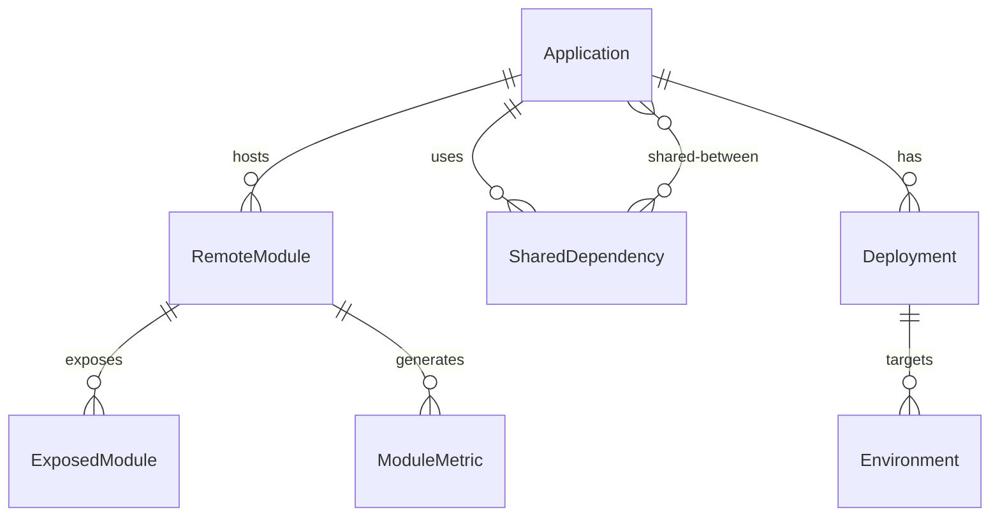
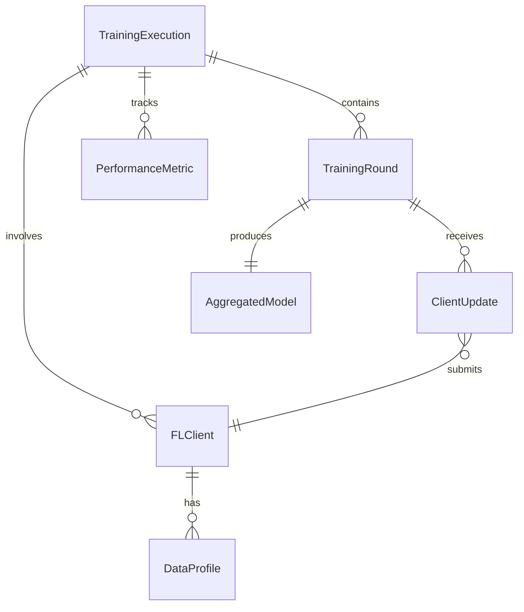
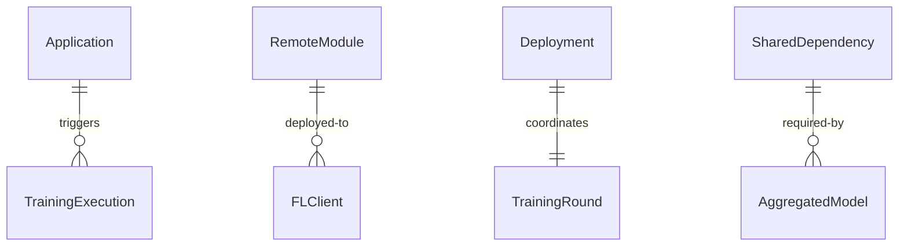

# Federation & Federated Learning Platform REST API Design

## Table of Contents

1. [Overview](#overview)
2. [System Architecture](#system-architecture)
3. [Authentication & Authorization](#authentication--authorization)
4. [Core API Endpoints](#core-api-endpoints)
   - [Module Federation APIs](#module-federation-apis)
   - [Federated Learning APIs](#federated-learning-apis)
5. [Entity Relationships](#entity-relationships)
6. [Data Models](#data-models)
7. [API Specifications](#api-specifications)
8. [WebSocket Events](#websocket-events)
9. [Error Handling](#error-handling)
10. [Security Considerations](#security-considerations)

## Overview

The Federation & Federated Learning Platform provides a unified REST API for managing both Module Federation (microfrontend architecture) and Federated Learning (distributed ML training) systems. This comprehensive API enables:

- **Module Federation Management**: Shell applications, remote modules, shared dependencies, and runtime configuration
- **Federated Learning Operations**: Training executions, client orchestration, model aggregation, and performance monitoring
- **Cross-System Integration**: Unified deployment, monitoring, and governance across both systems
- **Real-Time Capabilities**: WebSocket support for live updates and streaming metrics

## System Architecture

### High-Level Architecture

```
┌──────────────────────────────────────────────────────────────┐
│                     API Gateway                               │
│                  (Authentication, Rate Limiting)              │
└───────────────┬──────────────────────────┬───────────────────┘
                │                          │
    ┌───────────▼──────────┐   ┌──────────▼──────────────┐
    │  Module Federation    │   │  Federated Learning      │
    │      Service          │   │      Service             │
    └───────────┬──────────┘   └──────────┬───────────────┘
                │                          │
    ┌───────────▼──────────┐   ┌──────────▼───────────────┐
    │    Application        │   │    Training              │
    │    Registry           │   │    Orchestrator          │
    └───────────┬──────────┘   └──────────┬───────────────┘
                │                          │
    ┌───────────▼──────────┐   ┌──────────▼───────────────┐
    │    Remote Module      │   │    Client                │
    │    Repository         │   │    Manager               │
    └───────────────────────┘   └──────────────────────────┘
```

### Service Components

1. **Module Federation Service**
   - Shell application management
   - Remote module registry
   - Dependency resolution
   - Version control
   - Runtime configuration

2. **Federated Learning Service**
   - Training execution management
   - Client orchestration
   - Model aggregation
   - Metric collection
   - Privacy preservation

3. **Integration Layer**
   - Unified monitoring
   - Cross-system deployment
   - Shared authentication
   - Audit logging
   - Event streaming

## Authentication & Authorization

### Authentication Methods

```http
Authorization: Bearer <jwt-token>
X-API-Key: <api-key>
X-Client-Certificate: <client-cert>
```

### Permission Scopes

```javascript
{
  // Module Federation Scopes
  "federation:applications:read",
  "federation:applications:write",
  "federation:modules:deploy",
  "federation:config:manage",
  
  // Federated Learning Scopes
  "fl:training:execute",
  "fl:clients:manage",
  "fl:models:aggregate",
  "fl:metrics:view",
  
  // Admin Scopes
  "admin:system:configure",
  "admin:users:manage",
  "admin:audit:view"
}
```

## Core API Endpoints

### Module Federation APIs

#### Application Management

##### List Applications
```http
GET /api/v1/federation/applications
Query Parameters:
  - status: active|inactive|all
  - framework: react|vue|angular
  - search: string
  - page: number
  - limit: number
  - sort: name|version|health|created_at
```

##### Get Application Details
```http
GET /api/v1/federation/applications/{applicationId}
```

##### Create Application
```http
POST /api/v1/federation/applications
Body: {
  "name": "string",
  "host": "string",
  "version": "string",
  "framework": "react|vue|angular",
  "config": {
    "port": number,
    "publicPath": "string",
    "filename": "string",
    "shared": ["dependencies"]
  }
}
```

##### Update Application
```http
PUT /api/v1/federation/applications/{applicationId}
```

##### Delete Application
```http
DELETE /api/v1/federation/applications/{applicationId}
```

##### Deploy Application
```http
POST /api/v1/federation/applications/{applicationId}/deploy
Body: {
  "environment": "development|staging|production",
  "strategy": "blue-green|canary|rolling",
  "config": {...}
}
```

#### Remote Module Management

##### List Remote Modules
```http
GET /api/v1/federation/modules
Query Parameters:
  - applicationId: string
  - status: active|inactive|loading|error
  - search: string
```

##### Register Remote Module
```http
POST /api/v1/federation/modules
Body: {
  "name": "string",
  "url": "string",
  "applicationId": "string",
  "exposedModules": ["string"],
  "dependencies": {...}
}
```

##### Update Remote Module
```http
PUT /api/v1/federation/modules/{moduleId}
```

##### Load Remote Module
```http
POST /api/v1/federation/modules/{moduleId}/load
Body: {
  "targetApplication": "string",
  "lazy": boolean,
  "fallback": "string"
}
```

##### Get Module Metrics
```http
GET /api/v1/federation/modules/{moduleId}/metrics
Query Parameters:
  - period: 1h|24h|7d|30d
  - metrics: loadTime|size|errors|requests
```

#### Shared Dependencies

##### List Shared Dependencies
```http
GET /api/v1/federation/dependencies
```

##### Configure Shared Dependency
```http
POST /api/v1/federation/dependencies
Body: {
  "package": "string",
  "version": "string",
  "singleton": boolean,
  "strictVersion": boolean,
  "requiredVersion": "string"
}
```

##### Resolve Dependency Conflicts
```http
POST /api/v1/federation/dependencies/resolve
Body: {
  "applications": ["applicationId"],
  "strategy": "highest|lowest|manual",
  "overrides": {...}
}
```

#### Runtime Configuration

##### Get Runtime Config
```http
GET /api/v1/federation/runtime/{applicationId}
```

##### Update Runtime Config
```http
PUT /api/v1/federation/runtime/{applicationId}
Body: {
  "publicPath": "string",
  "chunkLoadTimeout": number,
  "remotes": {...},
  "shared": {...}
}
```

##### Hot Reload Module
```http
POST /api/v1/federation/runtime/{applicationId}/reload
Body: {
  "moduleId": "string",
  "clearCache": boolean
}
```

### Federated Learning APIs

#### Training Execution Management

##### List Training Executions
```http
GET /api/v1/fl/executions
Query Parameters:
  - status: running|completed|failed|pending
  - modelType: classification|regression|clustering
  - dateFrom: ISO8601
  - dateTo: ISO8601
  - page: number
  - limit: number
```

##### Get Execution Details
```http
GET /api/v1/fl/executions/{executionId}
```

##### Start Training Execution
```http
POST /api/v1/fl/executions
Body: {
  "modelType": "classification|regression|clustering",
  "algorithm": "fedavg|fedprox|fedopt",
  "config": {
    "rounds": number,
    "minClients": number,
    "clientFraction": number,
    "localEpochs": number,
    "batchSize": number,
    "learningRate": number
  },
  "privacyConfig": {
    "differential_privacy": boolean,
    "epsilon": number,
    "delta": number,
    "secure_aggregation": boolean
  }
}
```

##### Stop Training Execution
```http
POST /api/v1/fl/executions/{executionId}/stop
Body: {
  "reason": "string",
  "saveCheckpoint": boolean
}
```

##### Resume Training Execution
```http
POST /api/v1/fl/executions/{executionId}/resume
Body: {
  "fromRound": number,
  "adjustConfig": {...}
}
```

#### Client Management

##### List FL Clients
```http
GET /api/v1/fl/clients
Query Parameters:
  - status: active|idle|training|offline
  - capability: gpu|cpu|mobile
  - region: string
```

##### Register FL Client
```http
POST /api/v1/fl/clients
Body: {
  "name": "string",
  "capability": {
    "compute": "gpu|cpu",
    "memory": "string",
    "bandwidth": "string"
  },
  "dataProfile": {
    "samples": number,
    "distribution": {...},
    "quality": "high|medium|low"
  },
  "location": {
    "region": "string",
    "zone": "string"
  }
}
```

##### Update Client Status
```http
PUT /api/v1/fl/clients/{clientId}/status
Body: {
  "status": "active|idle|training|offline",
  "metadata": {...}
}
```

##### Assign Client to Training
```http
POST /api/v1/fl/clients/{clientId}/assign
Body: {
  "executionId": "string",
  "role": "trainer|validator|aggregator",
  "config": {...}
}
```

##### Get Client Metrics
```http
GET /api/v1/fl/clients/{clientId}/metrics
Query Parameters:
  - metrics: performance|data_quality|contribution
  - period: 1h|24h|7d|30d
```

#### Model Aggregation

##### Get Aggregation Status
```http
GET /api/v1/fl/aggregation/{executionId}/status
```

##### Configure Aggregation
```http
POST /api/v1/fl/aggregation/{executionId}/configure
Body: {
  "strategy": "fedavg|fedprox|fedopt|custom",
  "weights": "uniform|proportional|performance",
  "validation": {
    "enabled": boolean,
    "threshold": number,
    "metrics": ["accuracy", "loss"]
  }
}
```

##### Trigger Manual Aggregation
```http
POST /api/v1/fl/aggregation/{executionId}/trigger
Body: {
  "round": number,
  "clients": ["clientId"],
  "waitForAll": boolean
}
```

##### Get Aggregated Model
```http
GET /api/v1/fl/aggregation/{executionId}/model
Query Parameters:
  - round: number
  - format: h5|onnx|pytorch|tensorflow
```

#### Training Rounds

##### List Training Rounds
```http
GET /api/v1/fl/executions/{executionId}/rounds
```

##### Get Round Details
```http
GET /api/v1/fl/executions/{executionId}/rounds/{roundNumber}
```

##### Get Round Metrics
```http
GET /api/v1/fl/executions/{executionId}/rounds/{roundNumber}/metrics
```

##### Download Round Checkpoint
```http
GET /api/v1/fl/executions/{executionId}/rounds/{roundNumber}/checkpoint
```

#### Performance Monitoring

##### Get Training Metrics
```http
GET /api/v1/fl/metrics/training
Query Parameters:
  - executionId: string
  - metrics: loss|accuracy|convergence|participation
  - aggregation: mean|sum|max|min
  - interval: 1m|5m|1h|1d
```

##### Get System Metrics
```http
GET /api/v1/fl/metrics/system
Query Parameters:
  - resource: cpu|memory|network|storage
  - nodeType: client|server|aggregator
  - period: 1h|24h|7d
```

##### Get Data Distribution
```http
GET /api/v1/fl/metrics/data-distribution
Query Parameters:
  - executionId: string
  - analysis: heterogeneity|imbalance|quality
```

##### Export Metrics
```http
POST /api/v1/fl/metrics/export
Body: {
  "executionId": "string",
  "format": "csv|json|parquet",
  "metrics": ["string"],
  "dateRange": {
    "from": "ISO8601",
    "to": "ISO8601"
  }
}
```

### Integration APIs

#### Unified Deployment

##### Deploy Federation & FL System
```http
POST /api/v1/integration/deploy
Body: {
  "federation": {
    "applicationId": "string",
    "modules": ["moduleId"]
  },
  "federatedLearning": {
    "executionId": "string",
    "clients": ["clientId"]
  },
  "environment": "development|staging|production",
  "coordination": {
    "syncDeployment": boolean,
    "rollbackOnFailure": boolean
  }
}
```

##### Get Deployment Status
```http
GET /api/v1/integration/deployments/{deploymentId}
```

##### Rollback Deployment
```http
POST /api/v1/integration/deployments/{deploymentId}/rollback
```

#### Cross-System Monitoring

##### Get Combined Health Status
```http
GET /api/v1/integration/health
```

##### Get System Dependencies
```http
GET /api/v1/integration/dependencies
Query Parameters:
  - view: graph|list|matrix
  - depth: number
```

##### Get Performance Overview
```http
GET /api/v1/integration/performance
Query Parameters:
  - systems: federation|fl|both
  - period: 1h|24h|7d|30d
```

#### Event Streaming

##### Subscribe to Events
```http
GET /api/v1/integration/events/stream
Query Parameters:
  - types: module_loaded|training_started|round_completed|error
  - systems: federation|fl|both
```

##### Get Event History
```http
GET /api/v1/integration/events
Query Parameters:
  - from: ISO8601
  - to: ISO8601
  - type: string
  - severity: info|warning|error|critical
```

## Entity Relationships

### Module Federation Entities



### Federated Learning Entities



### Cross-System Relationships



## Data Models

### Module Federation Models

#### Application
```typescript
interface Application {
  id: string;
  name: string;
  host: string;
  version: string;
  status: 'active' | 'inactive' | 'deploying';
  health: 'healthy' | 'warning' | 'critical';
  framework: 'react' | 'vue' | 'angular';
  remotes: RemoteModule[];
  config: ApplicationConfig;
  metrics: ApplicationMetrics;
  dependencies: Record<string, string>;
  createdAt: string;
  updatedAt: string;
}
```

#### RemoteModule
```typescript
interface RemoteModule {
  id: string;
  name: string;
  url: string;
  applicationId: string;
  exposedModules: string[];
  loadTime: number;
  size: number;
  status: 'active' | 'inactive' | 'loading' | 'error';
  lastUpdated: string;
  version: string;
  dependencies: Record<string, string>;
}
```

#### SharedDependency
```typescript
interface SharedDependency {
  id: string;
  package: string;
  version: string;
  singleton: boolean;
  strictVersion: boolean;
  requiredVersion: string;
  applications: string[];
  loadStrategy: 'eager' | 'lazy';
}
```

### Federated Learning Models

#### TrainingExecution
```typescript
interface TrainingExecution {
  id: string;
  status: 'pending' | 'running' | 'completed' | 'failed';
  modelType: 'classification' | 'regression' | 'clustering';
  algorithm: 'fedavg' | 'fedprox' | 'fedopt';
  currentRound: number;
  totalRounds: number;
  participatingClients: number;
  config: TrainingConfig;
  metrics: ExecutionMetrics;
  startedAt: string;
  completedAt?: string;
}
```

#### FLClient
```typescript
interface FLClient {
  id: string;
  name: string;
  status: 'active' | 'idle' | 'training' | 'offline';
  capability: ClientCapability;
  dataProfile: DataProfile;
  location: ClientLocation;
  currentExecution?: string;
  performance: ClientPerformance;
  lastSeen: string;
}
```

#### TrainingRound
```typescript
interface TrainingRound {
  roundNumber: number;
  executionId: string;
  status: 'pending' | 'collecting' | 'aggregating' | 'completed';
  participatingClients: string[];
  startedAt: string;
  completedAt?: string;
  metrics: RoundMetrics;
  aggregatedModel?: ModelReference;
}
```

#### AggregatedModel
```typescript
interface AggregatedModel {
  id: string;
  executionId: string;
  roundNumber: number;
  algorithm: string;
  performance: ModelPerformance;
  weights: ArrayBuffer;
  metadata: ModelMetadata;
  createdAt: string;
}
```

## API Specifications

### Request/Response Formats

#### Standard Response
```json
{
  "success": true,
  "data": {...},
  "meta": {
    "timestamp": "2024-01-15T10:30:00Z",
    "version": "1.0.0",
    "requestId": "uuid"
  }
}
```

#### Error Response
```json
{
  "success": false,
  "error": {
    "code": "ERROR_CODE",
    "message": "Human readable message",
    "details": {...},
    "timestamp": "2024-01-15T10:30:00Z"
  }
}
```

#### Paginated Response
```json
{
  "success": true,
  "data": [...],
  "pagination": {
    "page": 1,
    "limit": 20,
    "total": 100,
    "hasNext": true,
    "hasPrev": false
  }
}
```

### Status Codes

- **200** - Success
- **201** - Created
- **202** - Accepted (async operation)
- **204** - No Content
- **400** - Bad Request
- **401** - Unauthorized
- **403** - Forbidden
- **404** - Not Found
- **409** - Conflict
- **422** - Unprocessable Entity
- **429** - Rate Limited
- **500** - Internal Server Error
- **503** - Service Unavailable

## WebSocket Events

### Module Federation Events

```javascript
// Connection
ws://api.platform.com/federation/events

// Subscribe to events
{
  "action": "subscribe",
  "events": ["module.loaded", "module.error", "app.deployed"],
  "filters": {
    "applicationId": "app-123"
  }
}

// Event format
{
  "event": "module.loaded",
  "timestamp": "2024-01-15T10:30:00Z",
  "data": {
    "moduleId": "module-456",
    "applicationId": "app-123",
    "loadTime": 245,
    "size": 156789
  }
}
```

### Federated Learning Events

```javascript
// Connection
ws://api.platform.com/fl/events

// Subscribe to training events
{
  "action": "subscribe",
  "events": ["round.started", "round.completed", "client.joined"],
  "filters": {
    "executionId": "exec-789"
  }
}

// Real-time metrics stream
{
  "action": "stream",
  "type": "metrics",
  "executionId": "exec-789",
  "interval": 1000
}
```

### Event Types

#### Module Federation
- `application.created`
- `application.deployed`
- `application.health_changed`
- `module.registered`
- `module.loaded`
- `module.error`
- `module.updated`
- `dependency.conflict`
- `dependency.resolved`

#### Federated Learning
- `execution.started`
- `execution.completed`
- `execution.failed`
- `round.started`
- `round.completed`
- `client.joined`
- `client.left`
- `client.update_received`
- `model.aggregated`
- `metrics.updated`

## Error Handling

### Error Codes

#### Module Federation Errors
- `MF001` - Application not found
- `MF002` - Module loading failed
- `MF003` - Dependency conflict
- `MF004` - Invalid configuration
- `MF005` - Deployment failed
- `MF006` - Version mismatch
- `MF007` - Network timeout
- `MF008` - Circular dependency

#### Federated Learning Errors
- `FL001` - Execution not found
- `FL002` - Insufficient clients
- `FL003` - Training failed
- `FL004` - Aggregation error
- `FL005` - Client disconnected
- `FL006` - Model incompatible
- `FL007` - Privacy violation
- `FL008` - Convergence failed

### Retry Strategies

```javascript
{
  "retry": {
    "maxAttempts": 3,
    "backoffMultiplier": 2,
    "initialInterval": 1000,
    "maxInterval": 30000,
    "retryableErrors": ["MF007", "FL005"]
  }
}
```

## Security Considerations

### Authentication Requirements

1. **API Key Authentication**
   - Required for all API calls
   - Rotated every 90 days
   - Scoped to specific operations

2. **JWT Token Authentication**
   - Short-lived access tokens (15 minutes)
   - Refresh tokens (7 days)
   - Contains user claims and permissions

3. **mTLS for FL Clients**
   - Client certificate validation
   - Certificate pinning for known clients
   - Automatic certificate renewal

### Privacy & Compliance

1. **Differential Privacy**
   - Noise addition for FL updates
   - Privacy budget management
   - Compliance with GDPR/CCPA

2. **Secure Aggregation**
   - Homomorphic encryption for model updates
   - Secret sharing protocols
   - Zero-knowledge proofs

3. **Data Governance**
   - Data locality enforcement
   - Audit logging
   - Consent management
   - Right to be forgotten

### Rate Limiting

```javascript
{
  "rateLimits": {
    "default": {
      "requests": 1000,
      "window": "1h"
    },
    "training": {
      "requests": 10,
      "window": "1h"
    },
    "deployment": {
      "requests": 50,
      "window": "1h"
    }
  }
}
```

### Security Headers

```http
X-Content-Type-Options: nosniff
X-Frame-Options: DENY
X-XSS-Protection: 1; mode=block
Content-Security-Policy: default-src 'self'
Strict-Transport-Security: max-age=31536000; includeSubDomains
```

## Implementation Notes

### Technology Stack

- **API Framework**: Node.js with Express/Fastify
- **Module Federation**: Webpack 5 Module Federation
- **FL Framework**: TensorFlow Federated / PySyft
- **Database**: PostgreSQL for metadata, Redis for caching
- **Message Queue**: RabbitMQ/Kafka for async operations
- **Monitoring**: Prometheus + Grafana
- **Container**: Docker + Kubernetes
- **API Gateway**: Kong/Traefik

### Deployment Considerations

1. **Scalability**
   - Horizontal scaling for API servers
   - Auto-scaling based on load
   - Geographic distribution

2. **High Availability**
   - Multi-region deployment
   - Database replication
   - Circuit breakers

3. **Performance**
   - Response caching
   - CDN for static assets
   - Connection pooling
   - Query optimization

### Monitoring & Observability

1. **Metrics**
   - API latency and throughput
   - Module load times
   - Training convergence rates
   - Client participation rates

2. **Logging**
   - Structured logging (JSON)
   - Centralized log aggregation
   - Log retention policies

3. **Tracing**
   - Distributed tracing
   - Request correlation IDs
   - Performance profiling

This comprehensive REST API design provides a complete foundation for implementing and operating both Module Federation and Federated Learning systems with proper security, scalability, and monitoring capabilities.