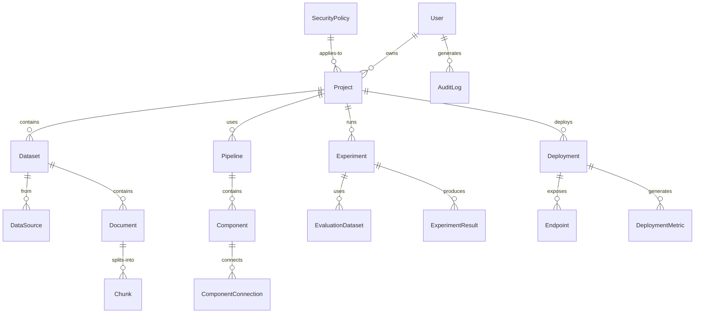
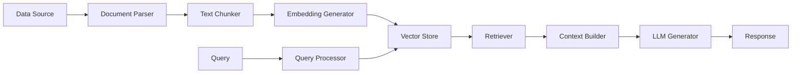

# RAG Platform REST API Design

## Document Change Log

### Version History

| Version | Date | Author | Changes | Breaking Changes |
|---------|------|---------|---------|------------------|
| 1.3.0 | 2025-01-03 | System | - Added pagination to all list endpoints<br>- Enhanced authentication specifications<br>- Standardized error response format<br>- Added document changelog section | No |
| 1.2.0 | 2025-08-28 | adrian | - Updated entity relationship diagrams<br>- Added descriptive matrices<br>- Enhanced documentation | No |
| 1.1.0 | 2025-08-27 | adrian | - Added initial API endpoints<br>- Defined core resources | No |
| 1.0.0 | 2025-08-27 | adrian | - Initial API design documentation | N/A |

### Upcoming Changes (Next Release)

- [ ] Add WebSocket support for real-time updates
- [ ] Implement GraphQL endpoint
- [ ] Add batch operations support
- [ ] Enhanced filtering capabilities

### Deprecation Notices

- None at this time

---

## Table of Contents

1. [Document Change Log](#document-change-log)
2. [Overview](#overview)
3. [System Architecture](#system-architecture)
4. [Authentication & Authorization](#authentication--authorization)
5. [Core API Endpoints](#core-api-endpoints)
   - [Project Management APIs](#project-management-apis)
   - [Data Management APIs](#data-management-apis)
   - [Pipeline Builder APIs](#pipeline-builder-apis)
   - [Experimentation Hub APIs](#experimentation-hub-apis)
   - [Deployment Manager APIs](#deployment-manager-apis)
   - [Monitoring Dashboard APIs](#monitoring-dashboard-apis)
   - [Debugging Workbench APIs](#debugging-workbench-apis)
   - [Governance Center APIs](#governance-center-apis)
6. [Entity Relationships](#entity-relationships)
7. [Data Models](#data-models)
8. [API Specifications](#api-specifications)
9. [WebSocket Events](#websocket-events)
10. [Error Handling](#error-handling)
11. [Security Considerations](#security-considerations)

## Overview

The RAG (Retrieval-Augmented Generation) Platform REST API provides comprehensive functionality for building, deploying, and managing RAG systems. This API enables:

- **End-to-End RAG Pipeline Management**: From data ingestion to response generation
- **Multi-Source Data Integration**: Support for various data sources and formats
- **Pipeline Orchestration**: Visual pipeline builder with drag-and-drop components
- **Experimentation & A/B Testing**: Compare different RAG configurations
- **Production Deployment**: Scale and monitor RAG applications
- **Debugging & Optimization**: Detailed tracing and performance analysis
- **Security & Governance**: RBAC, data classification, and audit logging

## System Architecture

### High-Level Architecture

```
┌──────────────────────────────────────────────────────────────┐
│                     API Gateway                               │
│              (Authentication, Rate Limiting, Load Balancing)  │
└───────────────┬──────────────────────────┬───────────────────┘
                │                          │
    ┌───────────▼──────────┐   ┌──────────▼──────────────┐
    │    Project Service    │   │    Pipeline Service      │
    └───────────┬──────────┘   └──────────┬───────────────┘
                │                          │
    ┌───────────▼──────────┐   ┌──────────▼───────────────┐
    │    Data Service       │   │   Embedding Service      │
    └───────────┬──────────┘   └──────────┬───────────────┘
                │                          │
    ┌───────────▼──────────┐   ┌──────────▼───────────────┐
    │   Vector Store        │   │   Generation Service     │
    └───────────┬──────────┘   └──────────┬───────────────┘
                │                          │
    ┌───────────▼──────────┐   ┌──────────▼───────────────┐
    │  Deployment Service   │   │  Monitoring Service      │
    └───────────────────────┘   └──────────────────────────┘
```

### Service Components

1. **Project Service**
   - Project lifecycle management
   - Dataset association
   - Pipeline versioning
   - Metrics aggregation

2. **Data Service**
   - Multi-source data ingestion
   - Document parsing and chunking
   - Metadata extraction
   - Data preprocessing

3. **Pipeline Service**
   - Component orchestration
   - Flow management
   - Configuration persistence
   - Version control

4. **Embedding Service**
   - Multiple embedding model support
   - Batch processing
   - Cache management
   - Vector generation

5. **Vector Store Service**
   - Multiple vector DB support
   - Index management
   - Semantic search
   - Hybrid search capabilities

6. **Generation Service**
   - LLM integration
   - Prompt management
   - Response generation
   - Safety filtering

7. **Deployment Service**
   - Environment management
   - Auto-scaling
   - Endpoint provisioning
   - Load balancing

8. **Monitoring Service**
   - Real-time metrics
   - Performance tracking
   - Safety monitoring
   - Alerting

## Authentication & Authorization

### Authentication Methods

```http
Authorization: Bearer <jwt-token>
X-API-Key: <api-key>
X-Service-Account: <service-account-token>
```

### Permission Scopes

```javascript
{
  // Project Scopes
  "projects:read",
  "projects:write",
  "projects:delete",
  "projects:deploy",
  
  // Data Scopes
  "data:read",
  "data:write",
  "data:delete",
  "data:process",
  
  // Pipeline Scopes
  "pipelines:read",
  "pipelines:write",
  "pipelines:execute",
  "pipelines:deploy",
  
  // Experimentation Scopes
  "experiments:read",
  "experiments:write",
  "experiments:execute",
  "experiments:evaluate",
  
  // Deployment Scopes
  "deployments:read",
  "deployments:write",
  "deployments:manage",
  "deployments:scale",
  
  // Monitoring Scopes
  "monitoring:read",
  "monitoring:configure",
  
  // Debugging Scopes
  "debugging:read",
  "debugging:execute",
  "debugging:trace",
  
  // Governance Scopes
  "governance:users:manage",
  "governance:policies:manage",
  "governance:audit:read",
  "governance:security:configure"
}
```

## Core API Endpoints

### Project Management APIs

#### Projects

##### List Projects
```http
GET /api/v1/projects
Query Parameters:
  - status: Live|InDevelopment|Archived
  - search: string
  - page: number
  - limit: number
  - sort: name|created|updated|status
```

##### Get Project Details
```http
GET /api/v1/projects/{projectId}
```

##### Create Project
```http
POST /api/v1/projects
Body: {
  "name": "string",
  "description": "string",
  "datasets": ["datasetId"],
  "pipeline": "pipelineId",
  "tags": ["string"]
}
```

##### Update Project
```http
PUT /api/v1/projects/{projectId}
```

##### Delete Project
```http
DELETE /api/v1/projects/{projectId}
```

##### Clone Project
```http
POST /api/v1/projects/{projectId}/clone
Body: {
  "name": "string",
  "includePipelines": boolean,
  "includeDatasets": boolean,
  "includeExperiments": boolean
}
```

##### Get Project Metrics
```http
GET /api/v1/projects/{projectId}/metrics
Query Parameters:
  - metrics: contextAdherence|userSatisfaction|latency|accuracy
  - period: 1h|24h|7d|30d
  - aggregation: avg|sum|min|max
```

##### Export Project
```http
POST /api/v1/projects/{projectId}/export
Body: {
  "format": "json|yaml|zip",
  "includeData": boolean,
  "includePipeline": boolean,
  "includeMetrics": boolean
}
```

### Data Management APIs

#### Data Sources

##### List Data Sources
```http
GET /api/v1/data/sources
Query Parameters:
  - type: file-upload|web-crawler|database|api|s3|gcs
  - status: active|syncing|error|inactive
  - projectId: string
```

##### Create Data Source
```http
POST /api/v1/data/sources
Body: {
  "name": "string",
  "type": "file-upload|web-crawler|database|api|s3|gcs",
  "description": "string",
  "config": {
    "connectionString": "string",
    "credentials": {...},
    "syncSchedule": "cron expression"
  },
  "projectId": "string"
}
```

##### Update Data Source
```http
PUT /api/v1/data/sources/{sourceId}
```

##### Delete Data Source
```http
DELETE /api/v1/data/sources/{sourceId}
```

##### Sync Data Source
```http
POST /api/v1/data/sources/{sourceId}/sync
Body: {
  "force": boolean,
  "incremental": boolean,
  "filters": {...}
}
```

##### Test Connection
```http
POST /api/v1/data/sources/test-connection
Body: {
  "type": "string",
  "config": {...}
}
```

#### Documents

##### List Documents
```http
GET /api/v1/data/documents
Query Parameters:
  - sourceId: string
  - type: pdf|txt|html|json|csv|docx
  - search: string
  - metadata: key=value pairs
  - page: number
  - limit: number
```

##### Upload Document
```http
POST /api/v1/data/documents
Headers:
  Content-Type: multipart/form-data
Body:
  - file: binary
  - sourceId: string
  - metadata: JSON string
```

##### Get Document
```http
GET /api/v1/data/documents/{documentId}
```

##### Update Document Metadata
```http
PATCH /api/v1/data/documents/{documentId}/metadata
Body: {
  "metadata": {...}
}
```

##### Delete Document
```http
DELETE /api/v1/data/documents/{documentId}
```

##### Parse Document
```http
POST /api/v1/data/documents/{documentId}/parse
Body: {
  "parser": "unstructured|langchain|custom",
  "config": {
    "extractTables": boolean,
    "extractImages": boolean,
    "preserveFormatting": boolean
  }
}
```

#### Chunks

##### List Chunks
```http
GET /api/v1/data/chunks
Query Parameters:
  - documentId: string
  - sourceId: string
  - search: string
  - minSize: number
  - maxSize: number
```

##### Create Chunks
```http
POST /api/v1/data/chunks
Body: {
  "documentId": "string",
  "strategy": "fixed|semantic|recursive|custom",
  "config": {
    "chunkSize": 512,
    "overlap": 50,
    "separator": "\\n\\n"
  }
}
```

##### Update Chunk
```http
PUT /api/v1/data/chunks/{chunkId}
Body: {
  "text": "string",
  "metadata": {...}
}
```

##### Delete Chunk
```http
DELETE /api/v1/data/chunks/{chunkId}
```

##### Regenerate Chunks
```http
POST /api/v1/data/documents/{documentId}/rechunk
Body: {
  "strategy": "string",
  "config": {...}
}
```

### Pipeline Builder APIs

#### Pipelines

##### List Pipelines
```http
GET /api/v1/pipelines
Query Parameters:
  - projectId: string
  - status: draft|published|deprecated
  - version: string
  - search: string
```

##### Get Pipeline
```http
GET /api/v1/pipelines/{pipelineId}
```

##### Create Pipeline
```http
POST /api/v1/pipelines
Body: {
  "name": "string",
  "projectId": "string",
  "components": [
    {
      "id": "string",
      "type": "chunker|embedder|vectorstore|retriever|generator",
      "config": {...},
      "position": {"x": number, "y": number}
    }
  ],
  "connections": [
    {
      "source": "componentId",
      "target": "componentId",
      "type": "data|control"
    }
  ]
}
```

##### Update Pipeline
```http
PUT /api/v1/pipelines/{pipelineId}
```

##### Delete Pipeline
```http
DELETE /api/v1/pipelines/{pipelineId}
```

##### Execute Pipeline
```http
POST /api/v1/pipelines/{pipelineId}/execute
Body: {
  "input": {
    "query": "string",
    "context": {...},
    "parameters": {...}
  },
  "trace": boolean
}
```

##### Validate Pipeline
```http
POST /api/v1/pipelines/{pipelineId}/validate
```

##### Publish Pipeline Version
```http
POST /api/v1/pipelines/{pipelineId}/publish
Body: {
  "version": "string",
  "changelog": "string",
  "tags": ["string"]
}
```

#### Pipeline Components

##### List Available Components
```http
GET /api/v1/pipelines/components
Query Parameters:
  - category: data-processing|embedding|vectorstore|retrieval|generation
  - provider: openai|cohere|anthropic|local
```

##### Get Component Configuration
```http
GET /api/v1/pipelines/components/{componentId}/config
```

##### Test Component
```http
POST /api/v1/pipelines/components/{componentId}/test
Body: {
  "config": {...},
  "input": {...}
}
```

### Experimentation Hub APIs

#### Experiments

##### List Experiments
```http
GET /api/v1/experiments
Query Parameters:
  - projectId: string
  - status: draft|running|completed|failed
  - type: accuracy|performance|ab-test
```

##### Get Experiment
```http
GET /api/v1/experiments/{experimentId}
```

##### Create Experiment
```http
POST /api/v1/experiments
Body: {
  "name": "string",
  "description": "string",
  "projectId": "string",
  "type": "accuracy|performance|ab-test",
  "pipeline": "pipelineId",
  "dataset": "datasetId",
  "config": {
    "metrics": ["accuracy", "latency", "f1Score"],
    "iterations": number,
    "parameters": {...}
  }
}
```

##### Start Experiment
```http
POST /api/v1/experiments/{experimentId}/start
Body: {
  "async": boolean,
  "notifyOnComplete": boolean
}
```

##### Stop Experiment
```http
POST /api/v1/experiments/{experimentId}/stop
```

##### Get Experiment Results
```http
GET /api/v1/experiments/{experimentId}/results
Query Parameters:
  - metrics: accuracy|latency|f1Score|precision|recall
  - format: json|csv|chart
```

##### Compare Experiments
```http
POST /api/v1/experiments/compare
Body: {
  "experimentIds": ["string"],
  "metrics": ["string"],
  "visualization": "table|chart|heatmap"
}
```

#### A/B Testing

##### Create A/B Test
```http
POST /api/v1/experiments/ab-tests
Body: {
  "name": "string",
  "projectId": "string",
  "variantA": {
    "pipelineId": "string",
    "config": {...}
  },
  "variantB": {
    "pipelineId": "string",
    "config": {...}
  },
  "trafficSplit": 50,
  "duration": 24,
  "successMetrics": ["string"]
}
```

##### Get A/B Test Results
```http
GET /api/v1/experiments/ab-tests/{testId}/results
```

##### Update Traffic Split
```http
PATCH /api/v1/experiments/ab-tests/{testId}/traffic
Body: {
  "variantASplit": number,
  "variantBSplit": number
}
```

##### Finalize A/B Test
```http
POST /api/v1/experiments/ab-tests/{testId}/finalize
Body: {
  "winner": "variantA|variantB",
  "deployWinner": boolean
}
```

#### Evaluation Datasets

##### List Evaluation Datasets
```http
GET /api/v1/experiments/datasets
Query Parameters:
  - type: qa-pairs|retrieval|generation
  - projectId: string
```

##### Create Evaluation Dataset
```http
POST /api/v1/experiments/datasets
Body: {
  "name": "string",
  "type": "qa-pairs|retrieval|generation",
  "data": [
    {
      "query": "string",
      "expectedAnswer": "string",
      "expectedDocuments": ["documentId"],
      "metadata": {...}
    }
  ]
}
```

##### Import Evaluation Dataset
```http
POST /api/v1/experiments/datasets/import
Headers:
  Content-Type: multipart/form-data
Body:
  - file: binary (CSV/JSON)
  - format: csv|json
  - mapping: JSON string
```

### Deployment Manager APIs

#### Deployments

##### List Deployments
```http
GET /api/v1/deployments
Query Parameters:
  - environment: development|staging|production
  - status: running|stopped|error|deploying
  - projectId: string
```

##### Get Deployment
```http
GET /api/v1/deployments/{deploymentId}
```

##### Create Deployment
```http
POST /api/v1/deployments
Body: {
  "name": "string",
  "pipelineId": "string",
  "environment": "development|staging|production",
  "config": {
    "instances": number,
    "cpu": "string",
    "memory": "string",
    "gpu": boolean
  },
  "autoScaling": {
    "enabled": boolean,
    "minInstances": number,
    "maxInstances": number,
    "targetCPU": number
  }
}
```

##### Update Deployment
```http
PUT /api/v1/deployments/{deploymentId}
```

##### Scale Deployment
```http
POST /api/v1/deployments/{deploymentId}/scale
Body: {
  "instances": number,
  "immediate": boolean
}
```

##### Stop Deployment
```http
POST /api/v1/deployments/{deploymentId}/stop
```

##### Restart Deployment
```http
POST /api/v1/deployments/{deploymentId}/restart
Body: {
  "graceful": boolean,
  "timeout": number
}
```

##### Rollback Deployment
```http
POST /api/v1/deployments/{deploymentId}/rollback
Body: {
  "targetVersion": "string"
}
```

#### Endpoints

##### List Endpoints
```http
GET /api/v1/deployments/endpoints
Query Parameters:
  - deploymentId: string
  - status: active|inactive|rate-limited
```

##### Create Endpoint
```http
POST /api/v1/deployments/endpoints
Body: {
  "name": "string",
  "deploymentId": "string",
  "path": "string",
  "rateLimit": number,
  "authentication": {
    "type": "api-key|jwt|oauth",
    "config": {...}
  },
  "cors": {
    "enabled": boolean,
    "origins": ["string"]
  }
}
```

##### Update Endpoint
```http
PUT /api/v1/deployments/endpoints/{endpointId}
```

##### Delete Endpoint
```http
DELETE /api/v1/deployments/endpoints/{endpointId}
```

##### Get Endpoint Metrics
```http
GET /api/v1/deployments/endpoints/{endpointId}/metrics
Query Parameters:
  - metrics: requests|latency|errors|tokens
  - period: 1h|24h|7d
```

### Monitoring Dashboard APIs

#### Metrics

##### Get System Metrics
```http
GET /api/v1/monitoring/metrics
Query Parameters:
  - metrics: contextAdherence|avgLatency|userSatisfaction|errorRate
  - projectId: string
  - deploymentId: string
  - period: 1h|24h|7d|30d
  - aggregation: avg|sum|min|max
```

##### Get Safety Metrics
```http
GET /api/v1/monitoring/safety
Query Parameters:
  - metrics: toxicity|pii|hallucination
  - threshold: number
  - period: 1h|24h|7d
```

##### Create Alert
```http
POST /api/v1/monitoring/alerts
Body: {
  "name": "string",
  "metric": "string",
  "condition": {
    "operator": ">|<|>=|<=|==",
    "threshold": number,
    "duration": number
  },
  "notifications": {
    "email": ["string"],
    "webhook": "string",
    "slack": "string"
  }
}
```

##### List Alerts
```http
GET /api/v1/monitoring/alerts
Query Parameters:
  - status: active|triggered|resolved
  - severity: low|medium|high|critical
```

##### Update Alert
```http
PUT /api/v1/monitoring/alerts/{alertId}
```

##### Delete Alert
```http
DELETE /api/v1/monitoring/alerts/{alertId}
```

##### Get Alert History
```http
GET /api/v1/monitoring/alerts/{alertId}/history
Query Parameters:
  - from: ISO8601
  - to: ISO8601
```

#### Dashboards

##### List Dashboards
```http
GET /api/v1/monitoring/dashboards
```

##### Create Dashboard
```http
POST /api/v1/monitoring/dashboards
Body: {
  "name": "string",
  "widgets": [
    {
      "type": "metric|chart|table|heatmap",
      "title": "string",
      "config": {...},
      "position": {"x": number, "y": number, "w": number, "h": number}
    }
  ]
}
```

##### Update Dashboard
```http
PUT /api/v1/monitoring/dashboards/{dashboardId}
```

##### Delete Dashboard
```http
DELETE /api/v1/monitoring/dashboards/{dashboardId}
```

##### Export Dashboard
```http
GET /api/v1/monitoring/dashboards/{dashboardId}/export
Query Parameters:
  - format: pdf|png|json
```

### Debugging Workbench APIs

#### Query Debugging

##### Debug Query
```http
POST /api/v1/debugging/query
Body: {
  "query": "string",
  "pipelineId": "string",
  "options": {
    "includeEmbeddings": boolean,
    "traceRetrieval": boolean,
    "showPrompt": boolean,
    "verbosity": "basic|detailed|verbose"
  }
}
```

##### Get Query Trace
```http
GET /api/v1/debugging/traces/{traceId}
```

##### List Query History
```http
GET /api/v1/debugging/history
Query Parameters:
  - projectId: string
  - from: ISO8601
  - to: ISO8601
  - status: success|error
```

##### Analyze Query Performance
```http
POST /api/v1/debugging/analyze
Body: {
  "traceId": "string",
  "metrics": ["latency", "tokenUsage", "retrievalAccuracy"]
}
```

#### Embeddings Analysis

##### Visualize Embeddings
```http
POST /api/v1/debugging/embeddings/visualize
Body: {
  "query": "string",
  "documentIds": ["string"],
  "method": "tsne|pca|umap",
  "dimensions": 2|3
}
```

##### Compare Embeddings
```http
POST /api/v1/debugging/embeddings/compare
Body: {
  "embeddings": [
    {
      "text": "string",
      "model": "string"
    }
  ],
  "metric": "cosine|euclidean|manhattan"
}
```

#### Logs

##### Get Logs
```http
GET /api/v1/debugging/logs
Query Parameters:
  - level: all|debug|info|warn|error
  - service: string
  - from: ISO8601
  - to: ISO8601
  - search: string
  - limit: number
```

##### Export Logs
```http
POST /api/v1/debugging/logs/export
Body: {
  "filters": {...},
  "format": "json|csv|txt",
  "dateRange": {
    "from": "ISO8601",
    "to": "ISO8601"
  }
}
```

### Governance Center APIs

#### User Management

##### List Users
```http
GET /api/v1/governance/users
Query Parameters:
  - role: Admin|Developer|Analyst|Viewer
  - status: active|inactive|suspended
  - search: string
```

##### Get User
```http
GET /api/v1/governance/users/{userId}
```

##### Create User
```http
POST /api/v1/governance/users
Body: {
  "name": "string",
  "email": "string",
  "role": "Admin|Developer|Analyst|Viewer",
  "permissions": ["string"],
  "projects": ["projectId"]
}
```

##### Update User
```http
PUT /api/v1/governance/users/{userId}
```

##### Delete User
```http
DELETE /api/v1/governance/users/{userId}
```

##### Reset User Password
```http
POST /api/v1/governance/users/{userId}/reset-password
```

##### Revoke User Access
```http
POST /api/v1/governance/users/{userId}/revoke
Body: {
  "reason": "string",
  "duration": number
}
```

#### Security Policies

##### List Security Policies
```http
GET /api/v1/governance/policies
Query Parameters:
  - type: encryption|access-control|rate-limiting|data-retention
  - enabled: boolean
```

##### Get Policy
```http
GET /api/v1/governance/policies/{policyId}
```

##### Create Policy
```http
POST /api/v1/governance/policies
Body: {
  "name": "string",
  "type": "encryption|access-control|rate-limiting|data-retention",
  "description": "string",
  "enabled": boolean,
  "settings": {...},
  "scope": {
    "projects": ["projectId"],
    "users": ["userId"]
  }
}
```

##### Update Policy
```http
PUT /api/v1/governance/policies/{policyId}
```

##### Delete Policy
```http
DELETE /api/v1/governance/policies/{policyId}
```

##### Test Policy
```http
POST /api/v1/governance/policies/{policyId}/test
Body: {
  "scenario": {...}
}
```

#### Data Classification

##### List Classification Rules
```http
GET /api/v1/governance/classification/rules
```

##### Create Classification Rule
```http
POST /api/v1/governance/classification/rules
Body: {
  "name": "string",
  "level": "Public|Internal|Confidential|Critical",
  "description": "string",
  "patterns": ["regex"],
  "actions": {
    "mask": boolean,
    "encrypt": boolean,
    "alert": boolean
  }
}
```

##### Scan Data
```http
POST /api/v1/governance/classification/scan
Body: {
  "scope": {
    "projects": ["projectId"],
    "dataSources": ["sourceId"]
  },
  "rules": ["ruleId"]
}
```

##### Get Classification Report
```http
GET /api/v1/governance/classification/reports/{reportId}
```

#### Retention Policies

##### List Retention Policies
```http
GET /api/v1/governance/retention
```

##### Create Retention Policy
```http
POST /api/v1/governance/retention
Body: {
  "dataType": "string",
  "retentionPeriod": number,
  "periodUnit": "days|months|years",
  "action": "archive|delete|compress",
  "schedule": "cron expression"
}
```

##### Execute Retention Policy
```http
POST /api/v1/governance/retention/{policyId}/execute
Body: {
  "dryRun": boolean
}
```

#### Audit Logs

##### Get Audit Logs
```http
GET /api/v1/governance/audit
Query Parameters:
  - user: string
  - action: CREATE|UPDATE|DELETE|ACCESS|LOGIN|LOGOUT
  - resource: string
  - from: ISO8601
  - to: ISO8601
  - page: number
  - limit: number
```

##### Export Audit Logs
```http
POST /api/v1/governance/audit/export
Body: {
  "format": "json|csv|pdf",
  "filters": {...},
  "dateRange": {
    "from": "ISO8601",
    "to": "ISO8601"
  }
}
```

##### Get Compliance Report
```http
GET /api/v1/governance/compliance/report
Query Parameters:
  - framework: gdpr|ccpa|hipaa|sox
  - format: json|pdf
```

##### Get Security Score
```http
GET /api/v1/governance/security/score
```

## Entity Relationships

### Core Entities



### Data Flow



## Data Models

### Core Models

#### Project
```typescript
interface Project {
  id: string;
  name: string;
  description: string;
  status: 'Live' | 'InDevelopment' | 'Archived';
  datasets: Dataset[];
  pipelines: Pipeline[];
  deployments: Deployment[];
  experiments: Experiment[];
  metrics: ProjectMetrics;
  owner: string;
  collaborators: string[];
  tags: string[];
  createdAt: string;
  updatedAt: string;
}
```

#### Dataset
```typescript
interface Dataset {
  id: string;
  name: string;
  projectId: string;
  sources: DataSource[];
  documentCount: number;
  totalChunks: number;
  lastSync: string;
  metadata: Record<string, any>;
}
```

#### DataSource
```typescript
interface DataSource {
  id: string;
  name: string;
  type: 'file-upload' | 'web-crawler' | 'database' | 'api' | 's3' | 'gcs';
  description: string;
  config: SourceConfig;
  documentCount: number;
  lastSync: string;
  status: 'active' | 'syncing' | 'error' | 'inactive';
}
```

#### Document
```typescript
interface Document {
  id: string;
  name: string;
  type: 'pdf' | 'txt' | 'html' | 'json' | 'csv' | 'docx';
  content: string;
  sourceId: string;
  metadata: DocumentMetadata;
  parsedElements: ParsedElement[];
  chunks: Chunk[];
  createdAt: string;
  updatedAt: string;
}
```

#### Chunk
```typescript
interface Chunk {
  id: string;
  text: string;
  documentId: string;
  source: string;
  metadata: ChunkMetadata;
  embedding?: number[];
  position: number;
  size: number;
}
```

#### Pipeline
```typescript
interface Pipeline {
  id: string;
  name: string;
  version: string;
  projectId: string;
  components: PipelineComponent[];
  connections: ComponentConnection[];
  config: PipelineConfig;
  status: 'draft' | 'published' | 'deprecated';
  createdAt: string;
  updatedAt: string;
}
```

#### PipelineComponent
```typescript
interface PipelineComponent {
  id: string;
  type: 'chunker' | 'embedder' | 'vectorstore' | 'retriever' | 'generator';
  name: string;
  provider: string;
  config: ComponentConfig;
  position: { x: number; y: number };
  inputs: string[];
  outputs: string[];
}
```

#### Experiment
```typescript
interface Experiment {
  id: string;
  name: string;
  description: string;
  projectId: string;
  type: 'accuracy' | 'performance' | 'ab-test';
  status: 'draft' | 'running' | 'completed' | 'failed';
  pipeline: string;
  dataset: string;
  config: ExperimentConfig;
  results?: ExperimentResults;
  startedAt?: string;
  completedAt?: string;
}
```

#### Deployment
```typescript
interface Deployment {
  id: string;
  name: string;
  pipelineId: string;
  environment: 'development' | 'staging' | 'production';
  status: 'running' | 'stopped' | 'error' | 'deploying';
  config: DeploymentConfig;
  endpoints: Endpoint[];
  metrics: DeploymentMetrics;
  createdAt: string;
  updatedAt: string;
}
```

#### User
```typescript
interface User {
  id: string;
  name: string;
  email: string;
  role: 'Admin' | 'Developer' | 'Analyst' | 'Viewer';
  permissions: string[];
  projects: string[];
  lastAccess: string;
  mfaEnabled: boolean;
  status: 'active' | 'inactive' | 'suspended';
}
```

#### SecurityPolicy
```typescript
interface SecurityPolicy {
  id: string;
  name: string;
  type: 'encryption' | 'access-control' | 'rate-limiting' | 'data-retention';
  description: string;
  enabled: boolean;
  settings: PolicySettings;
  scope: PolicyScope;
  createdAt: string;
  updatedAt: string;
}
```

## API Specifications

### Request/Response Formats

#### Standard Response
```json
{
  "success": true,
  "data": {...},
  "meta": {
    "timestamp": "2024-01-20T15:30:00Z",
    "version": "1.0.0",
    "requestId": "uuid"
  }
}
```

#### Error Response
```json
{
  "success": false,
  "error": {
    "code": "ERROR_CODE",
    "message": "Human readable message",
    "details": {...},
    "field": "field_name",
    "timestamp": "2024-01-20T15:30:00Z"
  }
}
```

#### Paginated Response
```json
{
  "success": true,
  "data": [...],
  "pagination": {
    "page": 1,
    "limit": 20,
    "total": 100,
    "totalPages": 5,
    "hasNext": true,
    "hasPrev": false
  }
}
```

#### Streaming Response
```json
{
  "event": "data",
  "id": "event-123",
  "data": {
    "chunk": "response text...",
    "index": 0,
    "finished": false
  }
}
```

### Status Codes

- **200** - Success
- **201** - Created
- **202** - Accepted (async operation)
- **204** - No Content
- **206** - Partial Content (streaming)
- **400** - Bad Request
- **401** - Unauthorized
- **403** - Forbidden
- **404** - Not Found
- **409** - Conflict
- **422** - Unprocessable Entity
- **429** - Rate Limited
- **500** - Internal Server Error
- **502** - Bad Gateway
- **503** - Service Unavailable

## WebSocket Events

### Connection

```javascript
// WebSocket connection
ws://api.ragplatform.com/v1/events

// Authentication
{
  "type": "auth",
  "token": "jwt-token"
}
```

### Event Subscriptions

```javascript
// Subscribe to events
{
  "action": "subscribe",
  "events": [
    "pipeline.executed",
    "experiment.completed",
    "deployment.status_changed"
  ],
  "filters": {
    "projectId": "proj-123"
  }
}
```

### Event Types

#### Pipeline Events
- `pipeline.created`
- `pipeline.updated`
- `pipeline.executed`
- `pipeline.failed`
- `pipeline.published`

#### Data Events
- `data.source_added`
- `data.sync_started`
- `data.sync_completed`
- `data.document_processed`
- `data.chunk_created`

#### Experiment Events
- `experiment.started`
- `experiment.progress`
- `experiment.completed`
- `experiment.failed`
- `experiment.metrics_updated`

#### Deployment Events
- `deployment.created`
- `deployment.status_changed`
- `deployment.scaled`
- `deployment.error`
- `deployment.metrics_updated`

#### Monitoring Events
- `monitoring.alert_triggered`
- `monitoring.alert_resolved`
- `monitoring.threshold_exceeded`
- `monitoring.safety_violation`

#### Governance Events
- `governance.policy_violated`
- `governance.audit_logged`
- `governance.user_access_changed`
- `governance.data_classified`

### Real-Time Query Streaming

```javascript
// Stream query execution
{
  "action": "stream_query",
  "pipelineId": "pipe-123",
  "query": "What is RAG?",
  "stream": true
}

// Response chunks
{
  "event": "query.chunk",
  "data": {
    "text": "RAG stands for",
    "index": 0,
    "tokens": 4
  }
}
```

## Error Handling

### Error Codes

#### General Errors (GEN)
- `GEN001` - Invalid request format
- `GEN002` - Missing required field
- `GEN003` - Invalid field value
- `GEN004` - Resource not found
- `GEN005` - Resource already exists
- `GEN006` - Operation not permitted
- `GEN007` - Rate limit exceeded
- `GEN008` - Service unavailable

#### Project Errors (PRJ)
- `PRJ001` - Project not found
- `PRJ002` - Project name already exists
- `PRJ003` - Cannot delete project with active deployments
- `PRJ004` - Maximum projects limit reached

#### Data Errors (DAT)
- `DAT001` - Data source connection failed
- `DAT002` - Document parsing failed
- `DAT003` - Chunk size exceeds limit
- `DAT004` - Unsupported file format
- `DAT005` - Data sync in progress

#### Pipeline Errors (PIP)
- `PIP001` - Pipeline validation failed
- `PIP002` - Component configuration invalid
- `PIP003` - Circular dependency detected
- `PIP004` - Pipeline execution timeout
- `PIP005` - Component not available

#### Experiment Errors (EXP)
- `EXP001` - Dataset not compatible
- `EXP002` - Experiment already running
- `EXP003` - Insufficient evaluation data
- `EXP004` - Metrics calculation failed

#### Deployment Errors (DEP)
- `DEP001` - Insufficient resources
- `DEP002` - Deployment failed
- `DEP003` - Endpoint conflict
- `DEP004` - Scaling limit reached
- `DEP005` - Health check failed

#### Security Errors (SEC)
- `SEC001` - Authentication failed
- `SEC002` - Insufficient permissions
- `SEC003` - Token expired
- `SEC004` - MFA required
- `SEC005` - Policy violation

### Retry Strategy

```javascript
{
  "retry": {
    "maxAttempts": 3,
    "backoffMultiplier": 2,
    "initialInterval": 1000,
    "maxInterval": 30000,
    "retryableErrors": [
      "GEN007",
      "GEN008",
      "DAT001",
      "PIP004"
    ]
  }
}
```

## Security Considerations

### Authentication

1. **API Key Authentication**
   - Generated per user/service
   - Rotated every 90 days
   - Scoped to specific permissions

2. **JWT Authentication**
   - Short-lived tokens (15 minutes)
   - Refresh tokens (7 days)
   - Contains user claims and permissions

3. **OAuth 2.0**
   - Support for external IdPs
   - PKCE flow for SPAs
   - Service-to-service auth

### Data Security

1. **Encryption**
   - AES-256 for data at rest
   - TLS 1.3 for data in transit
   - Field-level encryption for sensitive data

2. **Data Classification**
   - Automatic PII detection
   - GDPR/CCPA compliance
   - Data masking and redaction

3. **Access Control**
   - Role-Based Access Control (RBAC)
   - Attribute-Based Access Control (ABAC)
   - Project-level isolation

### API Security

1. **Rate Limiting**
```javascript
{
  "rateLimits": {
    "default": {
      "requests": 1000,
      "window": "1h"
    },
    "query_execution": {
      "requests": 100,
      "window": "1m"
    },
    "data_upload": {
      "requests": 10,
      "window": "1h",
      "maxSize": "100MB"
    }
  }
}
```

2. **Input Validation**
   - Schema validation
   - SQL injection prevention
   - XSS protection
   - File type verification

3. **Security Headers**
```http
X-Content-Type-Options: nosniff
X-Frame-Options: DENY
X-XSS-Protection: 1; mode=block
Content-Security-Policy: default-src 'self'
Strict-Transport-Security: max-age=31536000; includeSubDomains
```

### Compliance

1. **Audit Logging**
   - All API calls logged
   - User actions tracked
   - Data access monitored
   - Retention per policy

2. **Privacy**
   - GDPR compliance
   - CCPA compliance
   - Right to deletion
   - Data portability

3. **Certifications**
   - SOC 2 Type II
   - ISO 27001
   - HIPAA compliant options
   - PCI DSS for payment data

## Implementation Notes

### Technology Stack

- **API Framework**: FastAPI (Python) / Express.js (Node.js)
- **Vector Stores**: Pinecone, Weaviate, Qdrant, Chroma
- **LLM Providers**: OpenAI, Anthropic, Cohere, Local models
- **Database**: PostgreSQL for metadata, Redis for caching
- **Message Queue**: RabbitMQ/Kafka for async operations
- **Object Storage**: S3/GCS for documents and models
- **Container**: Docker + Kubernetes
- **Monitoring**: Prometheus + Grafana
- **Tracing**: OpenTelemetry + Jaeger

### Deployment Architecture

1. **Microservices Architecture**
   - Service per domain
   - Independent scaling
   - Fault isolation

2. **High Availability**
   - Multi-region deployment
   - Load balancing
   - Database replication
   - Disaster recovery

3. **Performance Optimization**
   - Response caching
   - Connection pooling
   - Batch processing
   - CDN for static assets

### Monitoring & Observability

1. **Metrics**
   - API latency and throughput
   - Query accuracy metrics
   - Resource utilization
   - Error rates

2. **Logging**
   - Structured logging
   - Centralized aggregation
   - Real-time analysis
   - Anomaly detection

3. **Tracing**
   - End-to-end request tracing
   - Performance profiling
   - Bottleneck identification
   - Dependency mapping

This comprehensive REST API design provides a complete foundation for building and operating a production-ready RAG platform with enterprise-grade features for security, scalability, and governance.