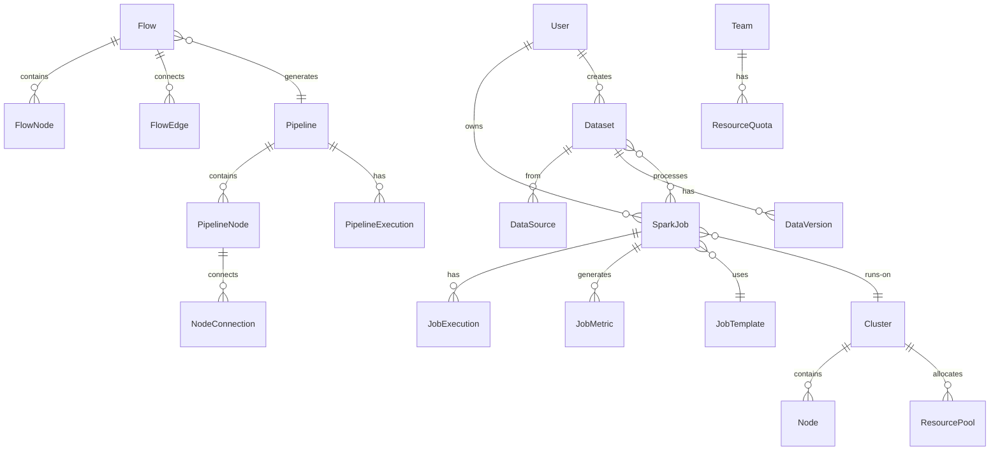
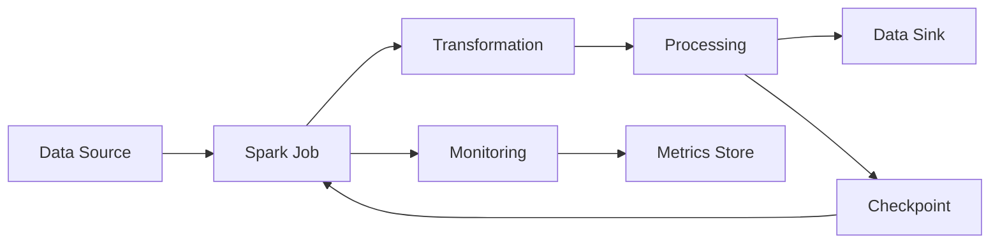

# Spark Services Platform REST API Design

## Table of Contents

1. [Overview](#overview)
2. [System Architecture](#system-architecture)
3. [Authentication & Authorization](#authentication--authorization)
4. [Core API Endpoints](#core-api-endpoints)
   - [Spark Job Management APIs](#spark-job-management-apis)
   - [Pipeline Management APIs](#pipeline-management-apis)
   - [Data Processing APIs](#data-processing-apis)
   - [Dataset Service APIs](#dataset-service-apis)
   - [Resource Management APIs](#resource-management-apis)
   - [Monitoring & Metrics APIs](#monitoring--metrics-apis)
   - [Flow Builder APIs](#flow-builder-apis)
   - [Template Management APIs](#template-management-apis)
5. [Entity Relationships](#entity-relationships)
6. [Data Models](#data-models)
7. [API Specifications](#api-specifications)
8. [WebSocket Events](#websocket-events)
9. [Error Handling](#error-handling)
10. [Security Considerations](#security-considerations)

## Overview

The Spark Services Platform REST API provides comprehensive functionality for managing Apache Spark jobs, data pipelines, and dataset services in a distributed computing environment. This API enables:

- **Spark Job Orchestration**: Submit, manage, and monitor Spark jobs across clusters
- **Pipeline Management**: Build and execute complex data processing pipelines
- **Dataset Services**: Manage data sources, transformations, and sinks
- **Visual Flow Builder**: Create data flows with drag-and-drop components
- **Resource Optimization**: Dynamic resource allocation and scaling
- **Real-time Monitoring**: Track job performance and cluster health
- **Template Management**: Reusable configurations for common workloads

## System Architecture

### High-Level Architecture

```
┌──────────────────────────────────────────────────────────────┐
│                     API Gateway                               │
│              (Authentication, Rate Limiting, Load Balancing)  │
└───────────────┬──────────────────────────┬───────────────────┘
                │                          │
    ┌───────────▼──────────┐   ┌──────────▼──────────────┐
    │  Spark Job Service    │   │   Pipeline Service       │
    └───────────┬──────────┘   └──────────┬───────────────┘
                │                          │
    ┌───────────▼──────────┐   ┌──────────▼───────────────┐
    │  Resource Manager     │   │   Flow Builder Service   │
    └───────────┬──────────┘   └──────────┬───────────────┘
                │                          │
    ┌───────────▼──────────┐   ┌──────────▼───────────────┐
    │  Spark Cluster        │   │   Dataset Service        │
    └───────────┬──────────┘   └──────────┬───────────────┘
                │                          │
    ┌───────────▼──────────┐   ┌──────────▼───────────────┐
    │  Storage Layer        │   │   Monitoring Service     │
    └───────────────────────┘   └──────────────────────────┘
```

### Service Components

1. **Spark Job Service**
   - Job submission and lifecycle management
   - Configuration management
   - Queue management
   - Resource allocation

2. **Pipeline Service**
   - Pipeline orchestration
   - DAG management
   - Workflow scheduling
   - Dependency resolution

3. **Dataset Service**
   - Data source connectivity
   - Dataset catalog
   - Metadata management
   - Access control

4. **Flow Builder Service**
   - Visual pipeline design
   - Component library
   - Flow validation
   - Export/Import

5. **Resource Manager**
   - Cluster resource allocation
   - Dynamic scaling
   - Resource pooling
   - Cost optimization

6. **Monitoring Service**
   - Real-time metrics collection
   - Performance monitoring
   - Alert management
   - Log aggregation

## Authentication & Authorization

### Authentication Methods

```http
Authorization: Bearer <jwt-token>
X-API-Key: <api-key>
X-Spark-Cluster: <cluster-id>
```

### Permission Scopes

```javascript
{
  // Job Management Scopes
  "jobs:read",
  "jobs:write",
  "jobs:execute",
  "jobs:terminate",
  
  // Pipeline Scopes
  "pipelines:read",
  "pipelines:write",
  "pipelines:execute",
  "pipelines:schedule",
  
  // Dataset Scopes
  "datasets:read",
  "datasets:write",
  "datasets:delete",
  "datasets:share",
  
  // Resource Scopes
  "resources:view",
  "resources:allocate",
  "resources:scale",
  "resources:terminate",
  
  // Monitoring Scopes
  "monitoring:read",
  "monitoring:configure",
  "monitoring:export",
  
  // Admin Scopes
  "admin:cluster:manage",
  "admin:users:manage",
  "admin:billing:view",
  "admin:security:configure"
}
```

## Core API Endpoints

### Spark Job Management APIs

#### Jobs

##### List Spark Jobs
```http
GET /api/v1/spark/jobs
Query Parameters:
  - status: Running|Completed|Failed|Pending
  - application: string
  - owner: string
  - projectId: string
  - startTime: ISO8601
  - endTime: ISO8601
  - page: number
  - limit: number
  - sort: name|startTime|status|owner
```

##### Get Job Details
```http
GET /api/v1/spark/jobs/{jobId}
```

##### Submit Spark Job
```http
POST /api/v1/spark/jobs
Body: {
  "name": "string",
  "application": "string",
  "mainClass": "string",
  "jarPath": "string",
  "arguments": ["string"],
  "sparkConfig": {
    "appName": "string",
    "executorMemory": "4g",
    "driverMemory": "2g",
    "executorCores": 4,
    "minExecutors": 2,
    "maxExecutors": 20,
    "dynamicAllocation": boolean
  },
  "resources": {
    "queue": "string",
    "priority": "low|medium|high|critical"
  },
  "projectId": "string",
  "tags": ["string"]
}
```

##### Update Job Configuration
```http
PUT /api/v1/spark/jobs/{jobId}/config
Body: {
  "sparkConfig": {...},
  "resources": {...}
}
```

##### Terminate Job
```http
POST /api/v1/spark/jobs/{jobId}/terminate
Body: {
  "force": boolean,
  "saveCheckpoint": boolean
}
```

##### Restart Job
```http
POST /api/v1/spark/jobs/{jobId}/restart
Body: {
  "fromCheckpoint": boolean,
  "overrideConfig": {...}
}
```

##### Get Job Logs
```http
GET /api/v1/spark/jobs/{jobId}/logs
Query Parameters:
  - type: driver|executor|all
  - executorId: string
  - tail: number
  - since: ISO8601
```

##### Get Job Metrics
```http
GET /api/v1/spark/jobs/{jobId}/metrics
Query Parameters:
  - metrics: cpu|memory|io|network|shuffle
  - granularity: 1m|5m|1h|1d
  - from: ISO8601
  - to: ISO8601
```

##### Clone Job
```http
POST /api/v1/spark/jobs/{jobId}/clone
Body: {
  "name": "string",
  "modifyConfig": {...}
}
```

#### Job Templates

##### List Job Templates
```http
GET /api/v1/spark/templates
Query Parameters:
  - type: etl|ml|streaming|analytics
  - search: string
```

##### Get Template
```http
GET /api/v1/spark/templates/{templateId}
```

##### Create Template
```http
POST /api/v1/spark/templates
Body: {
  "name": "string",
  "description": "string",
  "type": "etl|ml|streaming|analytics",
  "config": {
    "appName": "string",
    "executorMemory": "string",
    "driverMemory": "string",
    "executorCores": number,
    "minExecutors": number,
    "maxExecutors": number
  }
}
```

##### Update Template
```http
PUT /api/v1/spark/templates/{templateId}
```

##### Delete Template
```http
DELETE /api/v1/spark/templates/{templateId}
```

##### Create Job from Template
```http
POST /api/v1/spark/templates/{templateId}/instantiate
Body: {
  "jobName": "string",
  "overrides": {...}
}
```

### Pipeline Management APIs

#### Pipelines

##### List Pipelines
```http
GET /api/v1/pipelines
Query Parameters:
  - status: Active|Inactive|Failed
  - type: Training|Preprocessing|ETL|Inference
  - projectId: string
  - search: string
  - page: number
  - limit: number
```

##### Get Pipeline
```http
GET /api/v1/pipelines/{pipelineId}
```

##### Create Pipeline
```http
POST /api/v1/pipelines
Body: {
  "name": "string",
  "type": "Training|Preprocessing|ETL|Inference",
  "description": "string",
  "nodes": [
    {
      "id": "string",
      "type": "data-source|processing|transformation|data-sink|monitoring",
      "label": "string",
      "config": {...},
      "position": {"x": number, "y": number}
    }
  ],
  "edges": [
    {
      "id": "string",
      "source": "nodeId",
      "target": "nodeId",
      "type": "data|control",
      "config": {...}
    }
  ],
  "schedule": {
    "type": "cron|interval|event",
    "expression": "string"
  }
}
```

##### Update Pipeline
```http
PUT /api/v1/pipelines/{pipelineId}
```

##### Delete Pipeline
```http
DELETE /api/v1/pipelines/{pipelineId}
```

##### Execute Pipeline
```http
POST /api/v1/pipelines/{pipelineId}/execute
Body: {
  "parameters": {...},
  "async": boolean,
  "priority": "low|medium|high",
  "notifyOnComplete": boolean
}
```

##### Validate Pipeline
```http
POST /api/v1/pipelines/{pipelineId}/validate
```

##### Get Pipeline Execution History
```http
GET /api/v1/pipelines/{pipelineId}/executions
Query Parameters:
  - status: running|completed|failed
  - from: ISO8601
  - to: ISO8601
  - limit: number
```

##### Schedule Pipeline
```http
POST /api/v1/pipelines/{pipelineId}/schedule
Body: {
  "cronExpression": "string",
  "timezone": "string",
  "startDate": "ISO8601",
  "endDate": "ISO8601",
  "enabled": boolean
}
```

##### Export Pipeline
```http
GET /api/v1/pipelines/{pipelineId}/export
Query Parameters:
  - format: json|yaml|python
```

##### Import Pipeline
```http
POST /api/v1/pipelines/import
Headers:
  Content-Type: multipart/form-data
Body:
  - file: binary
  - format: json|yaml|python
```

### Data Processing APIs

#### Processing Nodes

##### List Available Nodes
```http
GET /api/v1/processing/nodes
Query Parameters:
  - category: source|transform|sink|monitoring
  - framework: spark|hadoop|flink
```

##### Get Node Configuration
```http
GET /api/v1/processing/nodes/{nodeType}/config
```

##### Validate Node Configuration
```http
POST /api/v1/processing/nodes/{nodeType}/validate
Body: {
  "config": {...},
  "inputSchema": {...}
}
```

#### Transformations

##### List Transformations
```http
GET /api/v1/processing/transformations
Query Parameters:
  - type: filter|map|reduce|join|aggregate|window
```

##### Apply Transformation
```http
POST /api/v1/processing/transform
Body: {
  "inputDataset": "string",
  "transformation": {
    "type": "filter|map|reduce|join|aggregate|window",
    "config": {...}
  },
  "outputDataset": "string",
  "sparkConfig": {...}
}
```

##### Preview Transformation
```http
POST /api/v1/processing/transform/preview
Body: {
  "inputSample": [...],
  "transformation": {...},
  "limit": number
}
```

#### Stream Processing

##### Create Stream
```http
POST /api/v1/processing/streams
Body: {
  "name": "string",
  "source": {
    "type": "kafka|kinesis|pubsub",
    "config": {...}
  },
  "processing": {
    "windowType": "tumbling|sliding|session",
    "windowDuration": "string",
    "watermark": "string"
  },
  "sink": {
    "type": "kafka|database|file",
    "config": {...}
  }
}
```

##### Get Stream Status
```http
GET /api/v1/processing/streams/{streamId}/status
```

##### Update Stream Configuration
```http
PUT /api/v1/processing/streams/{streamId}
```

##### Stop Stream
```http
POST /api/v1/processing/streams/{streamId}/stop
Body: {
  "saveState": boolean,
  "graceful": boolean
}
```

##### Get Stream Metrics
```http
GET /api/v1/processing/streams/{streamId}/metrics
Query Parameters:
  - metrics: throughput|latency|backlog|errors
  - window: 1m|5m|1h
```

### Dataset Service APIs

#### Datasets

##### List Datasets
```http
GET /api/v1/datasets
Query Parameters:
  - environment: dev|staging|prod
  - source: minio|s3|hdfs|database
  - creator: string
  - projectId: string
  - search: string
  - page: number
  - limit: number
```

##### Get Dataset
```http
GET /api/v1/datasets/{datasetId}
```

##### Create Dataset
```http
POST /api/v1/datasets
Body: {
  "name": "string",
  "description": "string",
  "environment": "dev|staging|prod",
  "source": {
    "type": "minio|s3|hdfs|database",
    "connectionString": "string",
    "credentials": {...}
  },
  "schema": {...},
  "partitionBy": ["column"],
  "format": "parquet|json|csv|avro|orc",
  "tags": ["string"]
}
```

##### Update Dataset
```http
PUT /api/v1/datasets/{datasetId}
```

##### Delete Dataset
```http
DELETE /api/v1/datasets/{datasetId}
```

##### Upload Data to Dataset
```http
POST /api/v1/datasets/{datasetId}/upload
Headers:
  Content-Type: multipart/form-data
Body:
  - file: binary
  - format: parquet|json|csv|avro|orc
  - overwrite: boolean
```

##### Query Dataset
```http
POST /api/v1/datasets/{datasetId}/query
Body: {
  "sql": "string",
  "limit": number,
  "format": "json|csv|parquet"
}
```

##### Get Dataset Schema
```http
GET /api/v1/datasets/{datasetId}/schema
```

##### Get Dataset Statistics
```http
GET /api/v1/datasets/{datasetId}/statistics
Query Parameters:
  - columns: comma-separated list
  - computeHistogram: boolean
```

##### Create Dataset Version
```http
POST /api/v1/datasets/{datasetId}/versions
Body: {
  "version": "string",
  "description": "string",
  "changes": ["string"]
}
```

##### List Dataset Versions
```http
GET /api/v1/datasets/{datasetId}/versions
```

##### Share Dataset
```http
POST /api/v1/datasets/{datasetId}/share
Body: {
  "users": ["userId"],
  "teams": ["teamId"],
  "permissions": ["read", "write", "delete"]
}
```

### Resource Management APIs

#### Clusters

##### List Clusters
```http
GET /api/v1/resources/clusters
Query Parameters:
  - status: active|idle|terminated
  - type: standalone|yarn|kubernetes|mesos
```

##### Get Cluster Details
```http
GET /api/v1/resources/clusters/{clusterId}
```

##### Create Cluster
```http
POST /api/v1/resources/clusters
Body: {
  "name": "string",
  "type": "standalone|yarn|kubernetes|mesos",
  "config": {
    "masterNodes": number,
    "workerNodes": number,
    "masterType": "string",
    "workerType": "string",
    "sparkVersion": "string"
  },
  "autoscaling": {
    "enabled": boolean,
    "minNodes": number,
    "maxNodes": number,
    "targetCPU": number
  }
}
```

##### Scale Cluster
```http
POST /api/v1/resources/clusters/{clusterId}/scale
Body: {
  "workerNodes": number,
  "immediate": boolean
}
```

##### Terminate Cluster
```http
POST /api/v1/resources/clusters/{clusterId}/terminate
Body: {
  "force": boolean,
  "waitForJobs": boolean
}
```

#### Resource Pools

##### List Resource Pools
```http
GET /api/v1/resources/pools
```

##### Create Resource Pool
```http
POST /api/v1/resources/pools
Body: {
  "name": "string",
  "resources": {
    "cpu": number,
    "memory": "string",
    "gpu": number
  },
  "priority": number,
  "users": ["userId"],
  "teams": ["teamId"]
}
```

##### Update Resource Pool
```http
PUT /api/v1/resources/pools/{poolId}
```

##### Get Resource Usage
```http
GET /api/v1/resources/usage
Query Parameters:
  - groupBy: user|team|project|cluster
  - period: 1h|24h|7d|30d
```

##### Get Resource Quotas
```http
GET /api/v1/resources/quotas
Query Parameters:
  - userId: string
  - teamId: string
  - projectId: string
```

##### Set Resource Quota
```http
POST /api/v1/resources/quotas
Body: {
  "scope": {
    "type": "user|team|project",
    "id": "string"
  },
  "limits": {
    "cpu": number,
    "memory": "string",
    "storage": "string",
    "concurrentJobs": number
  }
}
```

### Monitoring & Metrics APIs

#### Metrics

##### Get System Metrics
```http
GET /api/v1/monitoring/metrics
Query Parameters:
  - metrics: cpu|memory|disk|network
  - clusterId: string
  - nodeId: string
  - period: 1m|5m|1h|1d
  - aggregation: avg|sum|min|max
```

##### Get Job Metrics
```http
GET /api/v1/monitoring/jobs/{jobId}/metrics
Query Parameters:
  - stage: all|specific stage ID
  - task: all|specific task ID
  - metrics: runtime|shuffle|io|gc
```

##### Get Pipeline Metrics
```http
GET /api/v1/monitoring/pipelines/{pipelineId}/metrics
Query Parameters:
  - execution: latest|specific execution ID
  - node: all|specific node ID
```

#### Alerts

##### List Alerts
```http
GET /api/v1/monitoring/alerts
Query Parameters:
  - status: active|acknowledged|resolved
  - severity: info|warning|error|critical
  - source: job|cluster|pipeline
```

##### Create Alert Rule
```http
POST /api/v1/monitoring/alerts/rules
Body: {
  "name": "string",
  "condition": {
    "metric": "string",
    "operator": ">|<|>=|<=|==|!=",
    "threshold": number,
    "duration": "string"
  },
  "severity": "info|warning|error|critical",
  "notifications": {
    "email": ["string"],
    "slack": "webhook_url",
    "pagerduty": "integration_key"
  }
}
```

##### Update Alert Rule
```http
PUT /api/v1/monitoring/alerts/rules/{ruleId}
```

##### Delete Alert Rule
```http
DELETE /api/v1/monitoring/alerts/rules/{ruleId}
```

##### Acknowledge Alert
```http
POST /api/v1/monitoring/alerts/{alertId}/acknowledge
Body: {
  "message": "string"
}
```

#### Logs

##### Search Logs
```http
GET /api/v1/monitoring/logs
Query Parameters:
  - jobId: string
  - clusterId: string
  - level: trace|debug|info|warn|error|fatal
  - search: string
  - from: ISO8601
  - to: ISO8601
  - limit: number
```

##### Export Logs
```http
POST /api/v1/monitoring/logs/export
Body: {
  "filters": {...},
  "format": "json|csv|txt",
  "destination": {
    "type": "s3|gcs|download",
    "config": {...}
  }
}
```

### Flow Builder APIs

#### Flows

##### List Flows
```http
GET /api/v1/flows
Query Parameters:
  - projectId: string
  - status: draft|published|archived
  - search: string
```

##### Get Flow
```http
GET /api/v1/flows/{flowId}
```

##### Create Flow
```http
POST /api/v1/flows
Body: {
  "name": "string",
  "description": "string",
  "nodes": [...],
  "edges": [...],
  "viewport": {
    "x": number,
    "y": number,
    "zoom": number
  }
}
```

##### Update Flow
```http
PUT /api/v1/flows/{flowId}
```

##### Delete Flow
```http
DELETE /api/v1/flows/{flowId}
```

##### Validate Flow
```http
POST /api/v1/flows/{flowId}/validate
```

##### Execute Flow
```http
POST /api/v1/flows/{flowId}/execute
Body: {
  "parameters": {...},
  "sparkConfig": {...}
}
```

##### Export Flow as Code
```http
GET /api/v1/flows/{flowId}/export
Query Parameters:
  - language: python|scala|java
  - format: notebook|script
```

#### Flow Components

##### List Flow Components
```http
GET /api/v1/flows/components
Query Parameters:
  - category: source|transform|sink|ml|monitoring
```

##### Get Component Schema
```http
GET /api/v1/flows/components/{componentId}/schema
```

##### Create Custom Component
```http
POST /api/v1/flows/components
Body: {
  "name": "string",
  "category": "string",
  "icon": "string",
  "inputs": [...],
  "outputs": [...],
  "properties": [...],
  "code": "string"
}
```

### Template Management APIs

#### Configuration Templates

##### List Configuration Templates
```http
GET /api/v1/templates/configs
Query Parameters:
  - type: spark|pipeline|dataset
  - category: etl|ml|streaming
```

##### Create Configuration Template
```http
POST /api/v1/templates/configs
Body: {
  "name": "string",
  "type": "spark|pipeline|dataset",
  "category": "etl|ml|streaming",
  "config": {...},
  "parameters": [
    {
      "name": "string",
      "type": "string|number|boolean",
      "required": boolean,
      "default": any
    }
  ]
}
```

##### Apply Template
```http
POST /api/v1/templates/configs/{templateId}/apply
Body: {
  "targetType": "job|pipeline|dataset",
  "targetId": "string",
  "parameters": {...}
}
```

## Entity Relationships

### Core Entities



### Data Flow



## Data Models

### Core Models

#### SparkJob
```typescript
interface SparkJob {
  id: string;
  name: string;
  application: string;
  version: number;
  status: 'Pending' | 'Running' | 'Completed' | 'Failed';
  mainClass: string;
  jarPath: string;
  arguments: string[];
  sparkConfig: SparkConfiguration;
  resources: ResourceAllocation;
  k8sNodes: string[];
  startTime: string;
  endTime?: string;
  gitRepo: string;
  owner: string;
  projectId: string;
  accessControl: AccessControl;
  metrics: JobMetrics;
  createdAt: string;
  updatedAt: string;
}
```

#### Pipeline
```typescript
interface Pipeline {
  id: string;
  name: string;
  type: 'Training' | 'Preprocessing' | 'ETL' | 'Inference';
  status: 'Active' | 'Inactive' | 'Failed';
  nodes: PipelineNode[];
  edges: PipelineEdge[];
  schedule?: Schedule;
  config: PipelineConfig;
  created: string;
  lastRun: string;
}
```

#### PipelineNode
```typescript
interface PipelineNode {
  id: string;
  type: 'data-source' | 'processing' | 'transformation' | 'data-sink' | 'monitoring';
  label: string;
  position: { x: number; y: number };
  data: {
    nodeType: string;
    status: 'active' | 'processing' | 'failed' | 'pending';
    config?: any;
    metrics?: any;
  };
}
```

#### Dataset
```typescript
interface Dataset {
  id: string;
  name: string;
  description: string;
  environment: {
    name: string;
  };
  creator: {
    name: string;
    type: string;
    icon: string;
  };
  company: {
    name: string;
  };
  source: {
    name: string;
    type: 'minio' | 's3' | 'hdfs' | 'database';
  };
  status: string;
  lastUpdated: string;
  createdAt: string;
  updatedAt: string;
  lastRunAt: string;
  schema?: DatasetSchema;
  statistics?: DatasetStatistics;
}
```

#### SparkConfiguration
```typescript
interface SparkConfiguration {
  appName: string;
  executorMemory: string;
  driverMemory: string;
  executorCores: number;
  minExecutors: number;
  maxExecutors: number;
  dynamicAllocation?: boolean;
  sparkProperties?: Record<string, string>;
}
```

#### Cluster
```typescript
interface Cluster {
  id: string;
  name: string;
  type: 'standalone' | 'yarn' | 'kubernetes' | 'mesos';
  status: 'active' | 'idle' | 'terminated';
  nodes: ClusterNode[];
  sparkVersion: string;
  config: ClusterConfig;
  autoscaling?: AutoscalingConfig;
  metrics: ClusterMetrics;
  createdAt: string;
  updatedAt: string;
}
```

#### FlowNode
```typescript
interface FlowNode {
  id: string;
  type: 'sparkNode';
  position: { x: number; y: number };
  data: {
    label: string;
    nodeType: string;
    status?: string;
    metrics?: any;
    operations?: string[];
    config?: any;
  };
}
```

#### JobTemplate
```typescript
interface JobTemplate {
  id: string;
  name: string;
  description: string;
  type: 'etl' | 'ml' | 'streaming' | 'analytics';
  config: SparkConfiguration;
  parameters: TemplateParameter[];
  createdBy: string;
  createdAt: string;
  updatedAt: string;
}
```

## API Specifications

### Request/Response Formats

#### Standard Response
```json
{
  "success": true,
  "data": {...},
  "meta": {
    "timestamp": "2024-01-20T15:30:00Z",
    "version": "1.0.0",
    "requestId": "uuid",
    "clusterId": "cluster-123"
  }
}
```

#### Error Response
```json
{
  "success": false,
  "error": {
    "code": "ERROR_CODE",
    "message": "Human readable message",
    "details": {...},
    "sparkError": {
      "stage": "string",
      "task": "string",
      "exception": "string"
    },
    "timestamp": "2024-01-20T15:30:00Z"
  }
}
```

#### Paginated Response
```json
{
  "success": true,
  "data": [...],
  "pagination": {
    "page": 1,
    "limit": 20,
    "total": 100,
    "totalPages": 5,
    "hasNext": true,
    "hasPrev": false
  }
}
```

#### Streaming Response
```text
data: {"event": "job_progress", "progress": 25, "stage": "map", "message": "Processing partition 1/4"}\n\n
data: {"event": "job_progress", "progress": 50, "stage": "shuffle", "message": "Shuffling data"}\n\n
```

### Status Codes

- **200** - Success
- **201** - Created
- **202** - Accepted (job submitted)
- **204** - No Content
- **206** - Partial Content (streaming)
- **400** - Bad Request
- **401** - Unauthorized
- **403** - Forbidden
- **404** - Not Found
- **409** - Conflict (resource busy)
- **413** - Payload Too Large
- **422** - Unprocessable Entity
- **429** - Rate Limited
- **500** - Internal Server Error
- **502** - Bad Gateway (cluster unavailable)
- **503** - Service Unavailable
- **504** - Gateway Timeout

## WebSocket Events

### Connection

```javascript
// WebSocket connection
ws://api.sparkplatform.com/v1/events

// Authentication
{
  "type": "auth",
  "token": "jwt-token",
  "clusterId": "cluster-123"
}
```

### Event Subscriptions

```javascript
// Subscribe to job events
{
  "action": "subscribe",
  "events": [
    "job.started",
    "job.progress",
    "job.completed",
    "job.failed"
  ],
  "filters": {
    "jobId": "job-123",
    "projectId": "proj-456"
  }
}
```

### Event Types

#### Job Events
- `job.submitted`
- `job.started`
- `job.progress`
- `job.stage_started`
- `job.stage_completed`
- `job.task_started`
- `job.task_completed`
- `job.completed`
- `job.failed`
- `job.terminated`

#### Pipeline Events
- `pipeline.started`
- `pipeline.node_started`
- `pipeline.node_completed`
- `pipeline.edge_activated`
- `pipeline.completed`
- `pipeline.failed`

#### Cluster Events
- `cluster.node_added`
- `cluster.node_removed`
- `cluster.scaling`
- `cluster.resource_allocated`
- `cluster.resource_released`
- `cluster.health_check`

#### Stream Events
- `stream.started`
- `stream.batch_started`
- `stream.batch_completed`
- `stream.watermark_updated`
- `stream.checkpoint_created`
- `stream.error`

#### Monitoring Events
- `alert.triggered`
- `alert.resolved`
- `metric.threshold_exceeded`
- `resource.quota_exceeded`

### Real-Time Metrics Stream

```javascript
// Subscribe to metrics stream
{
  "action": "metrics_stream",
  "jobId": "job-123",
  "metrics": ["cpu", "memory", "shuffle"],
  "interval": 1000
}

// Metrics update
{
  "event": "metrics",
  "jobId": "job-123",
  "timestamp": "2024-01-20T15:30:00Z",
  "data": {
    "cpu": 85.5,
    "memory": 12884901888,
    "shuffleRead": 1073741824,
    "shuffleWrite": 536870912
  }
}
```

## Error Handling

### Error Codes

#### General Errors (GEN)
- `GEN001` - Invalid request format
- `GEN002` - Missing required field
- `GEN003` - Invalid field value
- `GEN004` - Resource not found
- `GEN005` - Resource already exists
- `GEN006` - Operation not permitted
- `GEN007` - Rate limit exceeded
- `GEN008` - Service unavailable

#### Spark Job Errors (SPK)
- `SPK001` - Job submission failed
- `SPK002` - Invalid Spark configuration
- `SPK003` - Jar file not found
- `SPK004` - Main class not found
- `SPK005` - Job execution timeout
- `SPK006` - Out of memory
- `SPK007` - Executor lost
- `SPK008` - Stage failure
- `SPK009` - Task failure
- `SPK010` - Shuffle failure

#### Pipeline Errors (PIP)
- `PIP001` - Pipeline validation failed
- `PIP002` - Circular dependency detected
- `PIP003` - Node configuration invalid
- `PIP004` - Edge connection invalid
- `PIP005` - Pipeline execution failed

#### Dataset Errors (DAT)
- `DAT001` - Dataset not accessible
- `DAT002` - Schema mismatch
- `DAT003` - Format not supported
- `DAT004` - Partition not found
- `DAT005` - Corruption detected

#### Cluster Errors (CLU)
- `CLU001` - Cluster unavailable
- `CLU002` - Insufficient resources
- `CLU003` - Node failure
- `CLU004` - Network partition
- `CLU005` - Scaling failed

#### Stream Errors (STR)
- `STR001` - Stream initialization failed
- `STR002` - Checkpoint failure
- `STR003` - Watermark violation
- `STR004` - Backlog exceeded
- `STR005` - Deserialization error

### Retry Strategy

```javascript
{
  "retry": {
    "maxAttempts": 3,
    "backoffMultiplier": 2,
    "initialInterval": 1000,
    "maxInterval": 30000,
    "retryableErrors": [
      "GEN007",
      "GEN008",
      "CLU001",
      "SPK007"
    ]
  }
}
```

## Security Considerations

### Authentication

1. **API Key Authentication**
   - Cluster-specific keys
   - Rotated every 30 days
   - Scoped to operations

2. **JWT Authentication**
   - Short-lived tokens (15 minutes)
   - Refresh tokens (24 hours)
   - Contains user claims and cluster access

3. **Kerberos Integration**
   - For Hadoop ecosystem
   - Ticket renewal automation
   - Principal management

### Data Security

1. **Encryption**
   - TLS 1.3 for API communication
   - Encryption at rest for datasets
   - Encrypted shuffle in Spark

2. **Access Control**
   - Role-Based Access Control (RBAC)
   - Project-level isolation
   - Dataset access policies
   - Column-level security

3. **Data Governance**
   - Data lineage tracking
   - Audit logging
   - PII detection and masking
   - Compliance reporting

### Network Security

1. **Network Isolation**
   - VPC/VNet deployment
   - Private endpoints
   - Network security groups
   - IP whitelisting

2. **Rate Limiting**
```javascript
{
  "rateLimits": {
    "default": {
      "requests": 1000,
      "window": "1h"
    },
    "job_submission": {
      "requests": 10,
      "window": "1m"
    },
    "data_upload": {
      "requests": 5,
      "window": "1h",
      "maxSize": "10GB"
    }
  }
}
```

3. **Security Headers**
```http
X-Content-Type-Options: nosniff
X-Frame-Options: DENY
X-XSS-Protection: 1; mode=block
Content-Security-Policy: default-src 'self'
Strict-Transport-Security: max-age=31536000; includeSubDomains
```

## Implementation Notes

### Technology Stack

- **API Framework**: Spring Boot (Java) / FastAPI (Python)
- **Spark Integration**: Apache Spark 3.x, Spark on Kubernetes
- **Storage**: HDFS, S3, MinIO, Delta Lake
- **Streaming**: Apache Kafka, Apache Pulsar
- **Database**: PostgreSQL for metadata, Redis for caching
- **Container**: Docker + Kubernetes
- **Monitoring**: Prometheus + Grafana, Spark UI
- **Logging**: ELK Stack (Elasticsearch, Logstash, Kibana)

### Deployment Architecture

1. **High Availability**
   - Multi-master Spark setup
   - Standby clusters
   - Automatic failover
   - Data replication

2. **Scalability**
   - Horizontal scaling for API servers
   - Dynamic executor allocation
   - Auto-scaling policies
   - Spot instance support

3. **Performance Optimization**
   - Adaptive query execution
   - Dynamic partition pruning
   - Broadcast join optimization
   - Cache management
   - Columnar storage (Parquet)

### Monitoring & Observability

1. **Metrics**
   - Job execution metrics
   - Stage and task metrics
   - Shuffle metrics
   - GC metrics
   - Resource utilization

2. **Logging**
   - Structured logging
   - Log aggregation
   - Real-time log streaming
   - Log retention policies

3. **Tracing**
   - Distributed tracing
   - Spark event timeline
   - DAG visualization
   - Performance profiling

This comprehensive REST API design provides a complete foundation for building and operating a production-ready Spark Services platform with enterprise-grade features for big data processing, machine learning, and real-time analytics.