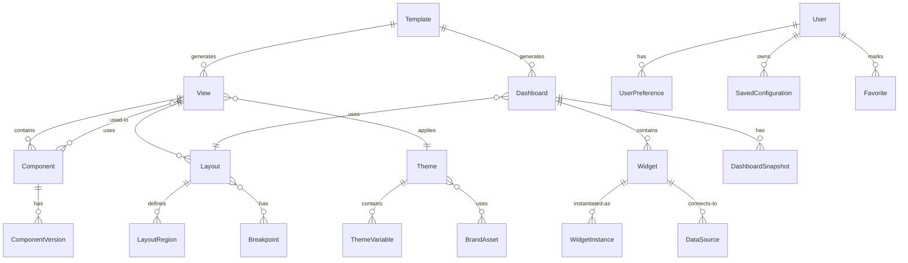
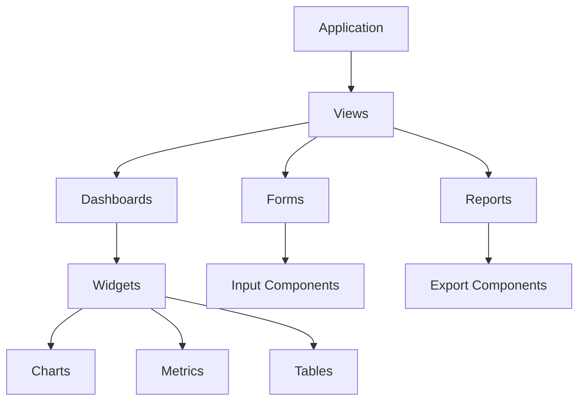

# Views & UI Platform REST API Design

## Document Change Log

### Version History

| Version | Date | Author | Changes | Breaking Changes |
|---------|------|---------|---------|------------------|
| 1.3.0 | 2025-01-03 | System | - Added pagination to all list endpoints<br>- Enhanced authentication specifications<br>- Standardized error response format<br>- Added document changelog section | No |
| 1.2.0 | 2025-08-28 | adrian | - Updated entity relationship diagrams<br>- Added descriptive matrices<br>- Enhanced documentation | No |
| 1.1.0 | 2025-08-27 | adrian | - Added initial API endpoints<br>- Defined core resources | No |
| 1.0.0 | 2025-08-27 | adrian | - Initial API design documentation | N/A |

### Upcoming Changes (Next Release)

- [ ] Add WebSocket support for real-time updates
- [ ] Implement GraphQL endpoint
- [ ] Add batch operations support
- [ ] Enhanced filtering capabilities

### Deprecation Notices

- None at this time

---

## Table of Contents

1. [Document Change Log](#document-change-log)
2. [Overview](#overview)
3. [System Architecture](#system-architecture)
4. [Authentication & Authorization](#authentication--authorization)
5. [Core API Endpoints](#core-api-endpoints)
   - [View Management APIs](#view-management-apis)
   - [Dashboard APIs](#dashboard-apis)
   - [Component Library APIs](#component-library-apis)
   - [Layout Management APIs](#layout-management-apis)
   - [Theme & Styling APIs](#theme--styling-apis)
   - [Widget Management APIs](#widget-management-apis)
   - [Template Management APIs](#template-management-apis)
   - [Personalization APIs](#personalization-apis)
6. [Entity Relationships](#entity-relationships)
7. [Data Models](#data-models)
8. [API Specifications](#api-specifications)
9. [WebSocket Events](#websocket-events)
10. [Error Handling](#error-handling)
11. [Security Considerations](#security-considerations)

## Overview

The Views & UI Platform REST API provides comprehensive functionality for managing user interfaces, dashboards, and visual components across the platform. This API enables:

- **Dynamic View Management**: Create, configure, and manage application views
- **Dashboard Building**: Design and deploy custom dashboards with widgets
- **Component Library**: Reusable UI components and patterns
- **Layout Systems**: Flexible grid and responsive layout management
- **Theme Customization**: Brand and style configuration
- **Widget Ecosystem**: Extensible widget framework
- **Template System**: Pre-built templates and layouts
- **Personalization**: User-specific customization and preferences

## System Architecture

### High-Level Architecture

```
┌──────────────────────────────────────────────────────────────┐
│                     API Gateway                               │
│              (Authentication, Rate Limiting, CDN)             │
└───────────────┬──────────────────────────┬───────────────────┘
                │                          │
    ┌───────────▼──────────┐   ┌──────────▼──────────────┐
    │    View Service       │   │   Dashboard Service      │
    └───────────┬──────────┘   └──────────┬───────────────┘
                │                          │
    ┌───────────▼──────────┐   ┌──────────▼───────────────┐
    │  Component Service    │   │   Widget Service         │
    └───────────┬──────────┘   └──────────┬───────────────┘
                │                          │
    ┌───────────▼──────────┐   ┌──────────▼───────────────┐
    │   Layout Engine       │   │   Theme Service          │
    └───────────┬──────────┘   └──────────┬───────────────┘
                │                          │
    ┌───────────▼──────────┐   ┌──────────▼───────────────┐
    │  Template Service     │   │  Personalization Service │
    └───────────────────────┘   └──────────────────────────┘
```

### Service Components

1. **View Service**
   - View lifecycle management
   - Routing configuration
   - View state management
   - Permission control

2. **Dashboard Service**
   - Dashboard creation and editing
   - Widget orchestration
   - Real-time data binding
   - Export/Import functionality

3. **Component Service**
   - Component registry
   - Version management
   - Dependency resolution
   - Component marketplace

4. **Widget Service**
   - Widget catalog
   - Data source binding
   - Widget configuration
   - Custom widget support

5. **Layout Engine**
   - Grid system management
   - Responsive breakpoints
   - Drag-and-drop support
   - Layout persistence

6. **Theme Service**
   - Theme management
   - Color schemes
   - Typography settings
   - Brand assets

7. **Template Service**
   - Template library
   - Template customization
   - Template versioning
   - Industry-specific templates

8. **Personalization Service**
   - User preferences
   - View customization
   - Saved configurations
   - Usage analytics

## Authentication & Authorization

### Authentication Methods

```http
Authorization: Bearer <jwt-token>
X-API-Key: <api-key>
X-View-Context: <context-id>
```

### Permission Scopes

```javascript
{
  // View Scopes
  "views:read",
  "views:write",
  "views:delete",
  "views:publish",
  
  // Dashboard Scopes
  "dashboards:read",
  "dashboards:write",
  "dashboards:share",
  "dashboards:export",
  
  // Component Scopes
  "components:read",
  "components:write",
  "components:publish",
  "components:install",
  
  // Widget Scopes
  "widgets:read",
  "widgets:write",
  "widgets:configure",
  "widgets:data-bind",
  
  // Layout Scopes
  "layouts:read",
  "layouts:write",
  "layouts:customize",
  
  // Theme Scopes
  "themes:read",
  "themes:write",
  "themes:apply",
  
  // Template Scopes
  "templates:read",
  "templates:write",
  "templates:fork",
  
  // Personalization Scopes
  "personalization:read",
  "personalization:write",
  "personalization:reset"
}
```

## Core API Endpoints

### View Management APIs

#### Views

##### List Views
```http
GET /api/v1/views
Query Parameters:
  - type: dashboard|detail|list|form|report
  - category: admin|user|public
  - status: draft|published|archived
  - search: string
  - tags: comma-separated
  - page: number
  - limit: number
  - sort: name|created|updated|popularity
```

##### Get View Details
```http
GET /api/v1/views/{viewId}
```

##### Create View
```http
POST /api/v1/views
Body: {
  "name": "string",
  "type": "dashboard|detail|list|form|report",
  "category": "admin|user|public",
  "description": "string",
  "route": "/path/to/view",
  "layout": {
    "type": "grid|flex|absolute",
    "config": {...}
  },
  "components": [
    {
      "id": "string",
      "type": "string",
      "position": {...},
      "props": {...}
    }
  ],
  "permissions": {
    "read": ["roleId"],
    "write": ["roleId"]
  },
  "metadata": {...}
}
```

##### Update View
```http
PUT /api/v1/views/{viewId}
```

##### Delete View
```http
DELETE /api/v1/views/{viewId}
```

##### Publish View
```http
POST /api/v1/views/{viewId}/publish
Body: {
  "version": "string",
  "changelog": "string",
  "targetEnvironments": ["dev", "staging", "prod"]
}
```

##### Clone View
```http
POST /api/v1/views/{viewId}/clone
Body: {
  "name": "string",
  "targetCategory": "string"
}
```

##### Export View
```http
GET /api/v1/views/{viewId}/export
Query Parameters:
  - format: json|yaml|html
  - includeAssets: boolean
```

##### Import View
```http
POST /api/v1/views/import
Headers:
  Content-Type: multipart/form-data
Body:
  - file: binary
  - overwrite: boolean
```

##### Get View Metrics
```http
GET /api/v1/views/{viewId}/metrics
Query Parameters:
  - metrics: views|engagement|performance
  - period: 1h|24h|7d|30d
```

#### View States

##### Get View State
```http
GET /api/v1/views/{viewId}/state
Query Parameters:
  - userId: string
  - session: string
```

##### Save View State
```http
POST /api/v1/views/{viewId}/state
Body: {
  "filters": {...},
  "sort": {...},
  "pagination": {...},
  "expandedItems": [...],
  "customSettings": {...}
}
```

##### Reset View State
```http
DELETE /api/v1/views/{viewId}/state
```

### Dashboard APIs

#### Dashboards

##### List Dashboards
```http
GET /api/v1/dashboards
Query Parameters:
  - category: analytics|monitoring|executive|operational
  - owner: userId
  - shared: boolean
  - search: string
  - tags: comma-separated
```

##### Get Dashboard
```http
GET /api/v1/dashboards/{dashboardId}
```

##### Create Dashboard
```http
POST /api/v1/dashboards
Body: {
  "name": "string",
  "description": "string",
  "category": "string",
  "layout": {
    "type": "grid|freeform",
    "columns": number,
    "rows": number,
    "gap": number
  },
  "widgets": [
    {
      "id": "string",
      "type": "string",
      "position": {
        "x": number,
        "y": number,
        "w": number,
        "h": number
      },
      "config": {...}
    }
  ],
  "refreshInterval": number,
  "theme": "string"
}
```

##### Update Dashboard
```http
PUT /api/v1/dashboards/{dashboardId}
```

##### Delete Dashboard
```http
DELETE /api/v1/dashboards/{dashboardId}
```

##### Share Dashboard
```http
POST /api/v1/dashboards/{dashboardId}/share
Body: {
  "users": ["userId"],
  "teams": ["teamId"],
  "permissions": ["view", "edit"],
  "expiresAt": "ISO8601"
}
```

##### Export Dashboard
```http
POST /api/v1/dashboards/{dashboardId}/export
Body: {
  "format": "pdf|png|json",
  "includeData": boolean,
  "dateRange": {
    "from": "ISO8601",
    "to": "ISO8601"
  }
}
```

##### Duplicate Dashboard
```http
POST /api/v1/dashboards/{dashboardId}/duplicate
Body: {
  "name": "string",
  "targetFolder": "string"
}
```

##### Get Dashboard Snapshot
```http
GET /api/v1/dashboards/{dashboardId}/snapshots/{snapshotId}
```

##### Create Dashboard Snapshot
```http
POST /api/v1/dashboards/{dashboardId}/snapshots
Body: {
  "name": "string",
  "description": "string",
  "includeData": boolean
}
```

### Component Library APIs

#### Components

##### List Components
```http
GET /api/v1/components
Query Parameters:
  - category: chart|form|navigation|layout|media
  - framework: react|vue|angular
  - search: string
  - tags: comma-separated
  - version: string
```

##### Get Component
```http
GET /api/v1/components/{componentId}
```

##### Register Component
```http
POST /api/v1/components
Body: {
  "name": "string",
  "category": "string",
  "framework": "react|vue|angular",
  "version": "string",
  "description": "string",
  "props": {
    "schema": {...}
  },
  "events": [...],
  "slots": [...],
  "dependencies": [...],
  "bundle": {
    "url": "string",
    "size": number
  },
  "documentation": "string",
  "examples": [...]
}
```

##### Update Component
```http
PUT /api/v1/components/{componentId}
```

##### Delete Component
```http
DELETE /api/v1/components/{componentId}
```

##### Get Component Bundle
```http
GET /api/v1/components/{componentId}/bundle
Query Parameters:
  - version: string
  - minified: boolean
```

##### Get Component Documentation
```http
GET /api/v1/components/{componentId}/docs
Query Parameters:
  - format: markdown|html
```

##### Test Component
```http
POST /api/v1/components/{componentId}/test
Body: {
  "props": {...},
  "mockData": {...}
}
```

#### Component Marketplace

##### Search Marketplace
```http
GET /api/v1/components/marketplace
Query Parameters:
  - query: string
  - category: string
  - minRating: number
  - free: boolean
```

##### Install Component
```http
POST /api/v1/components/marketplace/{componentId}/install
Body: {
  "version": "string",
  "scope": "global|project"
}
```

##### Rate Component
```http
POST /api/v1/components/marketplace/{componentId}/rate
Body: {
  "rating": number,
  "review": "string"
}
```

### Layout Management APIs

#### Layouts

##### List Layouts
```http
GET /api/v1/layouts
Query Parameters:
  - type: grid|flex|absolute|responsive
  - category: string
  - search: string
```

##### Get Layout
```http
GET /api/v1/layouts/{layoutId}
```

##### Create Layout
```http
POST /api/v1/layouts
Body: {
  "name": "string",
  "type": "grid|flex|absolute|responsive",
  "config": {
    "columns": number,
    "rows": number,
    "gap": number,
    "padding": {...},
    "breakpoints": [
      {
        "name": "mobile",
        "minWidth": 0,
        "maxWidth": 768,
        "columns": 1
      }
    ]
  },
  "regions": [
    {
      "id": "string",
      "name": "header|sidebar|content|footer",
      "position": {...},
      "constraints": {...}
    }
  ]
}
```

##### Update Layout
```http
PUT /api/v1/layouts/{layoutId}
```

##### Delete Layout
```http
DELETE /api/v1/layouts/{layoutId}
```

##### Preview Layout
```http
POST /api/v1/layouts/{layoutId}/preview
Body: {
  "components": [...],
  "data": {...}
}
```

#### Grid Systems

##### Get Grid Configuration
```http
GET /api/v1/layouts/grid/{gridId}
```

##### Update Grid Configuration
```http
PUT /api/v1/layouts/grid/{gridId}
Body: {
  "columns": number,
  "rows": number,
  "gap": number,
  "autoFlow": "row|column|dense"
}
```

##### Calculate Grid Layout
```http
POST /api/v1/layouts/grid/calculate
Body: {
  "containerWidth": number,
  "containerHeight": number,
  "items": [...],
  "config": {...}
}
```

### Theme & Styling APIs

#### Themes

##### List Themes
```http
GET /api/v1/themes
Query Parameters:
  - type: light|dark|custom
  - category: corporate|modern|classic
  - search: string
```

##### Get Theme
```http
GET /api/v1/themes/{themeId}
```

##### Create Theme
```http
POST /api/v1/themes
Body: {
  "name": "string",
  "type": "light|dark|custom",
  "colors": {
    "primary": "#hex",
    "secondary": "#hex",
    "background": "#hex",
    "surface": "#hex",
    "error": "#hex",
    "warning": "#hex",
    "info": "#hex",
    "success": "#hex"
  },
  "typography": {
    "fontFamily": "string",
    "fontSize": {
      "base": "16px",
      "scale": 1.25
    },
    "lineHeight": 1.5
  },
  "spacing": {
    "unit": 8,
    "scale": [0.25, 0.5, 1, 2, 3, 4, 6, 8]
  },
  "borderRadius": {
    "small": "2px",
    "medium": "4px",
    "large": "8px"
  },
  "shadows": [...],
  "transitions": {...}
}
```

##### Update Theme
```http
PUT /api/v1/themes/{themeId}
```

##### Delete Theme
```http
DELETE /api/v1/themes/{themeId}
```

##### Apply Theme
```http
POST /api/v1/themes/{themeId}/apply
Body: {
  "scope": "global|user|dashboard",
  "targetId": "string"
}
```

##### Preview Theme
```http
POST /api/v1/themes/{themeId}/preview
Body: {
  "viewId": "string",
  "components": [...]
}
```

##### Export Theme
```http
GET /api/v1/themes/{themeId}/export
Query Parameters:
  - format: css|scss|json
```

#### Brand Assets

##### List Brand Assets
```http
GET /api/v1/themes/brand-assets
```

##### Upload Brand Asset
```http
POST /api/v1/themes/brand-assets
Headers:
  Content-Type: multipart/form-data
Body:
  - file: binary
  - type: logo|icon|font|image
  - metadata: JSON string
```

##### Delete Brand Asset
```http
DELETE /api/v1/themes/brand-assets/{assetId}
```

### Widget Management APIs

#### Widgets

##### List Widgets
```http
GET /api/v1/widgets
Query Parameters:
  - category: chart|metric|table|map|media
  - dataSource: string
  - search: string
  - compatible: viewType
```

##### Get Widget
```http
GET /api/v1/widgets/{widgetId}
```

##### Create Widget
```http
POST /api/v1/widgets
Body: {
  "name": "string",
  "type": "chart|metric|table|map|media|custom",
  "category": "string",
  "config": {
    "dataSource": {
      "type": "api|database|stream",
      "endpoint": "string",
      "query": "string",
      "refresh": number
    },
    "visualization": {
      "type": "line|bar|pie|gauge|number",
      "options": {...}
    },
    "interactions": {
      "clickable": boolean,
      "draggable": boolean,
      "resizable": boolean,
      "events": [...]
    }
  },
  "defaultSize": {
    "width": number,
    "height": number
  }
}
```

##### Update Widget
```http
PUT /api/v1/widgets/{widgetId}
```

##### Delete Widget
```http
DELETE /api/v1/widgets/{widgetId}
```

##### Configure Widget Instance
```http
POST /api/v1/widgets/{widgetId}/instances/{instanceId}/config
Body: {
  "dataSource": {...},
  "visualization": {...},
  "filters": [...],
  "customProps": {...}
}
```

##### Get Widget Data
```http
GET /api/v1/widgets/{widgetId}/data
Query Parameters:
  - filters: JSON string
  - aggregation: string
  - timeRange: string
```

##### Refresh Widget Data
```http
POST /api/v1/widgets/{widgetId}/refresh
Body: {
  "force": boolean
}
```

#### Widget Library

##### Get Widget Library
```http
GET /api/v1/widgets/library
Query Parameters:
  - featured: boolean
  - trending: boolean
  - recent: boolean
```

##### Add to Library
```http
POST /api/v1/widgets/library
Body: {
  "widgetId": "string",
  "tags": ["string"],
  "public": boolean
}
```

##### Remove from Library
```http
DELETE /api/v1/widgets/library/{widgetId}
```

### Template Management APIs

#### Templates

##### List Templates
```http
GET /api/v1/templates
Query Parameters:
  - type: dashboard|view|report|form
  - industry: finance|healthcare|retail|tech
  - search: string
  - featured: boolean
```

##### Get Template
```http
GET /api/v1/templates/{templateId}
```

##### Create Template
```http
POST /api/v1/templates
Body: {
  "name": "string",
  "type": "dashboard|view|report|form",
  "category": "string",
  "industry": "string",
  "description": "string",
  "thumbnail": "string",
  "structure": {
    "layout": {...},
    "components": [...],
    "widgets": [...],
    "theme": "string"
  },
  "sampleData": {...},
  "requirements": {
    "dataSources": [...],
    "permissions": [...]
  }
}
```

##### Update Template
```http
PUT /api/v1/templates/{templateId}
```

##### Delete Template
```http
DELETE /api/v1/templates/{templateId}
```

##### Use Template
```http
POST /api/v1/templates/{templateId}/use
Body: {
  "name": "string",
  "customization": {
    "theme": "string",
    "components": {...},
    "data": {...}
  }
}
```

##### Fork Template
```http
POST /api/v1/templates/{templateId}/fork
Body: {
  "name": "string",
  "visibility": "private|public"
}
```

##### Get Template Preview
```http
GET /api/v1/templates/{templateId}/preview
Query Parameters:
  - width: number
  - height: number
```

### Personalization APIs

#### User Preferences

##### Get User Preferences
```http
GET /api/v1/personalization/preferences
Query Parameters:
  - userId: string
  - scope: global|application|view
```

##### Update User Preferences
```http
PUT /api/v1/personalization/preferences
Body: {
  "theme": "string",
  "language": "string",
  "timezone": "string",
  "dateFormat": "string",
  "numberFormat": "string",
  "defaultDashboard": "string",
  "shortcuts": [...],
  "notifications": {
    "enabled": boolean,
    "channels": ["email", "push", "in-app"]
  }
}
```

##### Reset User Preferences
```http
DELETE /api/v1/personalization/preferences
```

#### Saved Configurations

##### List Saved Configurations
```http
GET /api/v1/personalization/configurations
Query Parameters:
  - type: view|dashboard|filter|search
  - viewId: string
```

##### Save Configuration
```http
POST /api/v1/personalization/configurations
Body: {
  "name": "string",
  "type": "view|dashboard|filter|search",
  "targetId": "string",
  "config": {...},
  "isDefault": boolean
}
```

##### Apply Configuration
```http
POST /api/v1/personalization/configurations/{configId}/apply
```

##### Delete Configuration
```http
DELETE /api/v1/personalization/configurations/{configId}
```

#### Recent Items

##### Get Recent Items
```http
GET /api/v1/personalization/recent
Query Parameters:
  - type: view|dashboard|report|search
  - limit: number
```

##### Add Recent Item
```http
POST /api/v1/personalization/recent
Body: {
  "type": "view|dashboard|report|search",
  "itemId": "string",
  "metadata": {...}
}
```

##### Clear Recent Items
```http
DELETE /api/v1/personalization/recent
```

#### Favorites

##### List Favorites
```http
GET /api/v1/personalization/favorites
Query Parameters:
  - type: view|dashboard|widget|report
```

##### Add Favorite
```http
POST /api/v1/personalization/favorites
Body: {
  "type": "view|dashboard|widget|report",
  "itemId": "string"
}
```

##### Remove Favorite
```http
DELETE /api/v1/personalization/favorites/{itemId}
```

## Entity Relationships

### Core Entities



### Component Hierarchy



## Data Models

### Core Models

#### View
```typescript
interface View {
  id: string;
  name: string;
  type: 'dashboard' | 'detail' | 'list' | 'form' | 'report';
  category: 'admin' | 'user' | 'public';
  description: string;
  route: string;
  layout: Layout;
  components: ViewComponent[];
  permissions: ViewPermissions;
  status: 'draft' | 'published' | 'archived';
  metadata: Record<string, any>;
  createdBy: string;
  createdAt: string;
  updatedAt: string;
}
```

#### Dashboard
```typescript
interface Dashboard {
  id: string;
  name: string;
  description: string;
  category: string;
  layout: DashboardLayout;
  widgets: DashboardWidget[];
  theme: string;
  refreshInterval: number;
  sharing: SharingSettings;
  snapshots: DashboardSnapshot[];
  owner: string;
  createdAt: string;
  updatedAt: string;
}
```

#### Component
```typescript
interface Component {
  id: string;
  name: string;
  category: 'chart' | 'form' | 'navigation' | 'layout' | 'media';
  framework: 'react' | 'vue' | 'angular';
  version: string;
  description: string;
  props: ComponentProps;
  events: ComponentEvent[];
  slots: ComponentSlot[];
  dependencies: string[];
  bundle: ComponentBundle;
  documentation: string;
  examples: ComponentExample[];
  rating: number;
  downloads: number;
}
```

#### Widget
```typescript
interface Widget {
  id: string;
  name: string;
  type: 'chart' | 'metric' | 'table' | 'map' | 'media' | 'custom';
  category: string;
  config: WidgetConfig;
  dataSource: DataSourceConfig;
  visualization: VisualizationConfig;
  interactions: InteractionConfig;
  defaultSize: { width: number; height: number };
  instances: WidgetInstance[];
}
```

#### Layout
```typescript
interface Layout {
  id: string;
  name: string;
  type: 'grid' | 'flex' | 'absolute' | 'responsive';
  config: {
    columns: number;
    rows: number;
    gap: number;
    padding: Spacing;
    breakpoints: Breakpoint[];
  };
  regions: LayoutRegion[];
}
```

#### Theme
```typescript
interface Theme {
  id: string;
  name: string;
  type: 'light' | 'dark' | 'custom';
  colors: ColorPalette;
  typography: Typography;
  spacing: SpacingSystem;
  borderRadius: BorderRadiusScale;
  shadows: Shadow[];
  transitions: Transition[];
  customVariables: Record<string, string>;
}
```

#### Template
```typescript
interface Template {
  id: string;
  name: string;
  type: 'dashboard' | 'view' | 'report' | 'form';
  category: string;
  industry: string;
  description: string;
  thumbnail: string;
  structure: {
    layout: Layout;
    components: Component[];
    widgets: Widget[];
    theme: string;
  };
  sampleData: any;
  requirements: TemplateRequirements;
  usage: number;
  rating: number;
}
```

#### UserPreference
```typescript
interface UserPreference {
  userId: string;
  theme: string;
  language: string;
  timezone: string;
  dateFormat: string;
  numberFormat: string;
  defaultDashboard: string;
  shortcuts: Shortcut[];
  notifications: NotificationSettings;
  viewStates: Record<string, ViewState>;
  savedConfigurations: SavedConfiguration[];
}
```

## API Specifications

### Request/Response Formats

#### Standard Response
```json
{
  "success": true,
  "data": {...},
  "meta": {
    "timestamp": "2024-01-20T15:30:00Z",
    "version": "1.0.0",
    "requestId": "uuid"
  }
}
```

#### Error Response
```json
{
  "success": false,
  "error": {
    "code": "ERROR_CODE",
    "message": "Human readable message",
    "details": {...},
    "field": "field_name",
    "timestamp": "2024-01-20T15:30:00Z"
  }
}
```

#### Paginated Response
```json
{
  "success": true,
  "data": [...],
  "pagination": {
    "page": 1,
    "limit": 20,
    "total": 100,
    "totalPages": 5,
    "hasNext": true,
    "hasPrev": false
  }
}
```

### Status Codes

- **200** - Success
- **201** - Created
- **202** - Accepted
- **204** - No Content
- **400** - Bad Request
- **401** - Unauthorized
- **403** - Forbidden
- **404** - Not Found
- **409** - Conflict
- **422** - Unprocessable Entity
- **429** - Rate Limited
- **500** - Internal Server Error
- **503** - Service Unavailable

## WebSocket Events

### Connection

```javascript
// WebSocket connection
ws://api.uiplatform.com/v1/events

// Authentication
{
  "type": "auth",
  "token": "jwt-token"
}
```

### Event Subscriptions

```javascript
// Subscribe to events
{
  "action": "subscribe",
  "events": [
    "view.updated",
    "dashboard.changed",
    "widget.data_updated",
    "theme.applied"
  ],
  "filters": {
    "userId": "user-123",
    "viewId": "view-456"
  }
}
```

### Event Types

#### View Events
- `view.created`
- `view.updated`
- `view.deleted`
- `view.published`
- `view.state_changed`

#### Dashboard Events
- `dashboard.created`
- `dashboard.updated`
- `dashboard.widget_added`
- `dashboard.widget_removed`
- `dashboard.widget_updated`
- `dashboard.shared`
- `dashboard.snapshot_created`

#### Component Events
- `component.registered`
- `component.updated`
- `component.installed`
- `component.uninstalled`

#### Widget Events
- `widget.created`
- `widget.configured`
- `widget.data_updated`
- `widget.error`
- `widget.refreshed`

#### Layout Events
- `layout.changed`
- `layout.item_moved`
- `layout.item_resized`
- `layout.breakpoint_changed`

#### Theme Events
- `theme.created`
- `theme.updated`
- `theme.applied`
- `theme.removed`

#### Personalization Events
- `preference.updated`
- `configuration.saved`
- `configuration.applied`
- `favorite.added`
- `favorite.removed`

### Real-Time Data Updates

```javascript
// Subscribe to widget data
{
  "action": "subscribe_widget_data",
  "widgetId": "widget-123",
  "interval": 5000
}

// Data update event
{
  "event": "widget.data",
  "widgetId": "widget-123",
  "data": {...},
  "timestamp": "2024-01-20T15:30:00Z"
}
```

## Error Handling

### Error Codes

#### General Errors (GEN)
- `GEN001` - Invalid request format
- `GEN002` - Missing required field
- `GEN003` - Invalid field value
- `GEN004` - Resource not found
- `GEN005` - Resource already exists

#### View Errors (VIW)
- `VIW001` - View not found
- `VIW002` - Invalid view configuration
- `VIW003` - View already published
- `VIW004` - Cannot delete active view
- `VIW005` - View state corrupted

#### Dashboard Errors (DSH)
- `DSH001` - Dashboard not found
- `DSH002` - Widget configuration invalid
- `DSH003` - Data source unavailable
- `DSH004` - Export failed
- `DSH005` - Sharing limit exceeded

#### Component Errors (CMP)
- `CMP001` - Component not found
- `CMP002` - Component version mismatch
- `CMP003` - Dependency conflict
- `CMP004` - Bundle load failed
- `CMP005` - Component registration failed

#### Widget Errors (WDG)
- `WDG001` - Widget not found
- `WDG002` - Data binding failed
- `WDG003` - Visualization error
- `WDG004` - Refresh failed
- `WDG005` - Configuration invalid

#### Layout Errors (LAY)
- `LAY001` - Layout not found
- `LAY002` - Invalid grid configuration
- `LAY003` - Breakpoint conflict
- `LAY004` - Region overlap detected
- `LAY005` - Responsive calculation failed

#### Theme Errors (THM)
- `THM001` - Theme not found
- `THM002` - Invalid color format
- `THM003` - Variable undefined
- `THM004` - Asset upload failed
- `THM005` - Theme application failed

### Retry Strategy

```javascript
{
  "retry": {
    "maxAttempts": 3,
    "backoffMultiplier": 2,
    "initialInterval": 1000,
    "maxInterval": 30000,
    "retryableErrors": ["GEN004", "DSH003", "WDG004"]
  }
}
```

## Security Considerations

### Authentication

1. **JWT Authentication**
   - Short-lived access tokens (15 minutes)
   - Refresh tokens (7 days)
   - Role-based claims

2. **API Key Authentication**
   - Application-specific keys
   - Rate limiting per key
   - IP whitelisting

3. **Session Management**
   - Secure session cookies
   - CSRF protection
   - Session timeout

### Authorization

1. **Role-Based Access Control (RBAC)**
   - Predefined roles (Admin, Developer, User, Viewer)
   - Custom role creation
   - Permission inheritance

2. **Attribute-Based Access Control (ABAC)**
   - Context-aware permissions
   - Resource-level access
   - Dynamic policy evaluation

3. **Data-Level Security**
   - Row-level security
   - Column-level masking
   - Field encryption

### Content Security

1. **XSS Prevention**
   - Input sanitization
   - Output encoding
   - CSP headers

2. **Component Security**
   - Sandboxed execution
   - Script validation
   - Dependency scanning

3. **File Upload Security**
   - File type validation
   - Size limits
   - Virus scanning
   - Secure storage

### Rate Limiting

```javascript
{
  "rateLimits": {
    "default": {
      "requests": 1000,
      "window": "1h"
    },
    "dashboard_creation": {
      "requests": 10,
      "window": "1h"
    },
    "export": {
      "requests": 20,
      "window": "1h"
    },
    "file_upload": {
      "requests": 50,
      "window": "1h",
      "maxSize": "50MB"
    }
  }
}
```

### Security Headers

```http
X-Content-Type-Options: nosniff
X-Frame-Options: SAMEORIGIN
X-XSS-Protection: 1; mode=block
Content-Security-Policy: default-src 'self'; script-src 'self' 'unsafe-inline'
Strict-Transport-Security: max-age=31536000; includeSubDomains
```

## Implementation Notes

### Technology Stack

- **API Framework**: Node.js with Express/Fastify
- **Frontend Frameworks**: React, Vue, Angular support
- **Component Bundling**: Webpack, Rollup
- **State Management**: Redux, MobX, Vuex
- **Database**: PostgreSQL for metadata, Redis for caching
- **CDN**: CloudFront/Cloudflare for static assets
- **Container**: Docker + Kubernetes
- **Monitoring**: Prometheus + Grafana

### Performance Optimization

1. **Caching Strategy**
   - Component bundle caching
   - API response caching
   - Static asset CDN
   - Browser caching

2. **Lazy Loading**
   - Component lazy loading
   - Route-based code splitting
   - Progressive enhancement
   - Virtual scrolling

3. **Rendering Optimization**
   - Server-side rendering (SSR)
   - Static generation
   - Incremental static regeneration
   - Edge rendering

### Monitoring & Analytics

1. **Performance Metrics**
   - Page load time
   - Time to interactive
   - Component render time
   - API response time

2. **Usage Analytics**
   - View engagement
   - Widget interactions
   - User flow analysis
   - Feature adoption

3. **Error Tracking**
   - JavaScript errors
   - Component failures
   - API errors
   - Performance degradation

This comprehensive REST API design provides a complete foundation for building and operating a modern Views & UI platform with support for dynamic dashboards, reusable components, and extensive personalization capabilities.